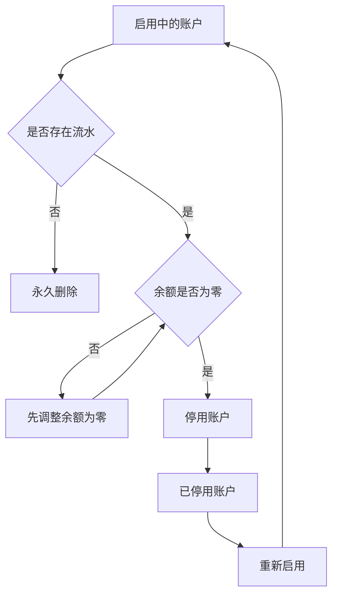

# Default bookkeeping account and account deactivation

## Summary

新增唯一的“默认记账账户”，让用户进入记账页时自动选中常用支付账户，同时保留为当前一笔临时切换账户的自由。账户管理同步补齐永久删除、停用、恢复和默认账户接替规则，确保历史账目不会因账户退出日常使用而失去来源。

---

## Problem frame

当前每笔记账都必须绑定账户，但进入记账页后仍需重复手动选择。对于长期使用同一个支付账户的用户，这一步没有增加有效信息，只增加了操作成本。

默认账户还会放大一个尚未解决的账户生命周期问题：如果允许删除已经绑定流水的账户，历史账目会失去“这笔钱从哪里支出”的上下文；如果连同流水一起删除，又会改写历史收支和统计。因此，本期需要同时定义默认账户和账户退出使用后的完整行为。

---

## Key decisions

- **采用“默认记账账户”作为正式名称：** “默认账户”过于宽泛，可能被理解为资产首页的默认展示对象；账户列表可以用“默认”作为简短标记。
- **使用唯一的显式默认：** 默认值由用户明确设置，不根据最近一次记账选择自动变化，也不按收支场景拆分多个默认值。
- **只允许支付账户成为默认：** 现金、借记卡、信用卡和虚拟账户可以成为默认；投资、负债、应收和自定义资产不能成为默认。
- **记账继续强制绑定账户：** 本期不引入无账户记账，也不会在账户退出使用后解除历史账目的绑定。
- **有流水停用、无流水删除：** 已产生任何流水的账户保留为历史上下文，只能停用；从未产生流水的账户可以永久删除。
- **停用前余额必须为零：** 避免隐藏账户后资产、负债或净资产出现难以解释的变化。
- **账户区域集中管理：** 默认切换、默认标记、停用账户和恢复入口统一放在账户管理范围，不在 App 全局设置中建设重复入口。

---

## Requirements

**Definition and eligibility**

- R1. 同一时刻最多只能有一个默认记账账户，也允许在没有合格账户时不存在默认记账账户。
- R2. 只有启用中的现金、借记卡、信用卡和虚拟账户可以成为默认记账账户。
- R3. 投资、负债、应收、自定义资产、已停用账户和未知类型账户不得成为默认记账账户。
- R4. 用户将其他合格账户设为默认后，原默认账户必须立即恢复为普通启用账户。
- R5. 默认记账账户及其变更必须在应用重新启动后继续生效，且不依赖用户登录。

**Automatic default behavior**

- R6. 当前不存在默认记账账户时，首次成功创建的合格支付账户必须自动成为默认记账账户。
- R7. 如果用户创建的第一个账户不具备默认资格，系统必须保持无默认状态，直到首个合格支付账户创建成功。
- R8. 已存在默认记账账户时，新建支付账户不得自动替换现有默认值。
- R9. 当前不存在默认记账账户时，重新启用的合格支付账户必须自动成为默认记账账户。
- R10. 已存在默认记账账户时，重新启用其他支付账户不得自动替换现有默认值。

**Bookkeeping behavior**

- R11. 用户每次进入新的记账流程时，系统必须自动选中当前有效的默认记账账户。
- R12. 用户必须能够为当前一笔记账切换到任意启用且可记账的账户，包括不能成为默认的非支付账户。
- R13. 为当前一笔切换账户、完成保存或取消记账均不得改变全局默认记账账户。
- R14. 当前没有有效默认记账账户时，记账页必须保持账户未选择状态并引导用户手动选择。
- R15. 记账仍必须且只能绑定一个启用账户；账户未选择或已失效时不得保存。

**Account management and presentation**

- R16. 账户列表必须为当前默认记账账户展示简短、可本地化且不只依赖颜色的“默认”标记。
- R17. 默认标记的无障碍信息必须同时表达账户名称和默认状态。
- R18. 账户管理范围必须展示当前默认记账账户，并允许从全部合格候选账户中切换默认值。
- R19. 合格的非默认账户详情必须提供“设为默认记账账户”操作。
- R20. 当前默认账户详情必须明确展示其默认状态，不提供会产生无效重复提交的设置操作。
- R21. 默认切换成功后，账户列表、账户详情和后续新打开的记账页必须立即反映新默认值。
- R22. 默认切换失败时，原默认账户必须保持不变，并向用户提供可重试的失败反馈。

**Permanent deletion and deactivation**

- R23. 从未产生任何账户流水的账户可以永久删除；餐饮支出和余额调整等任一流水都视为已有历史。
- R24. 已存在任何流水的账户不得永久删除，只能停用，以保留账户与历史账目的绑定关系。
- R25. 余额不为零的账户不得停用，页面必须说明需要先将余额调整为零。
- R26. 停用账户后，原有流水、账户名称及其他历史展示上下文必须完整保留。
- R27. 已停用账户不得出现在新记账的账户选择器、默认候选列表和普通启用账户列表中。
- R28. 账户管理范围必须提供独立的已停用账户入口，允许查看其资料和历史流水。
- R29. 用户必须能够重新启用已停用账户；重新启用不得改写其历史流水。
- R30. 用户选择停用或删除当前默认账户时，如果仍有其他合格候选账户，必须先选择接替的默认记账账户才能继续。
- R31. 用户选择停用或删除当前默认账户时，如果没有其他合格候选账户，系统必须明确提醒操作后将不存在默认记账账户，并允许用户确认继续。
- R32. 删除最后一个账户后，系统必须进入“无账户、无默认记账账户”状态。
- R33. 删除、停用、恢复或默认接替失败时，不得留下只完成部分变更的状态。
- R34. 永久删除前必须明确展示账户名称、不可恢复性及非零余额对当前资产汇总的影响，并由用户再次确认。

**Compatibility and quality**

- R35. 所有新增用户文案必须提供简体中文和英文原生本地化。
- R36. 默认标记、警告、停用状态和操作结果必须适配浅色、深色、动态字体和辅助功能。
- R37. 功能必须在 iOS 18 上完整可用；任何更高版本专属体验都必须提供 iOS 18 降级。

---

## Key flows

- F1. Create the first eligible account
  - **Trigger:** 当前没有默认记账账户，用户创建一个账户。
  - **Steps:** 非支付账户创建成功后保持无默认；首个支付账户创建成功后由系统自动设为默认。
  - **Outcome:** 默认资格与账户类型一致，用户不需要在首个支付账户创建后再次设置。
  - **Covered by:** R1-R3, R6-R8

- F2. Record with the default account
  - **Trigger:** 用户已有有效默认记账账户并打开新的记账页。
  - **Steps:** 页面自动选中默认账户；用户直接保存，或仅为当前一笔切换其他启用账户。
  - **Outcome:** 账目绑定实际选中的账户，全局默认值保持不变。
  - **Covered by:** R11-R15

- F3. Switch the default account
  - **Trigger:** 用户从账户管理或合格账户详情发起默认切换。
  - **Steps:** 用户选择新的合格账户并完成设置。
  - **Outcome:** 新账户获得唯一默认状态，原账户恢复为普通启用账户，后续记账自动选择新默认。
  - **Covered by:** R1-R5, R18-R22

- F4. Remove an unused default account
  - **Trigger:** 当前默认账户从未产生流水，用户发起永久删除。
  - **Steps:** 有其他默认候选时先选择接替者；没有候选时展示无默认提醒并由用户确认。
  - **Outcome:** 账户被永久删除，默认状态安全接替或进入无默认状态。
  - **Covered by:** R23, R30-R34

- F5. Deactivate an account with history
  - **Trigger:** 用户要移除一个已经产生流水的账户。
  - **Steps:** 非零余额先被阻止并引导调整为零；余额为零后按默认接替规则确认停用。
  - **Outcome:** 账户退出日常使用，历史账目和账户上下文保持可查看。
  - **Covered by:** R24-R28, R30-R33

- F6. Restore a deactivated account
  - **Trigger:** 用户从已停用账户区域重新启用一个账户。
  - **Steps:** 系统恢复其日常可用状态；若它是合格支付账户且当前无默认，则自动设为默认。
  - **Outcome:** 账户重新参与记账选择，历史不变，已有默认值不会被意外覆盖。
  - **Covered by:** R9, R10, R28, R29

---

## Acceptance examples

- AE1. A non-payment first account does not become default
  - **Covers R2, R3, R6, R7.**
  - **Given:** 用户没有任何账户和默认记账账户。
  - **When:** 用户先创建投资账户，随后创建现金账户。
  - **Then:** 投资账户创建后仍无默认；现金账户创建成功后自动成为默认记账账户。

- AE2. A new payment account does not replace the default
  - **Covers R8.**
  - **Given:** 现金账户已经是默认记账账户。
  - **When:** 用户新建一个信用卡账户。
  - **Then:** 现金账户继续保持默认，信用卡作为普通启用账户出现。

- AE3. A one-time account switch preserves the default
  - **Covers R11-R15.**
  - **Given:** 借记卡 A 是默认记账账户。
  - **When:** 用户打开记账页，将当前一笔切换到信用卡 B 并保存。
  - **Then:** 该笔账绑定信用卡 B；下次打开新的记账页时仍自动选择借记卡 A。

- AE4. Deleting an unused default requires a replacement
  - **Covers R23, R30, R33, R34.**
  - **Given:** 默认借记卡 A 没有流水，且另有可用的现金账户 B。
  - **When:** 用户删除借记卡 A。
  - **Then:** 用户必须先选择现金账户 B 作为接替者；删除与默认接替一起成功或一起失败。

- AE5. Removing the only eligible default can leave no default
  - **Covers R23, R31, R32, R34.**
  - **Given:** 默认现金账户没有流水，其他现有账户都不是合格支付账户。
  - **When:** 用户删除该现金账户并确认“删除后没有默认记账账户”的提醒。
  - **Then:** 现金账户被删除，其他账户保留，后续记账页不再自动选择账户。

- AE6. An account with history must be deactivated
  - **Covers R24-R28.**
  - **Given:** 一个账户已有餐饮支出或余额调整流水。
  - **When:** 用户尝试将该账户从日常使用中移除。
  - **Then:** 页面不提供永久删除结果；余额非零时先要求调整为零，余额为零后允许停用并保留全部历史。

- AE7. Deactivation preserves historical reports
  - **Covers R24, R26-R28.**
  - **Given:** 一个余额为零的账户存在过去月份的支出流水。
  - **When:** 用户停用该账户并重新查看过去月份和已停用账户详情。
  - **Then:** 过去的流水与统计仍保留原金额和账户上下文，该账户不再出现在新记账选择器中。

- AE8. Restoring an eligible account fills an empty default
  - **Covers R9, R10, R29.**
  - **Given:** 当前没有默认记账账户，一个已停用的信用卡账户仍保留历史。
  - **When:** 用户重新启用该信用卡账户。
  - **Then:** 信用卡恢复可用并自动成为默认记账账户，历史流水保持不变。

---

## Scope boundaries

- 本期不允许创建无账户绑定的记账，也不把账户删除后的历史账目改为“无账户”。
- 本期不提供“永久删除账户及其全部关联流水”的数据清理能力。
- 本期不支持按支出、收入、转账或其他场景分别设置多个默认账户。
- 本期不根据最近一次记账选择自动改变默认账户。
- 本期不在 App 全局设置中建设重复的默认账户入口。
- 本期不改变所有启用账户均可用于单次记账的既有规则；默认资格限制不等于记账资格限制。

---

## Dependencies and assumptions

- 账户流水包括当前已有的餐饮支出、余额调整以及未来新增的其他账户绑定流水。
- 已停用账户余额为零，因此不影响当前资产、负债和净资产汇总；其历史流水仍参与对应历史期间的统计。
- 账户类型在本期不支持修改，因此默认资格不会因编辑类型发生变化。
- 账户管理是默认切换、停用和恢复的唯一主要管理范围；账户详情可以提供上下文快捷操作。

---

## Sources and research

- `docs/brainstorms/2026-08-13-account-bound-dining-expense-requirements.md` 定义了记账必须绑定账户，以及未来默认账户应优先带入但允许单次切换的既有边界。
- `yadoA/Models/AccountType.swift` 定义了当前八类账户及其记账金额影响语义。
- `yadoA/Models/Account.swift` 定义了当前持久账户、余额和稳定账户标识。
- `yadoA/Features/Expenses/DiningExpenseEntryView.swift` 提供当前记账页账户选择和保存前有效性检查。
- `yadoA/Features/Expenses/ExpenseAccountSelectionView.swift` 提供当前启用账户选择与上下文创建流程。
- `yadoA/Features/Accounts/AccountListView.swift` 和 `yadoA/Features/Accounts/AccountDetailView.swift` 提供账户管理与详情展示的现有入口。
- `yadoA/Persistence/LocalAccountRepository.swift` 提供当前账户创建和资料更新边界；删除、停用、恢复与默认管理尚未存在。
