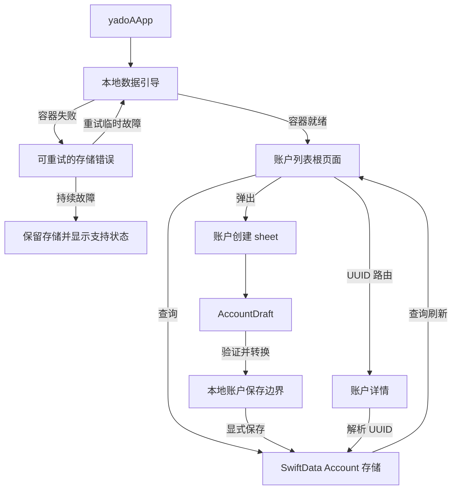
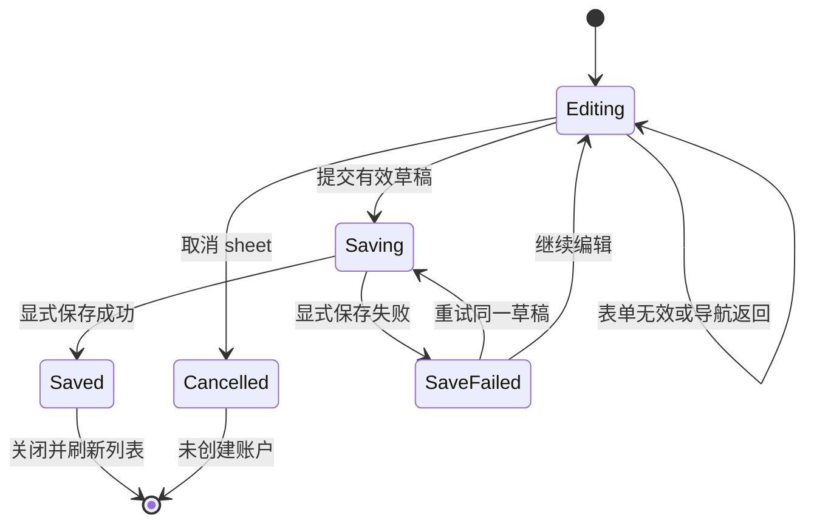

# feat: 新增本地账户列表

## 概要

构建首个无需后端的账户闭环：使用 SwiftData 持久化已创建的账户，将账户列表设为应用根页面，并支持从每一行进入基础账户详情页。应用在未登录时仍可完整使用；此版本仅保证设备本地持久化，不提供云备份或跨设备恢复能力。

---

## 问题背景

当前应用通过一个提醒结束账户创建原型流程，随后会丢弃已填写完成的 `AccountDraft`。目前没有正式的账户实体、持久化存储、账户列表或详情导航。本计划将在保持 V1 范围精简以及现有类型/模板流程不变的前提下，把该原型完善为一个可验证的本地优先闭环。

---

## 需求

### 本地账户数据

- R1. 未登录时创建的有效账户必须明确保存到基于文件的 SwiftData 存储中，并在应用重新启动后仍然可用。
- R2. 持久化账户需保存稳定的 UUID、账户类型原始值、可选模板 ID、清理后的名称、可选备注和卡号后缀、非负 `Decimal` 余额、ISO 货币代码，以及创建和更新时间戳。
- R3. V1 中所有账户均使用 `CNY` 创建；金额格式由存储的货币代码决定，货币选择和汇率功能暂缓实现。
- R4. 资产与负债余额均以非负值存储；由 `AccountType` 决定该值在界面上表述为余额、金额还是债务。

### 创建与持久化行为

- R5. 现有的“类型 → 模板 → 表单”流程从账户列表打开，并且仅在验证成功后才将 `AccountDraft` 转换为持久化账户。
- R6. 保存成功后关闭创建流程，新账户无需重启应用即可显示在列表中。
- R7. 保存失败时保留屏幕上的草稿，显示本地化错误，允许重试，并且绝不能产生重复账户。
- R8. 生产环境存储初始化失败时，必须通过可恢复的错误状态阻止进入账户界面；不得静默降级为内存存储。
- R15. 重试存储故障时绝不能删除或重新创建现有存储；若持续失败，应保留文件，并维持阻断状态，同时显示本地化的数据保护提示。

### 列表与详情体验

- R9. 应用根页面在空状态中显示内嵌的添加操作，在非空状态中显示导航栏尾部的添加操作；任何时候只能显示一个主要添加操作。已有账户按确定性的最新优先顺序排列。
- R10. 每个列表行显示可复用的账户图标、账户名称、账户类型（适用时显示掩码后的卡号后缀），以及本地化的 CNY 金额；金额的语义标签不能仅依赖颜色传达。
- R11. 选择列表行后，通过账户的稳定 UUID 导航到基础详情页并展示当前账户字段；无法解析该 ID 时，显示安全的“账户不可用”状态。

### 兼容性与质量

- R12. 此功能必须以 iOS 18.x 为部署目标完成编译和运行，使用系统语义样式适配浅色/深色外观，并且不得引入未受可用性检查保护的 iOS 26 专属 API。
- R13. 面向用户的账户类型、模板、创建、列表、错误和详情文案均来自原生字符串目录，并提供简体中文和英文值。
- R14. 自动化测试需验证模型转换、显式保存/错误行为、确定性查询、文件存储在容器重建后的持久性，以及“空状态 → 创建 → 列表 → 详情”的 UI 流程。

---

## 范围边界

### 包含范围

- 单一本地 SwiftData `Account` 模式（schema V1）。
- 基于文件的生产环境存储，以及相互隔离的内存预览/测试存储。
- 将现有账户创建流程改造为可关闭的 sheet。
- 最小化的系统 `List` 展示、空状态、添加入口和基础详情视图。
- 固定 CNY 格式化、本地化、iOS 18 目标修正，以及聚焦本功能的自动化测试。

### 后续工作

- 登录、云备份、恢复、服务端同步、冲突处理和删除墓碑。
- 交易记录、月度分组、转账、余额调整和审计历史。
- 账户编辑/删除、手动排序、搜索、分组、合计和净资产计算。
- 货币选择、汇率、多货币聚合，以及数据导出/导入。

---

## 关键技术决策

- KTD1. **使用 SwiftData 作为 V1 本地数据库：** SwiftData 在最低支持版本 iOS 18 之前就已可用，能在不引入依赖的情况下为小型应用提供原生持久化、SwiftUI 观察能力和迁移支持。
- KTD2. **保持 `AccountDraft` 为临时对象，并引入正式的 `Account`：** 表单字符串仍属于输入层关注点；持久化金额改用精确的 `Decimal` 值，静态模板通过稳定 ID 引用，而不是复制到数据库中。
- KTD3. **使用应用级 `ModelContainer`、通过 `@Query` 读取列表，并用轻量本地保存边界执行写入：** 这样既遵循 SwiftData 的原生模型，也能对草稿转换、重复检测、显式保存和回滚进行测试。在这个无后端版本中，没有必要引入面向同步的完整 `AccountsStore`。
- KTD8. **通过仓库拥有的单一 `ModelContext` 串行执行写入，并关闭自动保存：** 只有显式保存成功后，账户才算真正持久化，从而避免回滚和重试与隐式保存产生竞态。
- KTD4. **持久化 `currencyCode = CNY`，但不提供选择器：** 如果以后支持多货币，现有金额仍具有明确含义，同时不会扩大当前创建界面的范围。
- KTD5. **将存储故障视为阻断性故障，而不是临时性故障：** 内存降级仅用于预览和隔离测试，避免产品告知用户数据已保存，但数据却在重新启动后消失。
- KTD6. **使用 UUID 路由详情页，并解析当前持久化状态：** 导航不会保留或复制创建草稿，目标页面也能安全处理过期或缺失的标识符。
- KTD7. **不添加 `sortOrder`、`userID`、同步状态或交易关系：** 对当前列表而言，按创建时间最新优先已经足够；延后的功能只应在相应行为真正实现时再新增字段。

---

## 高层技术设计

### 组件与数据流

### 创建/保存状态流

---

## 验收示例

- AE1. **首个本地账户**
  - **假设：** 基于文件的存储中没有账户。
  - **当：** 用户添加一个余额为 `40` 的现金账户并保存。
  - **那么：** sheet 关闭，空状态消失，列表显示该账户及按 CNY 格式化的余额。

- AE2. **负债符号语义**
  - **假设：** 用户创建一个金额为 `2800` 的信用卡账户。
  - **当：** 该账户显示在列表和详情页中。
  - **那么：** 数据库保留正数 `2800`，界面将其标识为债务，而不是依赖负数或颜色表达。

- AE3. **保存失败与重试**
  - **假设：** 界面上存在一份有效草稿，并且本地保存边界发生故障。
  - **当：** 用户提交表单，并在故障解除后重试。
  - **那么：** 第一次尝试保留所有输入并显示错误；重试后仅创建一个使用原 UUID 的账户。

- AE4. **重新启动后的持久化**
  - **假设：** 一个账户已显式保存到生产环境样式的文件存储中。
  - **当：** 容器被销毁，并从同一存储位置重新创建。
  - **那么：** 可以再次获取相同 UUID 和所有持久化字段。

- AE5. **过期的详情路由**
  - **假设：** 导航中包含一个当前存储内不存在的账户 UUID。
  - **当：** 详情目标页面解析该路由。
  - **那么：** 页面显示本地化的不可用状态，而不是崩溃或展示其他账户。

---

## 实施单元

### U1. 建立本地化的 iOS 18 账户契约

- **目标：** 在新页面依赖账户展示元数据之前，修正兼容性基线并定义可复用、本地化的账户展示元数据。
- **需求：** R4、R10、R12、R13
- **依赖：** 无
- **文件：**
  - 修改 `yadoA.xcodeproj/project.pbxproj`
  - 修改 `yadoA/Models/AccountType.swift`
  - 修改 `yadoA/Features/Accounts/AccountCreationView.swift`
  - 新建 `yadoA/Localizable.xcstrings`
  - 修改 `yadoATests/yadoATests.swift`
- **方案：** 将项目和测试的部署目标设为 iOS 18.x。把本次涉及的账户文案迁移到稳定的本地化键/资源中，同时保留模板 ID；从创建流程的私有作用域中提取可复用的图标/色调元数据，并继续以系统语义颜色作为外观基线。
- **遵循的模式：** 保留现有基于 `AccountType` switch 的展示元数据、稳定的 `AccountTemplate.id` 值、SF Symbol 降级方案和品牌资源。
- **测试场景：**
  1. 本地化修改后，全部八种账户类型仍能解析出标题、图标、金额语义和模板行为。
  2. 已知模板能解析出其品牌图片；“其他”或未知模板能安全使用 SF Symbol 作为降级方案。
  3. 中英文账户标签从字符串目录解析，而不是通过仅存在于 UI 中的硬编码分支解析。
  4. 应用和测试 target 以 iOS 18.x 作为实际最低版本完成编译。
- **验证：** 现有创建流程在两种外观下均保持原有行为和图标；本地化资源验证通过，并且不存在要求高于 iOS 18、但未受可用性检查保护的 API。

### U2. 新增 SwiftData 账户模式与安全持久化边界

- **目标：** 将有效草稿转换为持久账户，并提供显式、可测试的本地保存能力。
- **需求：** R1、R2、R3、R4、R7、R8、R14、R15；覆盖 AE2、AE3、AE4
- **依赖：** U1
- **文件：**
  - 新建 `yadoA/Models/Account.swift`
  - 新建 `yadoA/Persistence/AccountDataContainer.swift`
  - 新建 `yadoA/Persistence/LocalAccountRepository.swift`
  - 新建 `yadoA/Features/App/LocalDataBootstrapView.swift`
  - 修改 `yadoA/yadoAApp.swift`
  - 新建 `yadoATests/AccountModelTests.swift`
  - 新建 `yadoATests/AccountPersistenceTests.swift`
- **方案：** 定义 schema V1，包含稳定 UUID、原始类型/模板标识符、清理后的展示字段、精确余额、`CNY` 和时间戳。配置基于文件的生产环境容器，并为预览/测试显式配置内存变体。仓库拥有一个关闭自动保存的串行写入 context，负责从验证到模型的转换、重复 ID 保护、插入、显式保存和回滚。引导过程依次处理初始化中、就绪、失败和重试中状态；它会重试临时故障且避免重复激活，并在故障持续时保留现有存储，通过本地化的阻断/支持状态阻止继续操作。
- **执行说明：** 优先通过测试驱动实现领域转换和持久化行为，因为本单元建立的是用户的持久数据契约。
- **遵循的模式：** 复用 `AccountAmountParser`，将其作为唯一支持区域设置的“字符串转 `Decimal`”边界；保存时复用草稿 UUID，而不是生成新的身份标识。
- **测试场景：**
  1. 覆盖 AE2。金额为 `2800` 的信用卡草稿创建出的账户应具有正数精确余额、`creditCard` 原始类型和 `CNY`。
  2. 有效模板草稿保留 UUID、模板 ID、去除首尾空白的名称、备注、数字后缀和注入的时间戳。
  3. 仅含空白的名称、空金额/负数/无效金额，或无效账户类型都不能进入插入流程。
  4. 零余额仍然有效，并且能精确往返转换。
  5. 覆盖 AE3。模拟保存失败时回滚待处理模型；使用同一草稿重试后成功一次，且不产生重复数据。
  6. 同一 UUID 插入两次时应被拒绝或妥善处理，获取结果中不能出现两个账户。
  7. 覆盖 AE4。关闭一个临时的文件容器，再通过同一 URL 重建，然后按 UUID 重新获取全部字段。
  8. 生产配置基于文件；预览/测试配置显式使用内存，并且绝不能被选作隐式错误降级方案。
  9. 注入保存失败后，即使出现自动保存时机，在重试之前，实时查询和重新打开的文件存储都应为空。
  10. 反复初始化失败时，现有存储文件保持不变；账户界面继续被阻断，并显示更新后的重试/支持内容。
- **验证：** 干净存储可以保存账户，并从重建的容器中再次获取；失败路径不会留下幽灵记录，生产环境引导流程也绝不会使用临时存储继续运行。

### U3. 将现有创建流程接入本地持久化

- **目标：** 将原型表单改造为可关闭的创建 sheet，正确处理成功、取消、重复提交和失败场景。
- **需求：** R5、R6、R7、R13、R14；覆盖 AE1、AE3
- **依赖：** U2
- **文件：**
  - 修改 `yadoA/Features/Accounts/AccountCreationView.swift`
  - 新建 `yadoATests/AccountCreationFlowTests.swift`
  - 修改 `yadoAUITests/yadoAUITests.swift`
- **方案：** 在 sheet 内保留现有“类型/模板/表单”导航栈。使用注入的保存操作替代原型完成提醒；在根页面新增取消操作；保存期间禁用重复提交；仅在显式保存成功后关闭；失败时保留草稿并显示本地化的可重试错误。
- **遵循的模式：** 保留现有的 `NavigationStack` 路由和条件表单字段；继续将卡号后缀清理为最多四位数字。
- **测试场景：**
  1. 覆盖 AE1。有效现金账户表单仅调用一次保存，并且只在保存成功后关闭。
  2. 基于模板的账户在表单提交时保留所选模板。
  3. 无效表单的保存按钮保持禁用，绝不调用持久化逻辑。
  4. 第一次保存仍在进行时快速点击两次保存，只产生一次保存尝试。
  5. 覆盖 AE3。保存失败后保留名称、金额、备注、后缀、所选类型和模板，并提供重试入口。
  6. 从类型列表取消时不创建账户；从模板/表单返回时保持 sheet 打开。
- **验证：** 创建 sheet 只会在取消或确认保存后返回列表，并且每个可见状态都具有本地化且可访问的控件。

### U4. 将账户列表设为应用根页面

- **目标：** 展示由 SwiftData 驱动、能够响应空或非空状态的列表，并提供唯一的主要添加入口。
- **需求：** R6、R9、R10、R12、R13、R14；覆盖 AE1、AE2
- **依赖：** U1、U2、U3
- **文件：**
  - 新建 `yadoA/Features/Accounts/AccountListView.swift`
  - 新建 `yadoA/Features/Accounts/AccountIconView.swift`
  - 修改 `yadoA/ContentView.swift`
  - 新建 `yadoATests/AccountListPresentationTests.swift`
  - 新建 `yadoAUITests/AccountListFlowUITests.swift`
- **方案：** 在列表根页面放置一个 `NavigationStack`，按最新优先顺序查询账户，并使用稳定 UUID 作为并列排序条件；以 sheet 形式展示创建流程，查询结果为空时使用系统空状态。空状态内嵌添加操作；保存首个账户后，该操作替换为导航栏尾部唯一的添加操作。列表行共享提取出的图标渲染器，并根据各账户存储的货币代码格式化余额；账户类型/债务文本和无障碍标签负责表达金融含义，不依赖颜色。已知模板 ID 解析为当前本地化模板标签；模板 ID 缺失或未知时，使用持久化的清理后账户名称和类型图标降级方案。
- **遵循的模式：** 继续使用 `List`、系统字体、`.secondary` 和语义色调，不引入自定义卡片/布局基础设施。
- **测试场景：**
  1. 干净的隔离存储显示空状态和一个可发现的添加操作。
  2. 覆盖 AE1。保存首个账户后 sheet 关闭，空状态立即替换为对应列表行。
  3. 首个账户出现后，内嵌的空状态操作消失，并且只有一个导航栏添加操作可以创建其他账户。
  4. 多个账户按最新优先顺序显示；时间戳相同时按 UUID 确定性排序。
  5. 银行账户行显示其品牌图标和掩码后缀；直接创建/自定义账户使用其类型降级图标。
  6. 已知模板跟随当前语言环境；模板缺失或已被移除时，保留持久化账户名称并使用安全的降级图标。
  7. 覆盖 AE2。信用卡和负债账户行存储正数金额，但在播报和显示时使用债务语义。
  8. 未知的已存储类型值使用安全的降级展示，不发生崩溃。
  9. 在超大动态字体、浅色模式和深色模式下，列表行层级仍然清晰可读，金额含义不会被截断。
- **验证：** UI 测试使用隔离存储覆盖“空状态 → 添加 → 非空状态”行为；手动检查确认语义样式和动态字体适配具有良好韧性。

### U5. 新增基于 UUID 的账户详情导航并完成闭环

- **目标：** 从每个持久化账户行导航到基础的当前数据详情页，同时不实现交易功能。
- **需求：** R10、R11、R12、R13、R14；覆盖 AE4、AE5
- **依赖：** U4
- **文件：**
  - 新建 `yadoA/Features/Accounts/AccountDetailView.swift`
  - 修改 `yadoA/Features/Accounts/AccountListView.swift`
  - 新建 `yadoATests/AccountDetailPresentationTests.swift`
  - 修改 `yadoAUITests/AccountListFlowUITests.swift`
- **方案：** 使用账户 UUID 作为导航数据，在目标页面解析最新账户，并展示名称、图标、类型/机构、可选后缀/备注和本地化余额。若解析失败，则显示本地化的不可用状态；不添加占位交易行，也不提供尚未启用的编辑/删除/转账控件。
- **遵循的模式：** 复用列表的账户图标和展示辅助方法，避免列表/详情的模板降级和金额语义发生偏差。
- **测试场景：**
  1. 选择已有账户行后，打开相同 UUID 的详情，并显示匹配的名称、类型、余额和货币。
  2. 可选备注和后缀仅在有值时显示；空值不会留下空白的带标签行。
  3. 覆盖 AE5。UUID 缺失时显示不可用状态，不得降级为第一个账户。
  4. 未知模板 ID 继续显示持久化账户名称和类型降级图标。
  5. 覆盖 AE4。重新打开文件存储后，恢复的账户仍可导航到相同的详情内容。
- **验证：** 自动化主流程可以从新保存的账户进入详情，模拟器重启也能确认账户仍在列表中且可继续导航。

---

## 全局影响

- **数据生命周期：** 这是 yadoA 的首个持久化业务 schema。未来的 schema 变更必须通过 SwiftData 迁移保留现有 `Account` 记录，而不是重新创建存储。
- **身份认证边界：** 账户读写不依赖 token 或 `userID`。未来的登录功能用于启用备份/同步，但不得取代本地存储作为应用可用数据源的地位。
- **导航：** `ContentView` 从仅包含创建流程的内容改为账户列表根页面；创建流程成为模态子流程，详情页使用栈式导航。
- **本地化：** 新的字符串目录成为账户功能展示文案的来源。用户输入的名称保持不变，静态类型/模板标签则通过稳定键进行本地化。

---

## 风险与依赖

- **持久性回退：** 生产配置意外使用内存存储，会导致金融数据静默丢失。通过配置断言/测试和文件存储重开测试降低风险。
- **模式漂移：** 持久化枚举或完整模板对象，会让存储记录与当前代码 case 耦合。应持久化稳定的原始 ID，并保留安全的展示降级方案。
- **重试重复：** 如果插入/保存职责不明确，SwiftData 自动保存和手动重试可能创建两条记录。应在一个写入边界中统一处理显式保存/回滚和 UUID 重复检查。
- **兼容性漂移：** 当前生成的项目声明 iOS 26.5，违反仓库的 iOS 18 规则。在判断 API 可用性之前，应修正每个实际 target。
- **未跟踪的仓库规范：** `AGENTS.md` 当前由用户所有且未被 Git 跟踪。实施时必须保留该文件，除非用户另行要求，否则不得暂存。

---

## 来源与调研

- `AGENTS.md` 定义了 iOS 18、本地化、外观、文档注释和个人 Git 约束。
- `yadoA/Models/AccountType.swift` 与 `yadoA/Models/AccountAmountParser.swift` 定义了当前的类型/模板/草稿契约，以及支持区域设置的精确金额解析。
- `yadoA/Features/Accounts/AccountCreationView.swift` 提供了需要保留的现有创建导航和条件表单行为。
- `yadoA/yadoAApp.swift` 与 `yadoA/ContentView.swift` 表明当前尚不存在数据容器或列表根页面。
- `yadoATests/yadoATests.swift` 确立了 Swift Testing 作为单元测试风格；UI 测试 target 当前仍是默认脚手架。
- [Apple：在多次启动之间保留应用的模型数据](https://developer.apple.com/documentation/swiftdata/preserving-your-apps-model-data-across-launches) 介绍了 `@Model`、根模型容器、显式保存、`@Query` 和内存测试配置。
- [Apple：ModelContainer](https://developer.apple.com/documentation/swiftdata/modelcontainer) 介绍了 iOS 17+ 可用性、共享 SwiftUI 环境行为，以及自动/自定义迁移职责。
