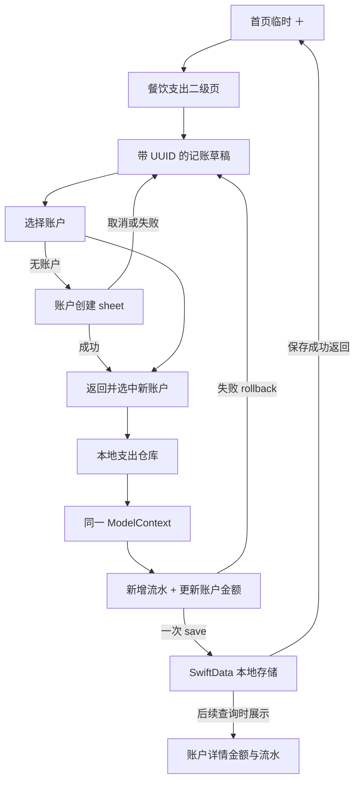

# feat: 实现账户绑定的餐饮支出记账闭环

## Summary

在首页提供临时“＋”入口，打开金额优先的二级记账页，并完成固定餐饮支出的输入、账户绑定和本地保存。保存时按账户类型联动金额，并在对应账户详情中展示流水。

本项目尚未上线，本次直接扩展当前本地数据结构，不建设历史版本迁移体系。默认账户、统一明细和用户排序继续延期。

---

## Problem Frame

yadoA 已经能在本地保存账户及其金额，但金额变化尚无来源记录。只修改账户金额会失去回看依据；只保存流水又会让记账与资产形成两套不一致的数据。

本次先完成最小闭环：用户记录一笔绑定账户的餐饮支出，账户金额随之变化，并能在该账户详情中确认记录。

---

## Requirements

### Entry and input

- R1. “记一笔”必须从首页导航栏的临时“＋”操作打开二级页面，不新增独立记账 Tab。
- R2. 页面必须以金额为主要视觉层级，并将“餐饮”作为不可切换的固定支出分类展示。
- R3. 页面必须提供内置简化数字键盘，包含数字、小数点、删除和完成，不提供加减计算。
- R4. V1 支出金额必须大于零，并支持 CNY 的两位小数精度。
- R5. 日期默认今天并允许选择过去或未来日期；备注为可选输入。

### Account binding

- R6. 每笔餐饮支出必须且只能绑定一个账户，未选择账户时不得保存。
- R7. 当前没有默认账户能力时，账户栏必须保持为空并引导用户主动选择。
- R8. 账户选择器必须允许选择所有当前支持的账户类型。
- R9. 账户栏和选择器必须展示名称、类型、尾号及金额语义，帮助用户区分账户并理解金额影响。
- R10. 没有任何账户时，页面必须提供创建账户入口；创建成功后返回原记账页并选中新账户。
- R11. 进入账户创建前已有的金额、日期和备注必须保留；创建取消或失败后也要返回原记账草稿。

### Save and balance linkage

- R12. 流水必须持久化餐饮分类、有效金额、账户绑定、记账日期和可选备注，并在应用重启后仍然存在。
- R13. 现金、借记卡、虚拟账户、投资、应收和自定义资产等资产或价值类账户必须扣减支出金额。
- R14. 信用卡和负债账户必须增加对应的正数债务金额。
- R15. 资产或价值类账户扣减后低于零时必须显示轻量提醒，同时继续允许保存并产生负数金额。
- R16. 过去、今天或未来日期的流水均必须在保存时立即联动账户金额。
- R17. 流水保存与账户金额联动必须形成一个完整结果；任一部分失败时都不得留下另一部分的已保存状态。
- R18. 每条流水必须拥有唯一 UUID；保存期间显示轻量 loading 并忽略重复完成操作。
- R19. 保存成功后必须给出轻量成功反馈，关闭记账页并返回首页。
- R20. 保存失败时必须保留当前输入和账户选择，提示失败并允许再次保存。
- R21. 用户未保存便离开记账页时，不得创建流水或修改账户金额。

### Account history and ordering

- R22. 账户详情必须只展示属于当前账户的餐饮流水，并按记账日期倒序排列；同一天按保存时间倒序排列。
- R23. 每条流水至少展示餐饮、支出金额和记账日期，仅在有备注时展示备注。
- R24. 保存返回后，绑定账户的最新金额和新流水必须在账户详情中立即可见。
- R25. 记账造成的金额变化不得改变现有账户在账户列表中的相对顺序。

### Compatibility and quality

- R26. 记账与账户流水必须无需登录即可在本地完整使用，并与账户共同持久化。
- R28. 所有新增用户文案必须提供简体中文和英文原生本地化，并通过明确标签而非仅靠颜色表达支出和债务语义。
- R29. 页面必须适配浅色、深色和动态字体，并保证内置数字键盘具备可访问的操作标签。
- R30. 功能必须在 iOS 18 上完整可用；任何更高版本专属体验都必须提供 iOS 18 降级。

> 原需求中的 R27 与 AE11（已上线版本的数据迁移）已被本次规划确认替代：项目尚未上线，因此本次不建设 V1 → V2 迁移和历史存储样本。

---

## Scope Boundaries

### Included

- 固定餐饮分类的单笔支出录入。
- 首页临时入口、二级记账页、账户选择和上下文账户创建。
- 流水与账户金额的一次本地保存、保存失败回滚和 loading 防重复点击。
- 当前账户详情内的流水列表。
- 数据保存、余额联动、失败回滚、账户隔离和流水排序自动测试。
- 中英文、浅色/深色、动态字体和无障碍适配。

### Deferred for later

- 已上线版本的数据迁移体系和旧存储样本。
- 跨账户统一明细页。
- 默认账户数据、设置入口和自动带入行为。
- 临时“＋”的最终全局位置，以及记账优先或资产优先的用户入口设置。
- 用户自定义账户排序。
- 收入、更多分类、转账、拆分账单、周期记账和加减计算。
- 流水编辑、删除、撤销，以及相应的金额回滚规则。
- 图片、标签、多货币和汇率换算。
- UI 自动化、数字键盘逻辑自动测试和专用故障测试开关；这些体验由人工验收。

---

## Key Technical Decisions

- KTD1. **直接将当前 SwiftData schema 更新为 2.0.0：** 项目尚未上线，本次把 `ExpenseTransaction` 加入当前容器，不引入 `VersionedSchema`、迁移计划或历史 fixture；不兼容的开发期本地数据可以清理后重建。
- KTD2. **流水通过稳定 `accountID` 绑定账户：** 当前没有账户删除能力，使用 UUID 延续现有详情路由模式；保存前必须验证目标账户仍然存在。
- KTD3. **持久化正数支出金额：** 流水保存正数 `Decimal`、`CNY`、固定餐饮分类、记账日、备注和保存时间；界面用“支出”标签与负向格式表达资金流出。
- KTD4. **由 `AccountType` 唯一定义支出影响方向：** 信用卡与负债增加正数债务，其余当前支持类型扣减余额或价值；未知账户类型不得保存支出。
- KTD5. **在单一写入 context 中保存完整结果：** 仓库关闭 autosave，在同一个 `ModelContext` 中验证账户、插入流水、修改金额并调用一次 `save()`；任何错误统一 `rollback()`。
- KTD6. **使用 UUID 与 loading 做基础防重复：** 每次进入记账页创建一份带唯一 UUID 的草稿；仓库在修改余额前显式拒绝已存在的 UUID，提交期间展示轻量 loading 并忽略重复点击。不建设联网场景所需的复杂幂等和并发恢复机制。
- KTD7. **允许支出后的资产金额为负：** 账户创建仍要求非负初始金额，但资产或价值账户保存支出后可为负数；余额不足只显示内联提醒，不增加确认弹窗。
- KTD8. **记账不修改 `Account.updatedAt`：** 该字段明确表示账户资料更新时间；支出只修改 `balance` 和新增流水，因此不改变现有账户排序。
- KTD9. **记账日期只保存年月日：** 流水以 `YYYYMMDD` 整数保存用户选择的年月日，`savedAt` 单独记录保存时间；本版本不处理跨时区转换。
- KTD10. **外层记账流程持有完整草稿：** 账户选择和账户创建是子流程；创建成功回传新账户 UUID，成功、取消或失败都不能重建外层草稿。
- KTD11. **保留账户列表创建的原有失败行为：** 仅从记账页打开账户创建时，失败后返回记账草稿；从账户列表创建时仍停留在表单并允许原地重试。
- KTD12. **使用字符缓冲区驱动内置键盘：** 键盘只处理数字、小数点和删除，最多两位小数；保存前转换为精确 `Decimal`。
- KTD13. **从首页导航栈进入记账页：** 首页工具栏“＋”推入二级页面，账户创建继续使用 sheet，现有双 Tab 结构保持不变。

---

## High-Level Technical Design

---

## Acceptance Examples

- AE1. Account must be selected
  - **Covers:** R6, R7
  - **Given:** 用户已有多个账户。
  - **When:** 用户打开记账页并只输入金额。
  - **Then:** 账户栏保持为空，直至用户主动选择账户后才可完成。

- AE2. First account creation preserves the draft
  - **Covers:** R10, R11
  - **Given:** 用户没有账户，并已输入金额、未来日期和备注。
  - **When:** 用户进入账户创建后成功、取消或创建失败。
  - **Then:** 三种结果都返回原记账页并保留输入；成功时额外选中新账户。

- AE3. Invalid amount cannot be saved
  - **Covers:** R4, R6
  - **Given:** 用户已选择账户。
  - **When:** 金额为空、为零、超过两位小数或不是有效数字。
  - **Then:** 页面不得保存，也不得修改账户金额。

- AE4. Insufficient asset amount does not block
  - **Covers:** R13, R15
  - **Given:** 资产类账户当前金额为 `40.00`。
  - **When:** 用户绑定该账户记录 `50.00` 的餐饮支出。
  - **Then:** 页面显示余额不足提醒但允许保存；成功后账户金额为 `-10.00`。

- AE5. Liability debt increases
  - **Covers:** R14
  - **Given:** 信用卡账户当前债务为 `100.00`。
  - **When:** 用户绑定该账户记录 `20.00` 的餐饮支出。
  - **Then:** 保存一笔 `20.00` 的支出，并将账户债务更新为 `120.00`。

- AE6. Future date affects the account immediately
  - **Covers:** R5, R16, R22
  - **Given:** 用户选择明天作为记账日期。
  - **When:** 用户今天保存这笔餐饮支出。
  - **Then:** 账户金额立即变化，该流水按明天的日期出现在账户详情中。

- AE7. Save failure leaves no partial result
  - **Covers:** R17, R18, R20
  - **Given:** 用户已填写有效金额并选择账户。
  - **When:** 本地保存失败，或 loading 期间再次点击完成。
  - **Then:** 保存失败时流水和金额都保持原状；重复点击不会启动第二次保存。

- AE8. Unsaved exit has no effect
  - **Covers:** R21
  - **Given:** 用户已经填写有效草稿。
  - **When:** 用户未点击完成便关闭记账页。
  - **Then:** 不产生流水，所选账户金额保持不变。

- AE9. Account history uses the transaction date
  - **Covers:** R22-R24
  - **Given:** 同一账户已有明天、今天和上周的流水，其中今天保存了两笔。
  - **When:** 用户打开该账户详情。
  - **Then:** 流水按明天、今天、上周排列；今天两笔按保存时间由新到旧排列，无备注流水不展示空备注行。

- AE10. Accounting does not reorder accounts
  - **Covers:** R25
  - **Given:** 账户 A 当前排列在账户 B 之前。
  - **When:** 用户使用账户 B 保存一笔餐饮支出。
  - **Then:** 账户 B 金额被更新，但列表仍保持账户 A 在账户 B 之前。

---

## Implementation Units

### U1. Add the expense model and extend the local container

- **Goal:** 建立餐饮流水的持久数据结构，并让应用、预览和测试容器同时认识账户与流水。
- **Requirements:** R12, R22, R23, R26, R30
- **Flows:** F5
- **Acceptance examples:** AE9
- **Dependencies:** None
- **Files:**
  - Create `yadoA/Models/ExpenseTransaction.swift`
  - Modify `yadoA/Persistence/AccountDataContainer.swift`
  - Modify `yadoA/Features/App/AppTabView.swift`
  - Create `yadoATests/ExpenseTransactionModelTests.swift`
- **Approach:** 新增包含唯一 UUID、`accountID`、固定餐饮分类、正数金额、`CNY`、`YYYYMMDD` 整数记账日、可选备注和 `savedAt` 的 SwiftData 模型。把当前 schema 版本更新为 2.0.0，并让生产、内存和预览容器使用相同模型集合，不增加迁移代码。受影响的 Preview 统一使用完整内存容器。
- **Automated test scenarios:**
  1. 有效流水精确保留全部字段，空白备注归一为 `nil`。
  2. 金额为零、负数或超过两位小数时不能形成有效流水。
  3. 年月日值可按日期稳定比较，`savedAt` 独立保留同日排序信息。
- **Verification:** 模型测试通过，所有引用 SwiftData 的 Preview 和测试容器都包含 `Account` 与 `ExpenseTransaction`。

### U2. Add atomic balance linkage and data-rule tests

- **Goal:** 将流水插入和账户金额变化收敛为一次可回滚的本地保存。
- **Requirements:** R6, R12-R18, R20, R24-R26
- **Flows:** F1, F3, F4, F6
- **Acceptance examples:** AE4-AE7, AE10
- **Dependencies:** U1
- **Files:**
  - Create `yadoA/Models/DiningExpenseDraft.swift`
  - Modify `yadoA/Models/Account.swift`
  - Modify `yadoA/Models/AccountType.swift`
  - Create `yadoA/Persistence/LocalExpenseRepository.swift`
  - Create `yadoATests/DiningExpensePersistenceTests.swift`
  - Modify `yadoATests/AccountModelTests.swift`
  - Modify `yadoATests/AccountListPresentationTests.swift`
- **Approach:** 为 `AccountType` 增加明确的支出影响方向。仓库使用关闭 autosave 的独立 `ModelContext`，先查询并拒绝已存在的流水 UUID，再验证账户、插入流水、修改 `balance` 并一次保存；保存失败统一回滚。提交 loading 负责阻止同一页面的重复调用，唯一属性保留为存储兜底。支出不修改 `Account.updatedAt`，并同步把字段注释收紧为账户资料更新时间。
- **Automated test scenarios:**
  1. 资产类账户执行 `40.00 - 50.00 = -10.00`，覆盖 AE4。
  2. 信用卡和负债执行 `100.00 + 20.00 = 120.00`，覆盖 AE5。
  3. 未来日期流水在保存时立即改变账户金额，覆盖 AE6。
  4. 未知账户类型、缺失账户或无效金额在模型变化前被拒绝。
  5. 注入保存前故障后，流水数量与账户金额都保持保存前状态，覆盖 AE7。
  6. 成功保存后文件重开，流水与更新金额都仍然存在。
  7. 保存账户 B 的支出前后，账户 A/B 的 `updatedAt` 与相对顺序不变，覆盖 AE10。
  8. 同一 UUID 再次提交时，原流水内容和账户金额都保持不变。
- **Verification:** 自动测试证明资产、债务、失败回滚、UUID 唯一和账户顺序规则；不承诺复杂并发或不确定提交恢复。

### U3. Build the amount-first entry page and simplified keypad

- **Goal:** 完成金额、日期、备注、余额提醒和 loading 提交状态的记账页面。
- **Requirements:** R2-R5, R15, R18-R21, R28-R30
- **Flows:** F1, F3, F4, F6
- **Acceptance examples:** AE3, AE4, AE6-AE8
- **Dependencies:** U1, U2
- **Files:**
  - Create `yadoA/Features/Expenses/DiningExpenseEntryFlow.swift`
  - Create `yadoA/Features/Expenses/SimplifiedAmountKeypad.swift`
  - Create `yadoA/Features/Expenses/DiningExpenseEntryView.swift`
- **Approach:** 外层流程持有一份带 UUID 的草稿和 `editing/saving/failed` 状态。金额键盘只提供 `0...9`、小数点、删除和完成，最多允许两位小数。日期只编辑年月日，备注允许为空；备注获得焦点时隐藏金额键盘并显示系统文本键盘，结束备注编辑后恢复金额键盘。预计余额低于零时显示文字与图标提醒，但不阻止完成。页面上半部允许滚动，金额键盘贴合底部安全区，各键保持至少 `44 × 44 pt` 点击区域。点击完成时复制一份待保存草稿，完成键短暂显示 loading 并忽略重复点击；本地同步保存结束后立即成功返回或恢复失败状态，不给整页增加明显锁定。
- **Manual test scenarios:**
  1. 输入 `0...9`、小数点和删除，确认金额最多两位小数，键盘没有加减计算。
  2. 点击备注时系统键盘替换金额键盘，结束编辑后可继续输入金额。
  3. 最大动态字体下页面可滚动，金额和键盘操作不会被截断。
- **Verification:** 编译通过，并在 iOS 18 模拟器上完成人工金额输入、备注焦点切换和动态字体验收。

### U4. Integrate account selection and contextual account creation

- **Goal:** 允许用户从全部账户中选择绑定目标，并在零账户时创建后返回原草稿。
- **Requirements:** R6-R11, R20, R28-R30
- **Flows:** F1, F2
- **Acceptance examples:** AE1, AE2
- **Dependencies:** U2, U3
- **Files:**
  - Create `yadoA/Features/Expenses/ExpenseAccountSelectionView.swift`
  - Modify `yadoA/Features/Expenses/DiningExpenseEntryView.swift`
  - Modify `yadoA/Features/Accounts/AccountCreationView.swift`
  - Modify `yadoA/Features/Accounts/AccountListView.swift`
- **Approach:** 账户选择页查询现有账户并复用列表的名称、图标、类型、尾号、金额和语义标签。记账页每次打开都从未选择状态开始；已选账户摘要保持可点击，重新选择只替换 `accountID`，不清空其他输入。零账户状态提供创建入口；上下文创建成功回传新账户 UUID，取消或失败则返回原草稿。账户列表原有创建入口和失败重试行为保持不变。
- **Manual test scenarios:**
  1. 已有账户时默认不选择账户，全部当前账户类型都可进入选择器。
  2. 创建账户成功后返回并选中新账户，原记账草稿不变。
  3. 创建账户取消或失败后返回，原记账草稿不变。
  4. 从账户列表创建失败时仍停留在账户表单，不改变既有行为。
  5. 已选账户可重新打开选择页并更换，更换后其他草稿字段不变。
- **Verification:** 编译通过，并人工覆盖已有账户、创建成功、取消和失败返回四条路径。

### U5. Wire the Home entry and save interaction

- **Goal:** 从首页临时“＋”进入记账页，并将有效草稿接入真实本地仓库。
- **Requirements:** R1-R21, R24, R28-R30
- **Flows:** F1-F4, F6
- **Acceptance examples:** AE1-AE8
- **Dependencies:** U2-U4
- **Files:**
  - Modify `yadoA/Features/Home/HomeView.swift`
  - Modify `yadoA/Features/Expenses/DiningExpenseEntryView.swift`
  - Modify `yadoA/Localizable.xcstrings`
- **Approach:** 在首页现有 `NavigationStack` 工具栏加入本地化临时“＋”，通过栈式导航打开记账页。页面向流程注入由当前环境容器创建的 `LocalExpenseRepository`。保存成功触发系统成功触觉和可访问成功状态后立即返回首页；失败显示内联错误并保留草稿；普通返回不保存。生产代码不增加 UI 测试故障开关。
- **Manual test scenarios:**
  1. 首页“＋”打开二级记账页，现有 Tab 数量不变。
  2. 资产预计金额小于零时出现文字提醒，但完成仍然可用。
  3. 提交期间出现短暂 loading，重复点击不启动第二次保存。
  4. 保存成功出现轻量反馈并返回首页；失败时停留并保留金额、账户、日期和备注。
  5. 未保存返回不产生结果；过去与未来记账日均在保存时立即联动账户金额。
  6. 中英文、浅色/深色和最大动态字体下均能完成记账。
- **Verification:** 编译通过，并在中英文、浅色/深色和 iOS 18 模拟器上人工走通完整记账流程。

### U6. Add account-scoped history and sorting tests

- **Goal:** 在账户详情展示当前账户流水，并自动验证账户隔离与排序规则。
- **Requirements:** R22-R26, R28-R30
- **Flows:** F5
- **Acceptance examples:** AE6, AE9, AE10
- **Dependencies:** U1, U2, U5
- **Files:**
  - Create `yadoA/Features/Expenses/ExpenseHistoryPresentation.swift`
  - Modify `yadoA/Features/Accounts/AccountDetailView.swift`
  - Modify `yadoA/Localizable.xcstrings`
  - Modify `yadoATests/AccountDetailPresentationTests.swift`
  - Create `yadoATests/ExpenseHistoryPresentationTests.swift`
- **Approach:** 账户详情保留“流水”区域，并按当前 `accountID` 查询流水；没有结果时显示本地化的次要空状态，不增加新的记账入口。有流水时按记账年月日、`savedAt`、UUID 三层顺序排列。每行展示餐饮、负向格式化支出金额、日期和可选备注；账户顶部继续显示当前金额。历史查询测试使用同一容器内的真实 A/B 账户与流水，避免只测试数组转换。
- **Automated test scenarios:**
  1. 账户 A 的查询结果不包含账户 B 的流水。
  2. 明天、今天、上周的流水按记账日倒序，覆盖 AE6 和 AE9。
  3. 同一记账日按 `savedAt` 倒序；保存时间相同时按 UUID 稳定排序。
  4. 有备注时展示清理后的备注，无备注时不生成空备注内容。
  5. 流水金额保存为正数，但展示层输出明确的餐饮支出与负向金额语义。
  6. 为账户 B 记账后，账户 A/B 的相对顺序仍然不变，覆盖 AE10。
- **Verification:** 数据层测试覆盖账户隔离、三层排序和空备注；页面是否立即刷新及视觉效果由人工验收。

---

## System-Wide Impact

- **Data lifecycle:** 当前账户与流水共享一个本地 SwiftData 容器。由于尚未上线，本次不承诺保留开发阶段旧 store；如 schema 不兼容，可清理本地开发数据后重新运行。
- **Financial invariants:** 账户创建金额仍非负；支出流水保存正数；资产可能因支出变负；债务以正数表示并因支出增加。
- **Ordering contract:** `Account.updatedAt` 表示账户资料更新时间，记账不得修改它；流水活动时间由 `savedAt` 表达。
- **Save boundary:** 只有 `LocalExpenseRepository` 可以同时新增流水和联动账户金额，避免两个写入入口产生部分结果。
- **Authentication boundary:** 账户和流水均使用本地容器，不依赖登录、token、`userID` 或后端。
- **Creation flow:** 账户创建增加上下文结果模式，但账户列表原有创建体验保持不变。

---

## Risks and Dependencies

- **Partial financial mutation:** 如果流水和余额分别保存，会产生不一致。实施必须使用单 context、单 save，并保留失败回滚自动测试。
- **Duplicate tap:** 本地保存通常很快，但 loading 期间仍要忽略再次点击完成；仓库在金额变化前显式检查 UUID，唯一属性作为存储层兜底。
- **Account ordering regression:** 更新 `updatedAt` 会让记账账户移动位置。保存测试必须断言该字段和 A/B 相对顺序未变。
- **Draft loss:** 如果账户创建重建记账页，取消和失败会丢失输入。草稿必须由外层记账流程持有。
- **Unknown account types:** 展示层可以降级未知类型，但保存层不能猜测金额方向，必须提示用户更换账户。
- **Manual verification dependency:** 页面、键盘、刷新和账户创建往返不做自动化测试；交付时必须提供并执行下方人工验收清单。

---

## Automated Verification

自动测试只覆盖不适合靠手工稳定制造的数据规则：

- 流水模型字段和金额校验。
- 资产扣减与债务增加。
- 流水与余额保存失败时共同回滚。
- 流水 UUID 唯一。
- 文件重开后流水和金额仍然存在。
- 账户流水隔离、日期排序、同日排序和空备注处理。
- 记账不修改账户资料更新时间或账户列表顺序。

实施时在可用的 iOS 18.x 模拟器上运行 `yadoATests`，并确认上述数据规则相关套件全部通过。

---

## Manual Acceptance Checklist

实现完成后向用户提供以下清单，由用户在 App 中直接验收：

- 从首页“＋”进入二级记账页，确认没有新增第三个 Tab。
- 确认页面以金额为中心，分类固定为餐饮。
- 测试数字、小数点、删除和完成；确认不能输入超过两位小数，也没有加减计算。
- 未选账户时不能保存；选择各类账户时能看到名称、类型、尾号和金额语义。
- 零账户时先填写金额、日期和备注，再分别测试创建成功、取消和失败；返回后草稿保持，成功时选中新账户。
- 用资产账户 `40.00` 记录 `50.00`，确认出现轻提醒但仍可保存，结果为 `-10.00`。
- 用信用卡账户 `100.00` 记录 `20.00`，确认结果债务为 `120.00`。
- 选择过去和未来日期，确认保存时立即更新账户金额。
- 点击完成时确认只出现短暂 loading；快速重复点击不会保存两次。
- 保存成功时确认有轻量触觉或可访问成功反馈，然后立即返回首页。
- 模拟可观察到的保存失败时，确认页面不退出且草稿仍在；不要求增加专用测试开关。
- 未保存直接返回，确认没有流水和金额变化。
- 保存成功后进入对应账户详情，确认新余额和新流水立即可见。
- 确认账户详情只显示当前账户流水，日期顺序正确，无备注时没有空备注行。
- 没有流水的账户详情显示本地化空状态，不出现额外记账入口。
- 为列表靠后的账户记账，确认账户列表顺序没有变化。
- 分别检查简体中文、英文、浅色、深色和最大动态字体。
- 在 iOS 18 设备或模拟器上完成一次完整流程。

---

## Sources and Research

- `docs/brainstorms/2026-08-13-account-bound-dining-expense-requirements.md` 是原始行为与范围来源；本计划记录了“未上线、不建设迁移”和“简化防重复/测试范围”的后续确认。
- `AGENTS.md` 定义 iOS 18、本地化、浅色/深色和中文声明注释要求。
- `yadoA/Persistence/AccountDataContainer.swift` 提供当前本地容器、稳定文件 URL 和显式内存测试配置。
- `yadoA/Persistence/LocalAccountRepository.swift` 提供独占 `ModelContext`、关闭 autosave、显式保存、故障注入和回滚模式。
- `yadoA/Models/Account.swift`、`yadoA/Models/AccountType.swift` 与 `yadoA/Models/AccountAmountParser.swift` 定义账户字段、债务语义、排序和创建金额约束。
- `yadoA/Features/Accounts/AccountCreationView.swift`、`yadoA/Features/Accounts/AccountListView.swift` 与 `yadoA/Features/Accounts/AccountDetailView.swift` 提供草稿状态、账户展示和 UUID 详情查询模式。
- `yadoA/Features/Home/HomeView.swift` 与 `yadoA/Features/App/AppTabView.swift` 确认首页可承载临时入口，且记账不应成为第三个 Tab。
- `yadoATests/AccountPersistenceTests.swift`、`yadoATests/AccountListPresentationTests.swift` 和 `yadoATests/AccountDetailPresentationTests.swift` 提供现有持久化与展示测试基线。
- [Apple: ModelContainer](https://developer.apple.com/documentation/swiftdata/modelcontainer) 说明容器管理 schema、持久存储和 SwiftUI 查询环境。
- [Apple: ModelContext.rollback()](https://developer.apple.com/documentation/swiftdata/modelcontext/rollback%28%29) 说明回滚会丢弃待处理插入并恢复已修改模型至最近提交状态。
