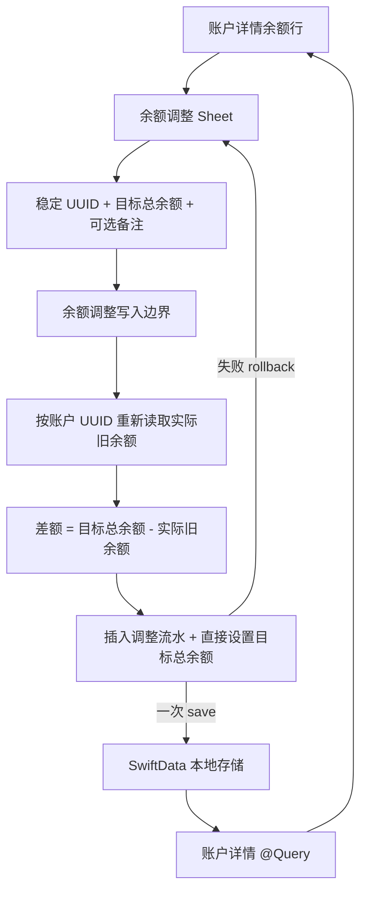
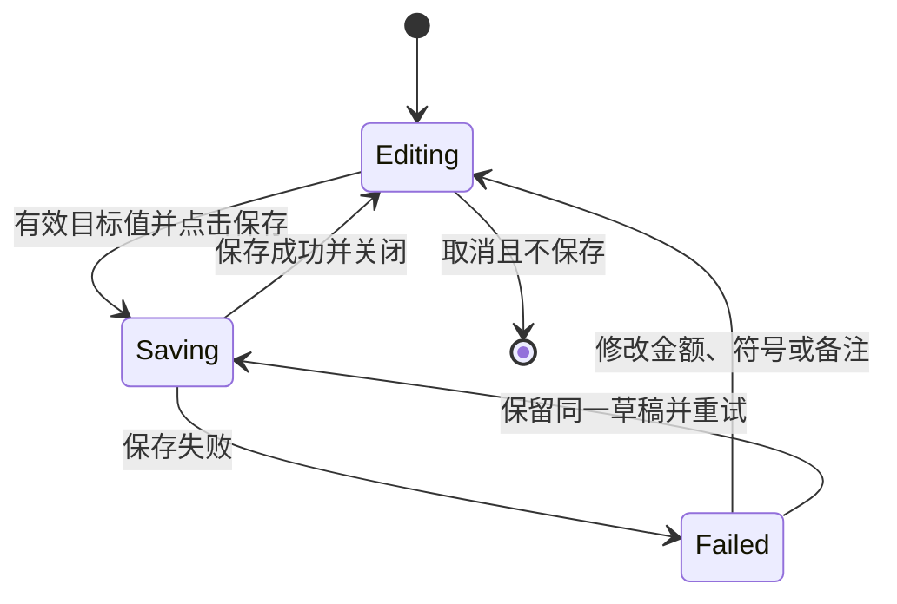

# feat: 支持账户余额手动调整

## Summary

在账户详情页把余额行变为调整入口，通过底部 Sheet 直接设置账户调整后的总余额。保存时自动计算差额，并将余额变化与“余额调整”流水作为同一个本地事务写入。

本计划同时把当前餐饮专用流水泛化为账户流水，让餐饮支出与余额调整共用账户范围内的查询、排序和展示基础。现有原生数字键盘改动作为实施基线保留。

---

## Problem Frame

账户余额可能因漏记、利息或初始录入偏差而与真实值不一致。当前只能通过餐饮支出改变余额，既不能直接校准总余额，也无法解释一次人工修正。

余额修改与调整流水如果分开保存，会产生无法追溯或部分落库的财务状态。本次需要延续现有原子写入边界，使用户看到的余额与账户流水始终一致。

---

## Requirements

### Entry and input

- R1. 点击账户详情的余额行必须拉起底部余额调整 Sheet。
- R2. Sheet 必须显示当前余额，并将其预填为调整后的总余额。
- R3. 输入值必须被解释为调整后的账户总余额，不得作为增加额或减少额再次运算。
- R4. 目标总余额必须支持正数、零和负数，并提供明确的正负切换。
- R5. 金额必须使用系统数字键盘，并限制为 CNY 两位小数精度。
- R6. 用户可以填写可选调整原因；业务日期自动使用保存当天。
- R7. 目标总余额与保存时账户余额相同时不得保存，也不得生成流水。

### Save behavior

- R8. 保存必须直接把账户余额设置为目标总余额。
- R9. 流水差额必须按“目标总余额减去保存时旧余额”计算，且不应用账户类型的支出方向规则。
- R10. 账户余额变化和余额调整流水必须一次成功或一起回滚。
- R11. 保存期间必须显示轻量 loading 并拒绝重复提交。
- R12. 保存失败必须保留目标余额和备注，显示失败反馈并允许重试。
- R13. 保存成功必须关闭 Sheet，并立即刷新详情中的余额与流水。
- R14. 余额调整不得修改 `Account.updatedAt`，也不得改变账户列表顺序。

### Account transaction history

- R15. 调整流水必须绑定当前账户，并持久化旧余额、目标总余额、带符号差额、当天日期和可选备注。
- R16. 余额调整必须以独立流水类型区别于餐饮支出。
- R17. 调整流水必须展示带正负号的差额，以及本地化的“旧余额 → 新余额”。
- R18. 调整原因为空时不得展示空备注行。
- R19. 餐饮支出与余额调整必须使用同一账户流水查询，并沿用记账日、保存时间和 UUID 的稳定排序。
- R20. 余额和流水必须共同本地持久化，应用重开后仍然存在。

### Compatibility and quality

- R21. 新增文案必须提供简体中文与英文原生本地化。
- R22. Sheet 和流水必须适配浅色、深色、动态字体与辅助功能。
- R23. 功能必须在 iOS 18 上完整可用。

---

## Scope Boundaries

### Included

- 从账户详情余额行打开底部调整 Sheet。
- 直接设置正数、零或负数目标总余额，并填写可选调整原因。
- 自动计算差额，原子保存余额和调整流水。
- 餐饮与余额调整的统一账户流水模型、查询、排序和展示。
- 金额、原子回滚、防重复、列表顺序和持久化的自动化数据测试。
- Sheet、系统键盘、外观、动态字体、辅助功能和 iOS 18 即时刷新的人工验收。

### Deferred to Follow-Up Work

- “增加多少”或“减少多少”的另一种录入模式。
- 自定义调整日期。
- 调整流水编辑、删除、撤销及余额回滚。
- 跨账户统一明细页。
- 账户列表手动排序。
- UI 自动化测试；本次由人工验收覆盖 Sheet 操作和视觉行为。

---

## Key Technical Decisions

- KTD1. **输入保存为目标总余额：** 写入边界在自己的 context 中读取实际旧余额，计算 `目标值 - 旧值` 后直接赋值目标值；任何账户类型都不复用支出方向规则。
- KTD2. **泛化为单一账户流水模型：** 项目尚未上线，直接用类型化账户流水承载餐饮支出与余额调整，避免两套模型、两次查询和内存合并排序。
- KTD3. **持久化完整且自洽的调整快照：** 草稿只提供目标余额；写入边界从刚读取的账户取得旧余额，并用精确十进制运算派生差额。模型必须验证 `差额 = 目标值 - 旧值`、三者均符合 CNY 精度且差额非零，调用方不能自行提供差额。
- KTD4. **用类型专属字段矩阵构造流水：** 餐饮只允许正数支出金额和餐饮分类；余额调整只允许完整的旧余额、目标余额和带符号差额。未知类型或非法字段组合必须被拒绝，不得降级为另一种流水展示。
- KTD5. **正负号与金额字符分开管理：** Sheet 的系统数字键盘只维护非负绝对值，正负切换单独保存；`-0` 统一归一为 `0`，不放宽账户创建的非负金额约束。
- KTD6. **沿用独立写 context 的原子边界：** 每次提交使用新建的关闭 autosave 的 `ModelContext`，仓库接收稳定 UUID 和值草稿并重新读取账户；重复 UUID 检查覆盖全部流水类型，插入流水和设置余额只保存一次，失败统一回滚。
- KTD7. **保存时的账户值是差额基准：** Sheet 展示值只用于预填；真正保存时重新读取账户，避免用可能过期的界面快照生成错误差额。
- KTD8. **余额活动不改变账户排序：** 调整只修改 `balance` 并新增流水，不修改表示账户资料更新时间的 `updatedAt`。
- KTD9. **流水排序不承担余额重放：** 调整日取保存当天并写入 `YYYYMMDD`，混合流水仍按业务日、`savedAt`、UUID 排序；`Account.balance` 是当前快照，流水只解释各次活动，不能按展示顺序重建余额。本版本不增加时区规则。
- KTD10. **保留当前原生键盘工作区改动：** 余额 Sheet 复用区域小数点归一化与两位精度规则，不恢复已删除的自定义金额键盘，也不覆盖当前本地化变更。
- KTD11. **保存成功后显式重建详情查询：** 独立 context 保存成功后，由详情父视图更新刷新标识并重建持有 `@Query` 的内容视图，不把 iOS 18 跨 context 自动合并时序作为正确性前提；最低 iOS 18 仍需人工确认余额和流水无须重新导航即可更新。

---

## High-Level Technical Design

### Typed transaction payloads

| 流水类型 | 必填字段 | 必须为空 | 关键校验 |
|---|---|---|---|
| 餐饮支出 | 正数支出金额、餐饮分类 | 调整前余额、调整后余额、调整差额 | 支出金额大于零且最多两位小数 |
| 余额调整 | 调整前余额、调整后余额、带符号差额 | 餐饮分类、餐饮支出金额 | 差额等于调整后减调整前，且差额不为零 |

未知类型或不符合矩阵的字段组合不能进入持久化或展示层。

### Save and refresh flow

### Sheet submission state

---

## Acceptance Examples

- AE1. Input is the resulting total
  - **Covers:** R3, R8, R9, R15-R17
  - **Given:** 账户当前余额是 `100.00`。
  - **When:** 用户输入目标总余额 `120.00` 并保存。
  - **Then:** 账户余额变为 `120.00`，不是 `220.00`；流水显示 `+20.00` 和 `100.00 → 120.00`。

- AE2. Negative target balance
  - **Covers:** R4, R8, R9, R15-R17
  - **Given:** 账户当前余额是 `40.00`。
  - **When:** 用户切换为负数并输入目标总余额 `10.00`。
  - **Then:** 账户余额变为 `-10.00`；流水显示 `-50.00` 和 `40.00 → -10.00`。

- AE3. Liability uses the exact target
  - **Covers:** R3, R8, R9
  - **Given:** 信用卡账户当前债务是 `100.00`。
  - **When:** 用户输入目标总余额 `80.00`。
  - **Then:** 账户余额直接变为 `80.00`，差额为 `-20.00`，不再按债务方向额外换算。

- AE4. Unchanged balance creates nothing
  - **Covers:** R2, R7
  - **Given:** Sheet 的目标总余额等于保存时账户余额。
  - **When:** 用户尝试保存。
  - **Then:** 不修改账户余额，也不产生流水。

- AE5. Failed save is atomic
  - **Covers:** R10-R12
  - **Given:** 用户已输入有效目标余额和调整原因。
  - **When:** 本地保存失败或保存期间再次点击。
  - **Then:** 余额和流水都保持保存前状态，草稿保留且最多只有一次有效重试。

---

## Implementation Units

### U1. Generalize the persisted account transaction model

- **Goal:** 将餐饮专用流水演进为可类型化承载餐饮支出和余额调整的单一账户流水，并更新完整 SwiftData schema。
- **Requirements:** R15-R20, R23
- **Flows:** F1, F2
- **Acceptance examples:** AE1-AE3
- **Dependencies:** None
- **Files:**
  - Rename `yadoA/Models/ExpenseTransaction.swift` to `yadoA/Models/AccountTransaction.swift`
  - Modify `yadoA/Models/DiningExpenseDraft.swift`
  - Modify `yadoA/Models/Account.swift`
  - Modify `yadoA/Persistence/AccountDataContainer.swift`
  - Modify `yadoA/Features/Accounts/AccountListView.swift`
  - Modify `yadoA/Features/Accounts/AccountDetailView.swift`
  - Modify `yadoA/Features/App/AppTabView.swift`
  - Modify `yadoA/Features/Home/HomeView.swift`
  - Rename `yadoATests/ExpenseTransactionModelTests.swift` to `yadoATests/AccountTransactionModelTests.swift`
  - Modify `yadoATests/DiningExpensePersistenceTests.swift`
- **Approach:** 为流水增加稳定类型并保留账户 UUID、业务日、备注、币种和保存时间等共同字段。餐饮与余额调整分别通过专属验证入口生成有效载荷；余额调整完整保存旧余额、目标余额和差额。当前 schema 直接更新到新的开发期版本，生产、内存和所有 Preview 使用同一模型集合，不引入迁移体系。
- **Execution note:** 先用模型测试锁定现有餐饮行为，再泛化模型，避免余额调整破坏已经完成的餐饮记账闭环。
- **Patterns to follow:** `yadoA/Models/ExpenseTransaction.swift` 的精确 `Decimal`、字段清理和日期校验；`yadoA/Persistence/AccountDataContainer.swift` 的显式生产/内存容器边界。
- **Test scenarios:**
  1. 餐饮流水泛化后仍保存正数支出金额、固定餐饮分类、日期和清理后的可选备注。
  2. 余额调整 `100 → 120` 精确保留旧值 `100`、目标值 `120` 和差额 `+20`，覆盖 AE1。
  3. 余额调整 `40 → -10` 精确保留负数目标值和差额 `-50`，覆盖 AE2。
  4. 余额调整前后值相同、超过两位小数、差额与前后值不一致或字段组合不完整时不能生成有效流水。
  5. 未知流水类型和餐饮/调整字段混用时必须被拒绝，不能误显示为另一种流水。
  6. 更新后的内存容器能同时持久化账户、餐饮流水和余额调整流水，schema 版本符合新开发期版本。
- **Verification:** 模型与容器测试证明两种流水可以在单一 schema 中有效共存，既有餐饮测试保持通过。

### U2. Add target-balance flow and atomic persistence

- **Goal:** 建立目标总余额草稿、提交状态和原子写入边界，确保账户余额与调整流水只产生一个完整结果。
- **Requirements:** R2-R14, R15, R20
- **Flows:** F1-F3
- **Acceptance examples:** AE1-AE5
- **Dependencies:** U1
- **Files:**
  - Create `yadoA/Models/BalanceAdjustmentDraft.swift`
  - Create `yadoA/Features/Accounts/BalanceAdjustmentFlow.swift`
  - Create `yadoA/Persistence/LocalBalanceAdjustmentRepository.swift`
  - Modify `yadoA/Models/AccountAmountParser.swift`
  - Create `yadoATests/BalanceAdjustmentFlowTests.swift`
  - Create `yadoATests/BalanceAdjustmentPersistenceTests.swift`
  - Modify `yadoATests/AccountListPresentationTests.swift`
- **Approach:** 草稿在 Sheet 生命周期内保留唯一流水 UUID、账户 UUID、非负金额字符、独立符号和备注。Flow 管理 `editing/saving/failed`，金额编辑复用当前原生键盘的区域小数点与两位精度规则。仓库在独立 context 中按 UUID 重新取账户，用实际旧余额计算差额；保存时若目标值已等于实际余额，返回“无变化”结果且不写入、不作为保存失败，重复 UUID 仍作为错误拒绝。有效调整直接设置目标余额后与流水一起显式保存；任何错误统一回滚且不修改 `updatedAt`。
- **Patterns to follow:** `DiningExpenseEntryFlow` 的草稿保留与 loading 防重；`LocalExpenseRepository` 的独占 context、UUID 检查、单次 `save()` 和故障回滚；`AccountCreationFlowTests` 的挂起保存防重测试。
- **Test scenarios:**
  1. Covers AE1. 现金账户 `100 → 120` 后最终余额是 `120`，差额是 `+20`，绝不变成 `220`。
  2. Covers AE2. 现金账户 `40 → -10` 后最终余额是 `-10`，差额是 `-50`。
  3. Covers AE3. 信用卡账户 `100 → 80` 后最终余额是 `80`，不调用债务支出方向规则。
  4. Covers AE4. 正负零归一后与当前零余额相等，保存不可用；仓库再次校验同值并返回无变化结果，不产生流水或失败提示。
  5. 金额为空、包含非法字符、超过两位小数时不可提交；区域小数分隔符与 `.5` 输入能归一为精确目标值。
  6. 保存挂起时快速重复提交只调用一次写入动作，失败后完整保留 UUID、目标值、符号和备注，重试成功只关闭一次。
  7. Covers AE5. 注入保存前故障后，新 context 读取到的余额、流水数量、`createdAt`、`updatedAt` 和账户相对顺序都保持原状；重试成功后只改变余额并新增一条流水。
  8. 账户缺失、账户币种非 CNY 或流水 UUID 重复时，账户余额保持不变且不新增流水。
  9. 文件存储重开后目标余额和调整流水仍然存在。
  10. 调整账户 B 前后，账户 A/B 的 `updatedAt` 与相对顺序保持不变。
  11. Sheet 以余额 `100` 打开，保存前另一笔餐饮支出把实际余额改为 `90`，再把目标设置为 `120` 时，调整流水必须保存 `90 → 120` 和差额 `+30`。
- **Verification:** 自动化测试证明目标总余额语义、正负数、精确差额、原子回滚、失败重试、UUID 防重、持久化和固定排序规则。

### U3. Generalize account-scoped history presentation

- **Goal:** 让账户详情在同一流水区域正确混排餐饮支出和余额调整，并为两种类型提供清晰的本地化金额语义。
- **Requirements:** R15-R23
- **Flows:** F1, F2
- **Acceptance examples:** AE1-AE3
- **Dependencies:** U1
- **Files:**
  - Rename `yadoA/Features/Expenses/ExpenseHistoryPresentation.swift` to `yadoA/Features/Accounts/AccountTransactionHistoryPresentation.swift`
  - Modify `yadoA/Features/Accounts/AccountDetailView.swift`
  - Modify `yadoA/Localizable.xcstrings`
  - Rename `yadoATests/ExpenseHistoryPresentationTests.swift` to `yadoATests/AccountTransactionHistoryPresentationTests.swift`
  - Modify `yadoATests/AccountDetailPresentationTests.swift`
- **Approach:** 保留按账户 UUID 过滤和业务日、保存时间、UUID 的三层排序。展示转换根据流水类型输出不同标题与行内容：餐饮继续显示负向支出金额；余额调整显示显式正负差额和本地化前后余额。空状态改为通用“暂无流水”，空备注继续缺省，并为组合信息提供完整无障碍播报。
- **Patterns to follow:** `ExpenseHistoryPresentation` 的查询下推、三层排序和本地化日期；`AccountDetailView` 的动态字体横纵布局；`AccountListPresentation` 的币种与语言环境格式化。
- **Test scenarios:**
  1. 同一账户的餐饮与余额调整按业务日、`savedAt`、UUID 混合稳定排序，且不包含其他账户流水。
  2. Covers AE1. `100 → 120` 展示显式 `+20` 和完整前后余额。
  3. Covers AE2. `40 → -10` 展示 `-50` 和带负号目标余额。
  4. 餐饮流水继续展示“餐饮”和负向支出金额，不被账户调整展示规则改变。
  5. 信用卡 `100 → 80` 展示差额 `-20`，不根据账户类型翻转符号。
  6. 空白调整原因归一为 `nil`，展示行不产生空备注内容。
  7. 未来或补记日期的餐饮与当天余额调整按业务日展示，但调整流水仍保留保存时的真实前后余额，不把展示顺序当成余额重放顺序。
  8. 中英文标题、通用空状态、日期、金额和前后余额关系均使用正确本地化。
- **Verification:** 展示测试覆盖账户隔离、混排、稳定排序、正负差额、前后余额、空备注和中英文本地化。

### U4. Integrate the balance adjustment Sheet in account detail

- **Goal:** 从账户详情余额行完成可访问的底部调整流程，并在保存成功后无须重新导航即可看到新余额与流水。
- **Requirements:** R1-R7, R11-R13, R17, R21-R23
- **Flows:** F1-F3
- **Acceptance examples:** AE1-AE5
- **Dependencies:** U2, U3
- **Files:**
  - Create `yadoA/Features/Accounts/BalanceAdjustmentView.swift`
  - Modify `yadoA/Features/Accounts/AccountDetailView.swift`
  - Modify `yadoA/Localizable.xcstrings`
  - Modify `yadoATests/AccountDetailPresentationTests.swift`
- **Approach:** 把余额整行变成带明确操作语义的按钮，并向 Sheet 传稳定账户 UUID、当前原始 `Decimal` 和保存闭包，不从格式化文本反解析。Sheet 使用带标题的导航容器，预填绝对值与符号，并提供系统小数键盘、可选备注、键盘完成按钮、底部保存按钮和明确的“取消”按钮；`editing/failed` 时取消按钮与下拉关闭都可用且不保存，`saving` 时两者同时不可用。保存中仅显示短 loading、阻止重复提交与关闭，不对整页做重度禁用。成功后提供触觉与 VoiceOver 反馈并关闭；失败保留草稿、显示内联错误、立即播报失败并把无障碍焦点移到错误提示。保存成功后详情父视图更新刷新标识，重建持有账户与流水 `@Query` 的内容视图，确保最低 iOS 18 不依赖跨 context 自动刷新时序。Sheet 支持中等和大尺寸，内容可滚动以兼容紧凑高度与大字体。
- **Patterns to follow:** `DiningExpenseEntryView` 的原生数字键盘、Sheet detent、loading、错误保留、成功反馈和安全区按钮；`AccountCreationView` 的保存期间关闭保护。
- **Test scenarios:**
  1. 余额行具备按钮和无障碍操作语义，点击后 Sheet 展示当前余额并正确预填正负状态。
  2. 当前负余额预填为负数状态和绝对金额；切换到正数后目标总余额正确更新；零不保留负号语义。
  3. 目标值与当前值相同时保存不可用，修改金额、符号或备注会清除旧失败提示。
  4. 保存期间显示短 loading，取消与重复保存入口不可用；失败后 Sheet 保留输入并可重试。
  5. 保存成功关闭 Sheet，详情页立即显示新的目标总余额和新增调整流水。
  6. 中英文、浅色/深色、最大动态字体和 VoiceOver 下可理解并完成整个调整流程；保存失败会被立即播报，焦点可定位错误与重试操作。
  7. iOS 18 最低运行时中独立 context 保存后，详情通过显式重建查询立即刷新，无需返回重进。
- **Verification:** iOS 18 构建通过；人工走通正数、负数、零、失败重试、取消、即时刷新、外观、动态字体和辅助功能场景。

---

## System-Wide Impact

- **Data lifecycle:** 当前开发期 schema 从餐饮专用流水演进为账户流水。项目尚未上线，不提供旧 store 迁移；不兼容的开发数据可清理重建。
- **Financial invariants:** 创建账户继续只接受非负初始金额；手动调整可以把任何账户直接设置为正、零或负值；餐饮支出规则保持不变。
- **Historical integrity:** 调整流水保存前值、后值和差额，即使账户后续继续变化，历史行仍可独立解释。
- **Snapshot versus history:** `Account.balance` 是当前余额快照；流水按业务日展示活动，未来或补记流水可能打破相邻行的前后衔接，因此不能从列表顺序重建余额。
- **Save boundary:** 余额调整必须通过独立原子仓库完成，禁止界面直接修改 `@Query` 返回的账户实例后分别保存流水。
- **Ordering contract:** `updatedAt` 继续只表示资料更新时间；余额调整通过流水时间排序，不影响账户列表位置。
- **Existing worktree:** `AccountAmountParser`、餐饮输入页面、草稿和 String Catalog 已有未提交的原生键盘改动；实施必须基于当前内容合并，不能覆盖或恢复旧键盘。

---

## Risks and Dependencies

- **Target-versus-delta regression:** 如果把输入值传入加减逻辑，`100 → 120` 会错误变成 `220`。模型和仓库测试必须直接断言最终总余额。
- **Partial financial state:** 余额与流水分别保存会造成不一致。两项修改必须位于同一 context 和同一次显式保存中，并由故障注入测试锁定回滚。
- **Stale opening snapshot:** Sheet 打开后展示的旧余额不能作为最终差额依据；保存边界必须重新读取实际账户值，并在同值时拒绝写入。
- **Invalid typed payload:** 单一流水模型包含类型专属字段；所有创建入口必须经过类型校验，禁止直接构造不完整组合。
- **Cross-context refresh on iOS 18:** Apple 的设计意图是同容器保存触发查询更新，但 iOS 18 曾存在相关框架问题。即时刷新需要真实 iOS 18 运行时验收，并保留显式重新查询的实施余地。
- **Worktree overlap:** 当前未提交的系统键盘改动与本功能共同修改金额解析、餐饮草稿和本地化资源。实施与提交必须保留两批用户工作并一起验证。

---

## Sources and Research

- `docs/brainstorms/2026-08-13-account-balance-adjustment-requirements.md` 是本计划的产品行为来源。
- `yadoA/Persistence/LocalExpenseRepository.swift` 提供独立写 context、单次保存和失败回滚模式。
- `yadoA/Features/Expenses/DiningExpenseEntryFlow.swift` 与 `yadoA/Features/Expenses/DiningExpenseEntryView.swift` 提供草稿、原生数字键盘、loading 和失败重试模式。
- `yadoA/Features/Expenses/ExpenseHistoryPresentation.swift` 提供账户过滤与稳定排序模式。
- `yadoATests/DiningExpensePersistenceTests.swift` 与 `yadoATests/AccountCreationFlowTests.swift` 提供原子回滚和快速重复提交的测试模式。
- Apple [ModelContext](https://developer.apple.com/documentation/swiftdata/modelcontext)、[`save()`](https://developer.apple.com/documentation/swiftdata/modelcontext/save()) 与 [`rollback()`](https://developer.apple.com/documentation/swiftdata/modelcontext/rollback()) 支持本计划的单 context 显式事务边界。
- Apple DTS [SwiftData background access](https://developer.apple.com/forums/thread/763500) 说明模型实例绑定所属 context，并讨论同容器保存后的查询合并设计意图。
- Apple [Query](https://developer.apple.com/documentation/swiftdata/query) 与 [ModelContext.didSave](https://developer.apple.com/documentation/swiftdata/modelcontext/didsave) 用于界定 iOS 18 即时刷新验证边界。
- Apple SwiftUI [`presentationDetents`](https://developer.apple.com/documentation/swiftui/view/presentationdetents(_:)) 与 [`interactiveDismissDisabled`](https://developer.apple.com/documentation/swiftui/view/interactivedismissdisabled(_:)) 均覆盖 iOS 18。
