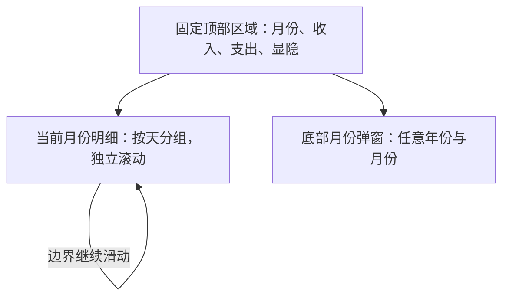
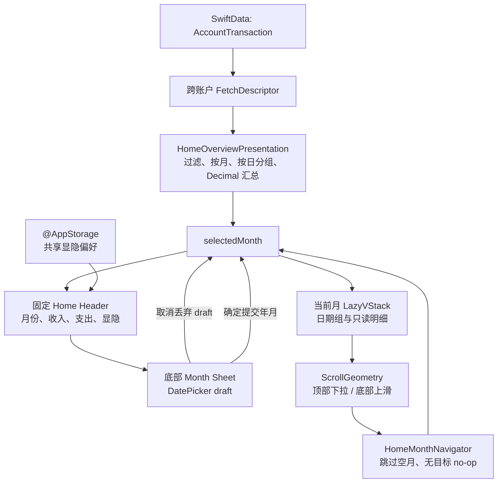

# 首页明细与月份浏览 - Plan

## Goal Capsule

- **Objective:** 交付参考图风格的首页最小版本，固定展示月份与收支概览，并展示当前月份按天分组的收入/支出明细。
- **Product authority:** 本计划只拥有首页展示与浏览范围；中间快捷入口、搜索、日历及明细后续操作不属于本次活动范围。
- **Primary user:** 使用本地记账功能的个人用户。
- **Open blockers:** 无。具体实现选择已在 Planning Contract 中落定；未来收入类型和快捷入口仍属于后续范围。
- **Execution posture:** 先完成展示投影与纯逻辑测试，再接入 Home UI、月份 Sheet 和 UI 夹具；实现阶段不得扩展 SwiftData schema 或新增记账类型。
- **Tail ownership:** 实现阶段负责代码、单元测试、UI 测试和 iOS 18 验收；本计划不包含提交、推送或发布操作。

## Product Contract

### Summary

首页采用方案 A：顶部区域固定，下面独立滚动当前月份的按日明细。用户可以通过月份弹窗查看任意自然月，也可以在明细列表边界切换到对应方向上最近的有数据月份。

### Problem Frame

当前首页仍是财务总览占位页，用户无法在进入应用后快速确认某个月的收入、支出和记账明细。现有本地流水已经具备业务日、保存时间和类型化展示基础，但首页尚未提供跨账户的月度浏览入口。

### Key Decisions

- KTD1. **采用固定头部加月份明细流：** (session-settled: user-directed — chosen over月份页面或一条跨月流水: 与参考图一致，且适合本期最小展示版本) Governs R1, R2。
- KTD2. **月份弹窗允许任意自然月：** (session-settled: user-directed — chosen over只展示有数据月份: 用户需要直接查看空月份) Governs R4, R5。
- KTD3. **边界切换两侧都跳过空月份：** (session-settled: user-directed — chosen over只切换相邻月份: 保证上下浏览都能到达最近的可用数据) Governs R13-R15。
- KTD4. **首次进入优先最近有数据月份：** (session-settled: user-directed — chosen over始终停留当前空月份: 有历史数据时首页先展示可用内容) Governs R3, R6。
- KTD5. **收入只代表真实收入流水：** (session-settled: user-directed — chosen over将正向余额调整计为收入: 避免把余额校准误认为收入) Governs R7, R10。
- KTD6. **记住收支显隐状态：** (session-settled: user-directed — chosen over每次进入都恢复默认状态: 用户可以持续控制金额隐私) Governs R7。
- KTD7. **本期只做展示与浏览：** (session-settled: user-directed — chosen over同步实现快捷入口和明细操作: 先完成首页核心可见价值，后续功能另行扩展) Governs R17。

### Requirements

#### Home structure and visual scope

- R1. 首页必须提供与参考图一致的整体视觉结构：固定顶部区域包含应用标题、月份选择、收入、支出和显隐控制，下方为当前月份的明细区域。
- R2. 顶部区域必须固定在屏幕上，明细列表独立滚动；顶部的搜索和日历图标只做视觉展示，点击不触发功能。
- R3. 首页首次进入时，如果当前自然月有真实收入或支出流水，则展示当前自然月；如果当前月为空但其他月份有数据，则展示最近一个有数据月份；如果本地完全没有数据，则展示当前自然月的空状态。

#### Month selection and empty states

- R4. 用户点击月份区域后，系统必须从底部弹出月份选择弹窗，提供年份和月份选择，并提供取消与确定操作。
- R5. 月份选择弹窗必须允许用户选择任意有效自然月，包括没有流水的月份；取消不得改变当前月份，确定后进入所选月份。
- R6. 选中的月份没有真实收入或支出流水时，明细区域必须展示空状态，不展示余额调整或其他非范围内流水。

#### Monthly summary and privacy

- R7. 顶部必须按选中月份展示真实收入总额和真实支出总额；当前版本没有真实收入流水时收入显示为 `0`，余额调整不得计入收入或支出。
- R8. 用户必须可以通过显隐控制切换收入和支出金额的隐藏/显示状态；隐藏状态使用与参考图一致的掩码表现，显示状态使用现有本地化金额格式。
- R9. 首页必须记住用户最近一次的收入/支出显隐选择，并在后续重新进入首页时沿用该选择。

#### Transaction details

- R10. 首页明细必须只展示真实收入和支出流水，不展示余额调整流水；本期不新增收入或其他分类的记账能力。
- R11. 明细必须按业务日分组，同一天的流水出现在同一组；每组展示日期、星期和当天收入/支出汇总，组内展示流水分类或备注及带方向的金额。
- R12. 明细应沿用现有本地流水的业务日语义和同日稳定排序；日期展示必须跟随当前语言环境，金额必须保持精确的本地化货币表现。

#### Boundary month switching

- R13. 当用户在明细列表底部继续向上滑动时，首页必须寻找更晚月份中最近的有真实收入或支出数据的月份；当用户在列表顶部继续向下拉动时，首页必须寻找更早月份中最近的有数据月份。
- R14. 两个方向都必须跳过中间没有真实收入或支出数据的月份；对应方向不存在有数据月份时，手势无响应且当前月份与滚动位置不变。
- R15. 月份切换成功后，首页必须更新顶部月份与收支汇总，并将新月份的明细定位到该月份列表顶部。

#### Compatibility and quality

- R16. 本期页面必须支持简体中文和英文本地化，适配浅色、深色和动态字体，并在 iOS 18 上完整可用。
- R17. 中间快捷入口只保留后续扩展的产品位置，不在本期实现其业务功能；明细行不提供详情、编辑、删除或其他后续操作。

### Key Flows

- F1. Initial month presentation
  - **Trigger:** 用户进入首页。
  - **Steps:** 系统按照 R3 判断当前月、最近有数据月份或当前月空状态；顶部显示对应月份与汇总，明细区域显示该月内容。
  - **Outcome:** 用户首次进入首页即可看到可用月份的概览，或在全新账本中看到明确的空状态。
  - **Covered by:** R3, R6, R7, R11

- F2. Select any month
  - **Trigger:** 用户点击顶部月份区域。
  - **Steps:** 底部弹窗展示年份和月份；用户取消或确定任意自然月。
  - **Outcome:** 取消保持原月份；确定进入目标月份，空月份显示空状态，有数据月份显示对应明细。
  - **Covered by:** R4-R6, R15

- F3. Switch month at list boundaries
  - **Trigger:** 用户在列表顶部或底部继续向边界方向滑动。
  - **Steps:** 系统在对应方向跳过空月份，寻找最近的有数据月份；若找不到则保持当前状态。
  - **Outcome:** 成功时进入目标月份顶部并更新汇总；失败时无视觉或数据变化。
  - **Covered by:** R13-R15

- F4. Toggle summary visibility
  - **Trigger:** 用户点击顶部显隐控制。
  - **Steps:** 收入和支出在掩码与金额之间切换，系统记住最近选择。
  - **Outcome:** 当前首页立即更新显示状态，之后重新进入首页沿用该状态。
  - **Covered by:** R7-R9

- F5. Browse daily transaction groups
  - **Trigger:** 用户滚动明细列表。
  - **Steps:** 系统按业务日将真实收入/支出流水归组，每组展示日期、星期、日汇总和组内行项目。
  - **Outcome:** 用户可以按天浏览选中月份的全部首页明细。
  - **Covered by:** R10-R12

### Acceptance Examples

- AE1. Current month with data opens normally
  - **Covers:** R3, R7, R11
  - **Given:** 当前自然月存在真实支出流水。
  - **When:** 用户首次进入首页。
  - **Then:** 首页展示当前自然月、对应收入/支出汇总和按天分组的明细。

- AE2. Current month is empty but history exists
  - **Covers:** R3, R6
  - **Given:** 当前自然月没有真实收入或支出，但更早月份存在数据。
  - **When:** 用户首次进入首页。
  - **Then:** 首页进入最近一个有数据月份，而不是停留在当前空月份。

- AE3. Completely empty local ledger
  - **Covers:** R3, R6
  - **Given:** 本地没有任何真实收入或支出流水。
  - **When:** 用户首次进入首页。
  - **Then:** 首页展示当前自然月和空状态，不产生虚假的收入/支出数据。

- AE4. Select an empty month manually
  - **Covers:** R4-R6
  - **Given:** 用户当前正在查看有数据月份。
  - **When:** 用户通过底部月份弹窗确定一个没有流水的自然月。
  - **Then:** 首页进入该月份并展示空状态；点击取消则仍停留在原月份。

- AE5. Skip empty months in both directions
  - **Covers:** R13-R15
  - **Given:** 当前月份有数据，向前或向后存在多个连续空月份，之后各有一个有数据月份。
  - **When:** 用户在列表顶部或底部继续向边界方向滑动。
  - **Then:** 首页跳过空月份进入最近的有数据月份，并定位到新月份顶部。

- AE6. No data in the requested direction
  - **Covers:** R13-R15
  - **Given:** 当前月份之外的对应方向没有任何有数据月份。
  - **When:** 用户继续向该方向滑动。
  - **Then:** 手势无响应，当前月份、汇总和滚动位置保持不变。

- AE7. Remember hidden or visible totals
  - **Covers:** R7-R9
  - **Given:** 用户将收入/支出切换为隐藏或显示。
  - **When:** 用户离开首页后再次进入。
  - **Then:** 首页沿用上一次的显隐状态，且切换月份时只更新对应月份数据，不改变显隐选择。

- AE8. Exclude balance adjustments from home
  - **Covers:** R7, R10
  - **Given:** 某月只有余额调整流水，没有真实收入或支出流水。
  - **When:** 用户查看该月首页。
  - **Then:** 收入为 `0`、支出为 `0`，明细区域展示空状态；余额调整仍只在账户详情范围内展示。

### Scope Boundaries

#### Deferred for later

- 中间快捷入口的具体业务能力。
- 搜索和日历的筛选、定位或查询功能。
- 首页明细点击后的详情、编辑、删除、撤销和其他操作。
- 收入记账、更多支出分类、转账、拆分账单及其他新增记账能力。

#### Outside this product slice

- 首页不承担余额调整流水的统一展示；余额调整继续由账户详情负责。

### Dependencies and Assumptions

- 当前本地流水类型只有餐饮支出和余额调整；本期不新增真实收入类型，因此首页收入在当前数据集下为 `0`。
- 首页统计和明细以真实收入/支出流水为准，不能从账户当前余额倒推收入或支出。
- 首页日期沿用现有 `YYYYMMDD` 业务日，并按当前语言环境显示日期与星期。
- 页面继续使用现有本地持久化数据和双 Tab 首页入口，不要求登录、联网或跨设备同步。

### Sources / Research

- `yadoA/Features/Home/HomeView.swift:4-39`：确认首页当前为财务总览占位页，并已有临时新增餐饮支出入口。
- `yadoA/Models/AccountTransaction.swift:25-86`：确认当前流水类型为餐饮支出和余额调整，流水带业务日、备注和保存时间。
- `yadoA/Features/Accounts/AccountTransactionHistoryPresentation.swift:28-45`：确认现有流水按业务日倒序、同日按保存时间倒序排列。
- `yadoA/Features/Accounts/AccountTransactionHistoryPresentation.swift:66-135`：确认现有餐饮支出与余额调整的展示语义和本地化金额转换边界。
- `yadoA/Models/TransactionDay.swift:3-23`：确认业务日使用当前时区下的公历 `YYYYMMDD`。
- `yadoA/Features/App/AppTabView.swift:4-13,41-60`：确认首页是应用默认一级 Tab，并保留现有双 Tab 结构。
- `yadoA/Persistence/AccountDataContainer.swift:20-23`：确认账户与类型化流水共同存在于当前本地 SwiftData 容器。

## Planning Contract

### Product Contract Preservation

**Product Contract unchanged; this plan adds implementation details only.** 产品需求、范围边界、稳定的 R/F/AE/KTD1–KTD7 标识继续作为实现和验收依据。

### Key Technical Decisions

- KTD8. **Home 建立跨账户展示投影边界：** Home 使用一个跨账户流水查询，并在展示投影层调用 `validatedPayload()`；当前只把 `diningExpense` 投影为支出，余额调整、未知类型和损坏载荷全部排除。这样不会把余额快照误算为收入，也不会影响账户详情继续展示完整历史。
- KTD9. **月份和聚合使用纯值类型：** 用 `HomeMonth` 表示自然年月，用 `HomeOverviewPresentation` 完成按月索引、按业务日分组、汇总和本地化转换；金额继续使用 `Decimal`，日期继续遵循 `TransactionDay` 的公历及时区语义。
- KTD10. **固定头部与独立滚动容器：** Home 使用固定头部加 `ScrollView`/`LazyVStack` 明细流，不使用整体滚动的单一 `List`；明细行保持只读，不新增导航或编辑手势。
- KTD11. **边界切换使用 iOS 18 滚动几何能力：** 用 `onScrollGeometryChange` 识别顶部下拉和底部上滑，用 `onScrollPhaseChange` 配合一次拖拽锁避免同一手势重复切换；切月后用 `ScrollViewReader` 或等价的 iOS 18 定位能力回到目标月份顶部。当前最低版本为 iOS 18，因此不需要为这些 API 另造低版本分支；不引入未降级的 iOS 26 API。
- KTD12. **月份选择不依赖数据月份：** Sheet 使用原生 `DatePicker` 的 wheel 样式选择日期，提交时只保留年/月并归一到该月第一天；可选日期范围不由现有流水月份裁剪，因此空月份、未来月份和历史月份都可选。
- KTD13. **显隐状态为共享隐私偏好：** 用一个 `@AppStorage` 布尔值同时控制顶部收入和支出汇总，首次使用默认隐藏，后续沿用最近一次选择；显隐只作用于顶部月度汇总，日汇总和明细行继续按参考图显示。隐藏状态下无障碍标签、值和播报文本不得泄露真实金额。
- KTD14. **月份状态与数据刷新分离：** `selectedMonth` 是已提交的页面状态，月份 Sheet 使用独立 draft；取消或交互式关闭只丢弃 draft。Home 重新出现时刷新查询投影但保留仍在页面生命周期内的已选月份；数据变化不自动把用户跳到其他月份，首次创建或视图被完全重建时才执行初始月份规则。
- KTD15. **首页保持展示入口的范围：** 移除当前占位页专用的 Home 新增支出 toolbar action，保留 `DiningExpenseEntryView` 及其已有实现，不在本期新增收入写入、快捷入口、搜索、日历、明细详情或编辑能力。
- KTD16. **测试使用隔离夹具：** 在现有 `--ui-testing-in-memory` 路径上增加 Home 专用、仅 Debug 的相对当前月夹具；夹具覆盖当前月、连续空月、两侧数据月和余额调整独占月，不改变生产启动和持久化 schema。

### High-Level Technical Design

页面状态转换遵循以下规则：

| 事件 | 前置条件 | 结果 |
| --- | --- | --- |
| 首次创建 Home | 当前月有真实收入/支出 | 选择当前月，明细位于顶部 |
| 首次创建 Home | 当前月为空且存在数据月 | 选择最近可用数据月，明细位于顶部 |
| 首次创建 Home | 没有任何真实收入/支出 | 选择当前月并展示空状态 |
| 打开月份 Sheet | 任意 | `pickerDraftMonth = selectedMonth` |
| 取消或交互式关闭 Sheet | 任意 | 月份、汇总和列表位置不变 |
| 确认月份 | 目标月有数据或为空 | 提交目标月，刷新头部与内容并定位顶部 |
| 顶部继续下拉 | 存在更早数据月 | 跳过空月，切换到最近的更早数据月并定位顶部 |
| 底部继续上滑 | 存在更晚数据月 | 跳过空月，切换到最近的更晚数据月并定位顶部 |
| 边界方向无匹配 | 任意 | 业务状态不变；系统橡皮筋动画不算月份切换 |
| 点击显隐 | 任意 | 只更新顶部汇总的显示状态并持久化 |

### Implementation Assumptions

这些是假设而非新增产品范围；它们不构成实现阻塞项。

- 初始月份在当前月无数据时优先选择当前月之前最近的有数据月；如果没有更早数据月，再选择最早的未来数据月；完全没有真实数据时保留当前月空状态。
- 月份选择只记住当前页面生命周期内的 `selectedMonth`；应用重新启动后按初始月份规则计算。用户明确要求持久化的只有收支显隐状态。
- 确认当前已选月份也视为一次成功月份选择，按 R15 将列表回到该月顶部。
- 无匹配边界手势允许系统保留原生回弹视觉，但不改变月份、汇总或列表业务状态。
- 搜索和日历使用静态图标，不暴露为可触发操作；若系统辅助功能仍将其读出，必须标记为不可用的本地化装饰内容。
- 默认隐藏状态与参考图一致；若实现阶段需要改为默认显示，必须先更新 KTD13 和对应验收场景。

### System-Wide Impact

- `HomeView` 从占位页变为默认 Home Tab 的主要展示入口；`AppTabView` 的双 Tab 结构保持不变。
- `AccountTransaction`、`AccountDataContainer` 和 schema 版本不变；账户详情继续显示余额调整和完整账户流水。
- `Localizable.xcstrings` 增加首页月份、汇总、空状态、显隐、Sheet 控件和无障碍文案的中英文资源。
- `@AppStorage` 新增一个用户偏好键；不承载财务数据，不参与 SwiftData 迁移。
- UI 测试启动路径增加隔离 Home 夹具；生产启动不读取测试参数，也不降级到内存存储。

### Sequencing and Dependencies

1. 先完成 U1 的跨账户投影、月份值类型、导航纯逻辑和确定性测试。
2. 再完成 U2 的固定头部、按日明细、空状态和只读交互。
3. 在 U2 基础上完成 U3 的月份 Sheet、滚动边界切换、显隐偏好和页面刷新状态。
4. 最后完成 U4 的本地化、隔离夹具、UI 自动化和 iOS 18/动态字体/深浅色验收。

### Risks & Mitigations

- **滚动边界回调重复触发：** 用滚动阶段锁和切换中状态保证一次拖拽最多切换一次月份；无目标尝试也要锁到手势结束，避免持续回弹连续执行。
- **空月或短列表无法产生越界：** 空状态和不足一屏的内容保留可回弹的最小滚动内容高度；纯逻辑测试覆盖空月两侧导航，iOS 18 模拟器重点验收真实手势。
- **标题与列表短暂错配：** 以一次 `selectedMonth` 提交驱动头部和内容投影，成功切换后再执行顶部定位；不要先改标题再延迟替换列表。
- **当前模型没有真实收入类型：** 首页收入固定显示 `0`，不得从余额调整、账户余额或正向差额推导收入；未来收入类型应单独扩展投影和验收。
- **隐私状态在测试间串联：** UI 测试启动时将 UserDefaults 偏好设置到明确值；隐藏时的可访问性测试只允许读到隐藏状态，不允许读到金额。
- **现有 Home 新增入口回归：** 本期明确移除占位页 toolbar action，但不删除 `DiningExpenseEntryView` 或其仓库；账户详情和现有记账流程的测试必须保持通过。

### Research Breadcrumbs

- `yadoA/Features/Accounts/AccountDetailView.swift`：沿用“外层状态 + 独立 `@Query` 子视图 + 刷新 token”的生命周期模式，以及现有 Sheet 的 detent/drag indicator 约定。
- `yadoA/Features/Accounts/AccountTransactionHistoryPresentation.swift`：沿用业务日倒序、保存时间倒序、UUID 正序的稳定排序和本地化金额边界；Home 只复用真实支出展示语义，不复用余额调整行。
- `yadoA/Models/AccountTransaction.swift`：以 `validatedPayload()` 作为类型和字段的唯一解码边界。
- `yadoA/Models/TransactionDay.swift`：月份计算和日期显示均使用公历、调用方时区和 `YYYYMMDD` 业务日。
- `yadoA/Features/App/LocalDataBootstrapView.swift`、`yadoA/yadoAApp.swift`：生产文件容器和 UI 测试内存容器的隔离边界。
- `yadoA/Support/View+TabBarCompat.swift`：项目现有的 iOS 26 可用性包装模式。
- Apple SwiftUI API：`onScrollGeometryChange`、`onScrollPhaseChange`、`ScrollViewReader` 和 `DatePicker` 为 iOS 18 目标下的实现候选；若加入 iOS 26 视觉增强，必须使用现有可用性降级模式。
- 仓库未发现 `docs/solutions/` learnings；没有额外历史经验需要合并。

## Implementation Units

### U1. 建立首页跨账户投影与月份导航

**Goal:** 为 Home 提供跨账户、按月、按日分组的纯展示数据和无副作用的月份导航。

**Requirements:** R3、R6–R7、R10–R15；覆盖 F1、F2、F3、F5 和 AE1–AE8。遵循 KTD8、KTD9。

**Dependencies:** 无；依赖现有 `AccountTransaction`、`TransactionDay` 和 `AccountTransactionHistoryPresentation` 的展示语义。

**Files:**

- 新建 `yadoA/Features/Home/HomeOverviewPresentation.swift`。
- 新建 `yadoATests/HomeOverviewPresentationTests.swift`。
- 不修改 `AccountTransaction.swift`、`AccountDataContainer.swift` 或 schema。

**Approach:**

1. 提供跨账户 `FetchDescriptor<AccountTransaction>`，沿用 `transactionDay` 倒序、`savedAt` 倒序、`id` 正序。
2. 提供 `HomeMonth` 年月值类型；年月比较、前后月份和 `YYYYMM` 解析使用 Gregorian calendar，不用 `savedAt` 推断月份。
3. 通过 `validatedPayload()` 过滤有效的 dining expense；余额调整、未知类型和损坏字段不生成首页行，也不让该月进入有数据月份集合。
4. 用 `Decimal` 聚合月度和日期支出；当前数据模型没有真实收入类型，因此收入为 `0`，不新增 income 类型。
5. 按 `transactionDay` 建立日组，组内保持已有稳定排序；行展示复用现有餐饮标题、负向金额、备注、货币格式和无障碍语义。
6. 提供 `HomeMonthNavigator`，接收有真实数据月份集合和当前月份，分别寻找更早/更晚的最近数据月；无目标返回无结果且不修改输入状态。
7. 初始月份按 KTD14 的假设选择；显式传入 `now`、`Calendar` 和 `Locale` 供测试，不让测试依赖系统当前日期。

**Test Scenarios:**

- 多账户流水只进入同一个 Home 聚合，并按业务日、保存时间、UUID 稳定排序。
- 当前月有支出时初始月为当前月，支出和每日汇总使用精确 `Decimal`。
- 当前月为空但历史有数据时选择最近历史数据月；只有未来数据时按假设选择最早未来数据月。
- 完全没有真实流水时保留当前月并返回空状态。
- 某月只有余额调整时收入、支出均为 `0`，月份不进入有数据集合。
- 同月同时有余额调整和餐饮支出时只展示餐饮支出。
- 手动选择空月份时只返回该月空状态，但仍可向两侧导航到最近真实数据月。
- 向较早和较晚方向均跳过多个连续空月份；无目标时返回无匹配且当前月份不变。
- 英文与简体中文的月份、日期、星期、分类、金额和无障碍文本正确。
- 无效业务日、未知类型或字段损坏的流水不会让首页崩溃或伪造数据。

**Verification:** `HomeOverviewPresentationTests` 覆盖初始月份、空状态、跨账户聚合、真实流水过滤、按日分组、稳定排序、精确汇总、本地化和双向月份导航；现有账户流水模型与详情展示测试保持通过。

### U2. 实现固定头部与按日只读明细

**Goal:** 把 U1 的月度投影接入参考图风格的固定 Home 结构，并保持明细区域独立滚动。

**Requirements:** R1–R2、R6–R8、R10–R12、R16–R17；覆盖 F1、F4、F5 和 AE1、AE3、AE7、AE8。遵循 KTD10、KTD15。

**Dependencies:** U1。

**Files:**

- 修改 `yadoA/Features/Home/HomeView.swift`。
- 修改 `yadoA/Localizable.xcstrings`（若 U4 尚未完成，先登记所需 keys）。
- 不修改 `yadoA/Features/App/AppTabView.swift` 的 Tab 结构。

**Approach:**

1. 将应用标题、月份选择入口、收入、支出、显隐控制和静态搜索/日历图标放在滚动容器外的固定头部。
2. 用 `ScrollView` + `LazyVStack` 渲染日期组；每组展示日期、星期、当天收入/支出汇总和只读明细行。
3. 明细行不使用 `NavigationLink`，不提供详情、编辑、删除或其他后续操作；余额调整不出现在 Home。
4. 顶部汇总使用本地化货币格式；空状态使用本地化 `ContentUnavailableView` 或等价语义组件，不能以余额调整占位。
5. 动态字体下用 `ViewThatFits` 或纵向布局降级，金额使用等宽数字但不依赖颜色表达正负方向。
6. 为头部、月份入口、汇总、显隐控件、滚动区域、日期组、空状态和每条明细提供稳定 accessibility identifier/label。
7. 移除占位页的 `home-add-expense` toolbar action；保留 `DiningExpenseEntryView` 和既有仓库代码不变。

**Test Scenarios:**

- Home 不再显示旧的 Financial Overview 占位内容，固定头部和当前/最近数据月内容正常显示。
- 明细滚动时头部保持可见，只有明细区域发生滚动。
- 日期组按天展示，组内行没有详情、编辑、删除入口。
- 余额调整独占月份显示收入 `0`、支出 `0` 和空状态；同月有支出时只显示支出。
- 搜索和日历图标不触发导航、筛选或其他状态变化。
- 中文、英文、深色、浅色和最大动态字体下头部与明细保持可读。

**Verification:** 用 SwiftUI 预览或 iOS 18 模拟器检查固定头部、按日分组、空状态、只读边界和无障碍树；现有 AppTab、账户列表、账户详情和记账流程测试不得回归。

### U3. 实现月份 Sheet、边界切换与隐私偏好

**Goal:** 完成任意月份选择、空月份继续浏览、双向跳过空月、切换回顶部和显隐状态记忆。

**Requirements:** R4–R9、R13–R16；覆盖 F2、F3、F4 和 AE4–AE7。遵循 KTD11–KTD14。

**Dependencies:** U1、U2。

**Files:**

- 修改 `yadoA/Features/Home/HomeView.swift`。
- 新建 `yadoA/Features/Home/HomeMonthPickerView.swift`。
- 新建或修改 `yadoA/Support/View+ScrollBoundaryCompat.swift`（仅当实现需要抽出可复用的 iOS 18 滚动观察包装）。
- 修改 `yadoA/Localizable.xcstrings`。

**Approach:**

1. 月份入口打开 bottom sheet；Sheet 内用 draft 日期选择值，取消和交互式关闭丢弃 draft，确定才提交 `selectedMonth`。
2. DatePicker 使用 wheel 样式且不按数据月份裁剪；提交时忽略日字段，只保留年/月。
3. 在独立明细 ScrollView 上用 `onScrollGeometryChange` 和滚动阶段状态识别顶部继续下拉、底部继续上滑；一次手势最多触发一次导航。
4. 空月份和不足一屏的月份保留可回弹的最小内容高度，使用户仍可向前后方向触发搜索。
5. 成功导航时一次性更新月份、头部汇总和明细投影，再将当前月份的首个日期组或空状态锚点滚动到顶部。
6. 无目标时保持月份、汇总和列表位置不变；允许平台回弹动画存在，但不得误报月份切换。
7. 使用共享 `@AppStorage` 隐私状态；默认隐藏，切换月份或离开/返回 Home 不重置；无障碍只播报“已隐藏/已显示”等状态，不播报隐藏金额。
8. 若 iOS 26 视觉 API 被采用，必须放入现有可用性包装并提供 iOS 18 语义等价降级；本功能不依赖 iOS 26 才可用。

**Test Scenarios:**

- Sheet 展示当前月份；取消或下滑关闭后原月份、汇总和滚动位置不变。
- 确定有数据月和空月份均能更新月份；空月份显示空状态并可继续向两个方向找数据。
- 上边界向下拉跳到最近更早数据月，下边界向上滑跳到最近更晚数据月，中间空月全部跳过。
- 对应方向无数据时月份、汇总和列表位置保持不变；同一次拖拽不会连续跳过多个数据月。
- 成功切换后新月份首个日期组或空状态位于列表顶部，头部和列表不会短暂错配。
- 显隐控制同时切换收入和支出；切换月份、切换 Tab、重新进入 Home 后保留选择。
- VoiceOver/accessibility label 在隐藏状态不包含真实金额，显隐控件具有动态状态和值。
- 空列表和不足一屏列表在 iOS 18 模拟器中都能触发双向边界手势。

**Verification:** 纯逻辑导航由 U1 测试证明；月份 Sheet、显隐状态和空状态由 UI 自动化证明；跨连续空月的真实拖拽、回弹和顶部定位在 iOS 18 模拟器人工验收。

### U4. 增加本地化资源、UI 夹具与回归验证

**Goal:** 让首页行为可在隔离数据中稳定复现，并完成双语言、无障碍、兼容性和现有功能回归验证。

**Requirements:** R1–R17；覆盖 F1–F5 和 AE1–AE8。遵循 KTD13、KTD16。

**Dependencies:** U1–U3。

**Files:**

- 修改 `yadoA/yadoAApp.swift`，仅在 Debug + `--ui-testing-in-memory` 下识别 Home fixture 参数。
- 新建 `yadoA/Support/HomeUITestFixture.swift` 或等价的测试数据构造边界。
- 修改 `yadoAUITests/UITestApplication.swift`。
- 修改 `yadoAUITests/yadoAUITests.swift`。
- 新建 `yadoAUITests/HomeOverviewFlowUITests.swift`。
- 修改 `yadoATests/AppTabViewTests.swift`（若现有启动断言需要更新）。
- 修改 `yadoA/Localizable.xcstrings`，补齐中英文首页资源。

**Approach:**

1. UI fixture 使用隔离内存容器和相对当前月的固定数据布局：当前月有数据，前后各有数据月，中间有连续空月，并额外放置余额调整独占月。
2. fixture 不写入生产文件，不改变模型 schema，不新增外部依赖；工程使用 `PBXFileSystemSynchronizedRootGroup`，新增 Swift 文件保持在对应目录即可纳入 target。
3. UI 测试每个场景开始时把 `@AppStorage` 偏好设为已知状态，避免测试顺序污染。
4. 更新旧的 Home 启动断言，新增空账本、月份 Sheet、显隐状态和 fixture 月份浏览场景；跨月回弹细节保留 iOS 18 模拟器人工验收作为补充。
5. 校验所有新增用户文案进入 String Catalog，英文和简体中文均有值；动态字体、深色模式和无障碍属性使用系统语义样式。

**Test Scenarios:**

- 空账本启动显示当前月空状态，不显示旧占位页或虚构收入/支出。
- fixture 启动显示数据月，月份 Sheet 取消、确认有数据月和确认空月份均正确。
- fixture 两侧越界跳过连续空月；无目标方向不改变业务状态。
- 隐藏/显示切换跨 Tab 离开与返回保持；隐藏时 UI 树不暴露金额。
- 余额调整独占月在 Home 为空，在账户详情历史中仍可见。
- 英文/简体中文、浅色/深色和动态字体下关键控件存在且可读。
- 现有账户创建、账户编辑、余额调整、餐饮支出保存和账户历史测试保持通过。

**Verification:** 运行 `yadoATests` 与 `yadoAUITests` 的完整测试目标；在 iOS 18 模拟器用 fixture 手工执行双向连续空月跳转、无目标回弹、空列表回弹和头部固定检查。

## Verification Contract

### Automated gates

- 编译 `yadoA` 应用 target，最低部署目标保持 iOS 18；新增 Swift 文件必须同时进入应用 target 或对应测试 target。
- 运行 `yadoATests` 全部测试，重点检查 `HomeOverviewPresentationTests`、`AppTabViewTests`、`AccountTransactionHistoryPresentationTests` 和现有持久化测试。
- 运行 `yadoAUITests` 全部测试，重点检查 Home 启动、空状态、月份 Sheet、显隐状态和 fixture 月份浏览。
- 用固定 `Calendar`、`Locale`、`Date` 的测试数据证明月份计算不依赖运行机器当前日期、时区或浮点金额。

### Manual iOS 18 gates

- 当前月有数据、当前月为空但有历史数据、完全空账本三种初始状态都符合 Product Contract。
- 手动选择任意空月份后可以看到空状态，并能向两个方向跳到最近真实数据月。
- 明细顶部下拉和底部上滑分别按方向跳过连续空月；无目标时月份、汇总和列表位置不变。
- 成功切换后新月份的头部汇总、首个日期组和列表顶部同步。
- 头部固定，只有明细区域滚动；动态字体、深色/浅色、中文/英文均可读。
- 搜索和日历只有图标，点击不触发功能；明细行无后续操作入口。
- VoiceOver 不会从隐藏汇总的 label、value、hint 或 accessibility tree 读出真实金额。

### Change boundaries

- 不修改 `AccountTransaction`、`AccountDataContainer` schema、账户详情余额调整语义或现有记账类型。
- 不新增 SPM 包、网络请求、登录、同步或其他外部服务。
- 任何 iOS 26 视觉增强都必须有 iOS 18 分支；核心首页行为不能依赖高版本 API。

## Definition of Done

- [ ] Product Contract 未被改写，R1–R17、F1–F5、AE1–AE8 和 KTD1–KTD7 的语义均有实现或验证落点。
- [ ] U1–U4 的实现、测试和验证项均完成；没有遗留未决定的阻塞问题。
- [ ] Home 跨账户只展示真实收入/支出，余额调整、未知类型和损坏流水不会污染首页汇总或可用月份。
- [ ] 固定头部、按日明细、任意月份 Sheet、空状态、双向跳过空月、成功回到顶部和无目标 no-op 均可复现。
- [ ] 收支显隐状态默认隐藏、只影响顶部汇总、跨 Tab 离开与返回保持，且无障碍不泄露隐藏金额。
- [ ] 所有新增用户文案支持简体中文和英文；浅色、深色、动态字体和 iOS 18 均有验收证据。
- [ ] 旧的 Home 占位页与 placeholder add action 不再出现，但 `DiningExpenseEntryView`、账户详情和现有记账持久化能力未被删除或破坏。
- [ ] 现有单元、持久化、UI 测试与新增 Home 测试全部通过；测试夹具不会写入生产文件。
- [ ] 未引入 schema 迁移、新依赖、未降级的高版本 API、重复的金额格式化逻辑或 abandoned/实验性代码。
- [ ] 最终 diff 仅包含本功能相关变更；失败尝试和未使用的临时文件已清理。
