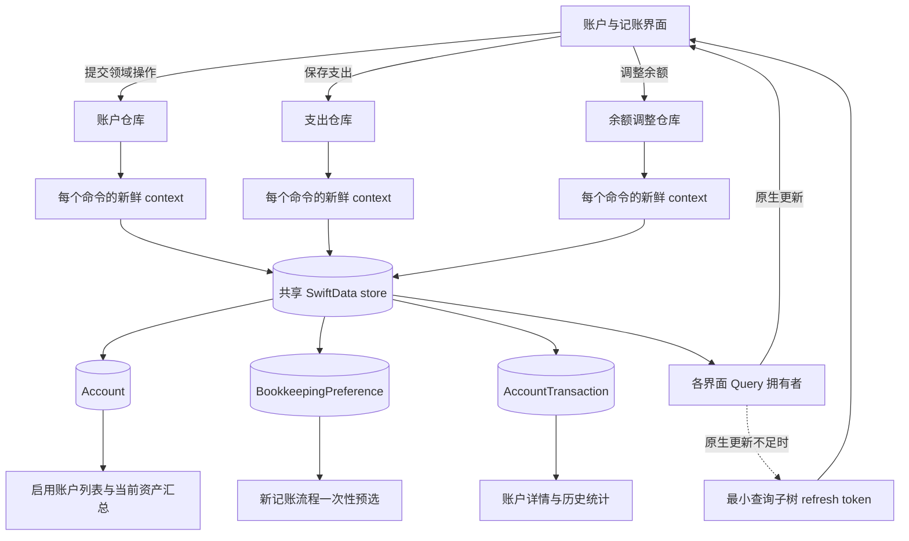
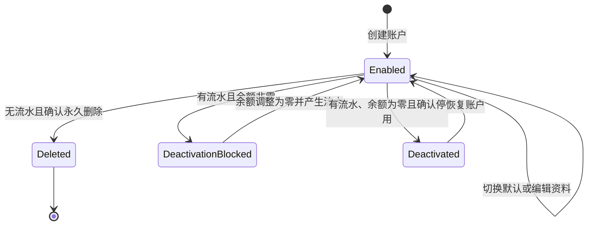
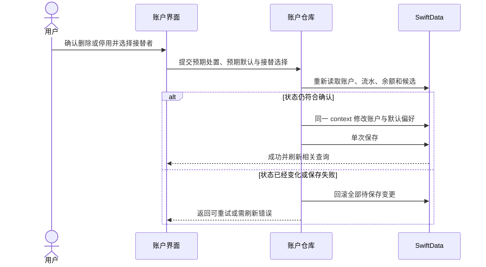
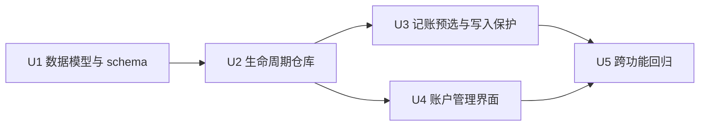

# Default Bookkeeping Account Implementation Plan

## Summary

为 yadoA 增加唯一的“默认记账账户”，让新建记账流程自动带入稳定的支付账户，并补齐账户永久删除、停用、恢复和默认接替的完整生命周期。方案沿用现有 SwiftData 独立 `ModelContext`、单次 `save()` 和失败 `rollback()` 模式，保留所有历史流水及统计上下文。

本期直接把开发期 schema 升级到 V4，不建设 V3 → V4 历史迁移体系。停用账户详情保持只读，仅允许查看资料、历史和恢复；恢复后按账户类型重新开放原本支持的操作，未知类型仍不得记账或调整余额。

---

## Problem Frame

当前每笔记账必须绑定账户，但新记账流程不会自动选择常用账户，用户需要重复完成没有新增信息的选择。与此同时，现有账户只有创建和资料编辑，没有安全的退出机制；若直接删除已有流水的账户，历史账目的来源上下文会丢失。

默认账户与账户生命周期必须一起实现：无流水账户可以永久删除，有流水账户只能在余额归零后停用；默认账户被删除或停用时，要在同一次持久化操作中完成接替或进入无默认状态。完整产品行为以原始需求为准（see origin: `docs/brainstorms/2026-08-20-default-bookkeeping-account-requirements.md`）。

---

## Requirements

### Default definition and persistence

- R1. 系统在任意时刻最多存在一个有效默认记账账户，也允许没有默认账户；有效默认必须指向现存、启用且属于现金、借记卡、信用卡或虚拟账户的账户（origin R1-R5）。
- R2. 当前没有有效默认时，首次成功创建或恢复的合格支付账户自动填补默认；已有有效默认时不得被新建或恢复操作覆盖（origin R6-R10）。
- R3. 默认值持久化在本地财务数据容器中，应用重启后保持不变，不依赖登录状态（origin R5）。
- R4. 用户可以从账户管理或合格账户详情切换默认；成功后所有相关页面立即刷新，失败时旧默认保持不变并允许重试（origin R18-R22）。

### Bookkeeping behavior

- R5. 每个全新的记账流程只在初始化时解析一次有效默认并自动选中；已经存在的草稿选择不因页面重建或默认值变化而被覆盖（origin R11）。
- R6. 用户可以为当前一笔选择任意启用且可记账的已知账户，单次切换、保存或取消均不改变全局默认（origin R12-R14）。
- R7. 记账保存边界重新验证所选账户仍存在、启用且可记账；失效选择保留草稿并阻止保存，不自动替换为新默认（origin R15）。

### Account lifecycle

- R8. 永久删除只适用于没有任何 `AccountTransaction` 的账户；任意餐饮、余额调整或未来账户流水都会把退出方式固定为停用（origin R23-R24）。
- R9. 有历史的账户只有余额精确为零时才能停用；停用不修改账户资料、历史流水及流水的 `accountID`（origin R25-R26）。
- R10. 停用账户退出普通账户列表、当前资产汇总、默认候选和新记账选择器，并在独立入口中以只读详情保留资料和历史（origin R27-R28）。
- R11. 恢复账户不改写历史；恢复后重新获得资料编辑能力，并按账户类型恢复原本支持的记账和余额调整能力，再按 R2 决定是否自动成为默认（origin R9-R10, R29）。
- R12. 删除或停用有效默认账户时，有其他合格候选必须由用户选择接替者；没有候选必须确认操作后无默认，账户处置与默认变化一起成功或一起回滚（origin R30-R33）。
- R13. 无流水但余额非零的账户仍可永久删除，确认信息必须说明账户名称、不可恢复性和对当前资产汇总的影响（origin R34）。

### Presentation and quality

- R14. 普通账户列表和详情用可本地化、非纯颜色的“默认”状态表示唯一默认，并让 VoiceOver 同时播报账户名称与默认状态（origin R16-R17, R20）。
- R15. 所有生命周期确认都在提交时重新读取目标账户、流水、余额、当前默认和接替候选；过期确认不得静默改变操作类型或覆盖更新后的默认值。
- R16. 停用账户的过去流水继续进入账户详情、首页和图表统计；普通账户列表、当前资产汇总、默认候选和新记账选择器排除停用账户（origin R24, R26-R28）。
- R17. 新增文案提供简体中文和英文，并覆盖浅色、深色、动态字体、VoiceOver 与 iOS 18；本期不引入无降级分支的高版本 API（origin R35-R37）。

---

## Scope Boundaries

### Included

- 唯一全局默认记账账户的自动建立、手动切换、持久化和无效指针安全降级。
- 新记账流程的一次性默认预选，以及支出和余额调整保存边界的停用账户校验。
- 无流水永久删除、有流水且零余额停用、停用账户恢复、默认接替和无默认确认。
- 启用账户与停用账户的分区展示、只读停用详情、历史统计保留和跨上下文刷新。
- 开发期 schema V4、内存与文件容器重开验证、中英文和辅助功能覆盖。

### Excluded

- 无账户记账、账户删除后把历史流水改为“无账户”，或连同账户永久删除全部历史流水。
- 最近使用账户自动覆盖默认，或按支出、收入、转账场景维护多个默认。
- 在 App 全局设置中增加重复的默认账户入口。
- 修改账户类型、币种体系、流水模型分类或把现有 UUID 软关联重构为 SwiftData relationship。
- 为 V3 开发期数据建设 `VersionedSchema`、`SchemaMigrationPlan` 或历史文件迁移 fixture；不兼容的开发数据允许手动清理重建。
- 停用账户的资料编辑和余额调整；必须先恢复账户。

---

## Key Technical Decisions

- KTD1. **使用独立偏好模型保存默认 UUID：** 新增固定 singleton ID 的 `BookkeepingPreference`，只保存 `defaultAccountID: UUID?`；不用每个 `Account.isDefault`，避免多布尔字段产生双默认或部分切换状态。
- KTD2. **默认引用继续使用 UUID 软关联：** 与现有 `AccountTransaction.accountID` 保持一致，不扩大为 SwiftData relationship。纯读取只查询 canonical singleton ID，并区分偏好缺失、明确无默认、有效默认和失效指针；读取不写库，只有创建、恢复、切换或账户处置命令才规范化无效状态。
- KTD3. **以可空停用时间表达账户状态：** `Account.deactivatedAt == nil` 表示启用，非空表示停用；不同时保存 `isActive`，避免两个字段互相矛盾。停用和恢复不修改表示资料编辑时间的 `updatedAt`。
- KTD4. **直接升级开发期 schema：** 把容器更新到 V4 并保持生产文件容器初始化失败时保留文件、阻断启动和允许重试；基于“没有存量用户”的确认，不建设历史 schema 迁移链。
- KTD5. **每个命令使用新鲜 context：** 各 repository 持有 `ModelContainer`，每次创建、编辑、记账、余额调整、默认切换、删除、停用或恢复命令都新建并释放关闭 autosave 的 `ModelContext`，避免长期 context 返回已注册的旧对象。命令按 UUID 读取、校验并只保存一次，错误统一 rollback。
- KTD6. **所有账户写入共享同步串行域：** 账户生命周期与全部 `AccountTransaction` 写入继续在 `@MainActor` 上同步完成，最终校验到 `save()` 之间不得 `await` 或跳出隔离域；UUID 软关联下的“无流水检查后删除”依赖这一应用内互斥约束。未来引入后台 writer 前必须先建设统一写协调器。
- KTD7. **预检只服务界面，提交时重新判定：** 删除或停用弹窗显示前可以生成处置建议，但最终命令携带预期处置与预期默认，仓库重新检查流水、余额和候选状态；状态漂移返回可区分的领域错误，不把删除静默降级为停用。
- KTD8. **区分默认资格和记账资格：** 默认资格仅覆盖四类启用支付账户；单笔记账仍允许其他启用、已知且受支持的账户。未知类型在两个入口都安全排除。
- KTD9. **记账使用一次性默认快照：** 默认只填充尚未初始化且没有显式账户选择的新草稿；当前流程之后发生的默认切换不覆盖用户选择，所选账户失效时保留草稿并要求重新选择。
- KTD10. **停用只改变日常可用性：** 当前列表、资产汇总和写入入口过滤停用账户；账户详情及 Home/Charts 继续直接按稳定 UUID 或流水事实读取历史，不把停用状态加入历史聚合条件。
- KTD11. **先验证原生查询刷新，再使用最小局部兜底：** 逐个验证 iOS 18 下同一 `ModelContainer` 的跨 context 保存能否驱动账户列表、详情、管理页和选择器的 `@Query` 更新；默认依赖原生观察，仅对被测试证明无法及时更新的最小查询子树沿用 `AccountDetailView` 的局部 refresh token，不引入应用级失效总线。
- KTD12. **跨 context 只传稳定值：** 界面、预检结果和 repository 命令只传 UUID 与值类型快照，不传 SwiftData 模型实例；删除成功先退出详情，再刷新上级查询，停用与恢复后按 UUID 重取。

---

## High-Level Technical Design

以下图示用于约束职责和状态，不规定具体方法签名。

### Component and data flow

### Account lifecycle

### Atomic removal sequence

---

## Implementation Units

### U1. Persist default preference and account activation state

- **Goal:** 建立默认账户与停用状态的持久化基础，并将所有默认资格判断收敛为可测试的领域规则。
- **Files:**
  - `yadoA/Models/AccountType.swift`
  - `yadoA/Models/Account.swift`
  - `yadoA/Models/BookkeepingPreference.swift` (new)
  - `yadoA/Persistence/AccountDataContainer.swift`
  - `yadoA/Features/App/AppTabView.swift`
  - `yadoA/Features/Accounts/AccountCreationView.swift`
  - `yadoA/Features/Accounts/AccountListView.swift`
  - `yadoA/Features/Accounts/AccountDetailView.swift`
  - `yadoA/Features/Accounts/AccountEditView.swift`
  - `yadoA/Features/Home/HomeView.swift`
  - `yadoA/Features/Charts/ChartView.swift`
  - `yadoATests/AccountModelTests.swift`
  - `yadoATests/AccountPersistenceTests.swift`
  - `yadoATests/AccountTransactionModelTests.swift`
- **Approach:** 为账户类型增加纯粹的默认资格判断；为账户增加可空 `deactivatedAt` 及派生启用状态；新增固定 ID 的单例偏好模型。生产、内存与全部 SwiftData-backed Preview 容器使用同一 V4 schema；保持现有文件容器失败保护，不加入迁移计划或改变现有 store URL。
- **Patterns:** 沿用 `Account.id` 和 `AccountTransaction.accountID` 的稳定 UUID 模式，以及 `AccountDataContainer` 对生产文件存储与测试内存存储的显式区分。
- **Test scenarios:**
  1. 现金、借记卡、信用卡、虚拟账户具备默认资格；投资、负债、应收、自定义资产和未知类型不具备资格。
  2. 新账户默认启用，设置 `deactivatedAt` 后变为停用，恢复为 `nil` 后重新启用；停用和恢复不改变 `updatedAt`。
  3. singleton 偏好可以保存一个默认 UUID 或 `nil`，重复读取不会创建多条设置记录。
  4. V4 schema、生产配置、内存配置和 Preview 都注册 `Account`、`AccountTransaction` 与 `BookkeepingPreference`，配置名同步到 V4。
  5. V4 内存容器和文件容器都能保存并重开账户、流水、停用状态和默认 UUID。
  6. 文件容器初始化失败继续保留原文件并阻断启动，不删除存储、不降级到内存库，也不通过更换 URL 静默创建另一份 store。
- **Verification:** 模型、容器重开和现有账户持久化测试通过；schema 版本、Preview 和测试容器的模型集合一致。
- **Dependencies:** 无。
- **Covers:** R1-R3, R17; origin F1, F3, F6; AE1, AE2, AE8.

### U2. Enforce atomic default and account lifecycle operations

- **Goal:** 让创建、默认切换、删除、停用、恢复和默认接替共享一个可重试、无部分状态的仓库边界。
- **Files:**
  - `yadoA/Persistence/LocalAccountRepository.swift`
  - `yadoATests/AccountPersistenceTests.swift`
  - `yadoATests/DefaultBookkeepingAccountPersistenceTests.swift` (new)
  - `yadoATests/AccountLifecyclePersistenceTests.swift` (new)
- **Approach:** 扩展 repository，使其持有容器并为每个命令创建新鲜 context，按 UUID 读取最新对象，集中解析 canonical 默认、统计目标账户全部流水、检查余额和候选。创建与恢复可在无有效默认时填补 singleton；删除或停用当前默认必须同时写入接替 UUID 或经确认清空。资料编辑也在最终边界拒绝停用账户。
- **Patterns:** 复用 `persistChanges`、`beforeSave` 故障注入、单次 `save()` 和统一 `rollback()`；保持同步 `@MainActor` 串行且校验到保存之间不挂起，不从 View 直接修改 `@Query` 模型。
- **Test scenarios:**
  1. 首个非支付账户创建后无默认，随后首个合格账户成为默认；已有默认时新账户不覆盖。
  2. 手动切换只接受启用且合格账户；无效候选或注入保存失败时旧默认保持不变。
  3. 无流水账户可永久删除；餐饮、余额调整或任意其他 `AccountTransaction` 都阻止永久删除并要求停用。
  4. 有历史且非零余额阻止停用；零余额允许停用并保留账户与全部流水。
  5. 删除非默认账户不改变默认；删除或停用默认时，接替与处置一起提交，没有候选时只有携带无默认确认才允许继续。
  6. 无流水非零账户可以删除；先通过余额调整清零后因产生流水只能进入停用路径。
  7. 恢复合格账户在无有效默认时自动成为默认，已有默认时不覆盖；恢复非合格账户不改变默认。
  8. 无效默认 UUID 在读取中视为无默认，创建或恢复合格账户时在同一次保存中修复。
  9. 非 canonical 偏好记录不参与解析；重复写入和文件重开后 canonical 偏好仍只有一条确定记录。
  10. 编辑 Sheet 打开后账户被停用时，旧草稿提交失败，资料、`updatedAt` 和停用状态不变；恢复后可以再次编辑。
  11. 另一个 context 先新增流水、改变余额或切换默认后，生命周期命令使用新鲜 context 看到最新状态并拒绝过期处置。
  12. 确认期间候选失效或默认被切换时，旧命令失败并要求刷新，不静默改用其他处置。
  13. 接替加删除、接替加停用、恢复加自动默认在故障注入下全部回滚；文件重开后仍没有半完成状态。
- **Verification:** 新生命周期持久化测试覆盖成功、状态漂移、故障回滚和文件重开；现有创建与编辑持久化行为保持通过。
- **Dependencies:** U1。
- **Covers:** R1-R4, R8-R13, R15; origin F1, F3-F6; AE1, AE2, AE4-AE6, AE8.

### U3. Apply one-time default selection and write-boundary safety

- **Goal:** 让新记账流程获得便利的默认预选，同时保证停用或过期账户永远不能绕过保存边界。
- **Files:**
  - `yadoA/Features/Expenses/DiningExpenseEntryFlow.swift`
  - `yadoA/Features/Expenses/DiningExpenseEntryView.swift`
  - `yadoA/Features/Expenses/ExpenseAccountSelectionView.swift`
  - `yadoA/Persistence/LocalExpenseRepository.swift`
  - `yadoA/Persistence/LocalBalanceAdjustmentRepository.swift`
  - `yadoATests/DiningExpenseEntryFlowTests.swift` (new)
  - `yadoATests/DiningExpensePersistenceTests.swift`
  - `yadoATests/BalanceAdjustmentPersistenceTests.swift`
- **Approach:** 页面从持久化偏好解析值类型默认快照，并只在 flow 尚未初始化时注入一次；flow 不直接访问 SwiftData。选择器仅展示启用且可记账账户；当前选择失效时保留 UUID 和其他草稿内容，显示不可用状态并要求重选。支出与余额调整 repository 改为每个命令使用新鲜 context，并在最终保存前拒绝停用或未知账户。
- **Patterns:** 保持 `DiningExpenseEntryFlow` 的草稿所有权、失败保留与保存防重复；继续使用独立 context 原子插入流水并更新账户余额。
- **Test scenarios:**
  1. 有有效默认的新流程自动选中默认；无默认、无效 UUID 或默认账户停用时保持未选择。
  2. SwiftUI 初始化任务重复、页面重新出现或其他页面切换默认，都不覆盖当前草稿的手动选择。
  3. 用户为当前一笔切换到合格或非支付的启用账户并保存后，全局默认不变；下一次新流程仍选择全局默认。
  4. 当前页打开后所选账户被停用或删除时，金额、日期和备注保留，保存被禁用且不自动换成新默认。
  5. 失效账户随后以同一 UUID 恢复时，当前草稿重新成为有效选择，其他字段不变。
  6. 界面校验后账户被停用时，支出 repository 在提交边界拒绝保存，草稿保留且账户余额和流水均不变化。
  7. 停用账户的余额调整被 repository 拒绝；启用账户原有支出和余额调整成功、失败回滚行为保持不变。
  8. 支出 repository 曾读取账户后，其他命令调整余额；下一笔支出基于最新余额计算，不覆盖调整结果。
  9. 跨 context 变化触发选择器重新查询时，当前草稿只更新账户可用性，不重新应用全局默认。
- **Verification:** flow 单元测试和两个财务写入持久化测试通过，默认变化不会污染单笔草稿或全局偏好。
- **Dependencies:** U2。
- **Covers:** R5-R7, R10-R11, R15; origin F2, F5-F6; AE3, AE6-AE8.

### U4. Build account management and deactivated-account UI

- **Goal:** 在账户区域集中提供默认状态、默认切换、删除/停用确认、已停用账户查看和恢复入口。
- **Files:**
  - `yadoA/Features/Accounts/AccountListView.swift`
  - `yadoA/Features/Accounts/AccountDetailView.swift`
  - `yadoA/Features/Accounts/AccountEditView.swift`
  - `yadoA/Features/Accounts/AccountManagementView.swift` (new)
  - `yadoA/Features/Accounts/DefaultAccountSelectionView.swift` (new)
  - `yadoA/Features/Accounts/DeactivatedAccountListView.swift` (new)
  - `yadoA/Features/Accounts/AccountLifecycleFlow.swift` (new)
  - `yadoA/Localizable.xcstrings`
  - `yadoATests/AccountListPresentationTests.swift`
  - `yadoATests/AccountDetailPresentationTests.swift`
  - `yadoATests/AccountLifecycleFlowTests.swift` (new)
  - `yadoAUITests/AccountListFlowUITests.swift`
- **Approach:** 普通列表只投影启用账户并展示默认 badge，资产汇总也只聚合启用账户。账户管理页是列表工具栏进入的二级中心，只展示当前默认、候选选择和停用入口，不复制普通列表。新增可测试 flow 管理预检、接替选择、无默认确认、提交禁用、状态漂移反馈和失败重试；详情把账户转换为值类型 edit seed 后再打开编辑 Sheet，避免跨界面传递 SwiftData 模型实例。
- **Patterns:** 复用现有 `AccountRowPresentation`、`AccountDetailPresentation`、原生 confirmation dialog/sheet、语义色、稳定 accessibility identifier 和各业务 flow 的 loading 防重复模式。先用 iOS 18 characterization test 验证原生 `@Query` 更新，只为失败的最小查询子树增加局部 refresh token。
- **Test scenarios:**
  1. 启用列表与资产汇总排除停用账户，默认账户显示文字和图形层面可识别的“默认”状态。
  2. VoiceOver 标签同时包含账户名称和默认状态；中英文键数量与内容一致，深浅色和动态字体下不依赖颜色传达状态。
  3. 合格非默认详情提供“设为默认”，当前默认详情只展示状态；非合格账户没有默认操作。
  4. 无流水账户显示永久删除确认并包含名称、不可恢复性和非零余额影响；有流水账户只提供停用路径。
  5. 非零历史账户显示先调整到零的阻止状态；零余额历史账户可以进入停用确认。
  6. 移除当前默认且有候选时必须选择接替者；无候选时必须确认无默认；保存失败保留当前真实状态并提供重试。
  7. 已停用入口可查看资料和历史并恢复，停用详情不显示编辑和余额调整；恢复后按账户类型重新显示原本支持的操作，未知类型仍不开放记账和余额调整。
  8. 没有启用账户但存在停用账户时，空状态同时保留创建账户和已停用账户入口，用户可以找到并恢复最后一个停用账户。
  9. 存在启用账户但没有合格默认候选时，管理页解释默认资格并提供创建账户操作；存在停用账户时仍保留已停用入口。
  10. 生命周期 flow 在 saving 时阻止重复提交；瞬时保存失败保留确认内容，状态漂移则关闭旧确认、显示“账户状态已变化，请重新确认”的本地化反馈并刷新，VoiceOver 同步播报。
  11. 跨 context 切换、停用、删除或恢复成功后，账户列表、详情和管理页通过原生查询或最小局部 token 立即刷新；rollback 不触发局部刷新。
  12. 删除后 VoiceOver 焦点落到账户列表标题或相邻账户；停用、恢复和默认切换后聚焦并播报新状态，失败时聚焦错误反馈。
  13. 默认/停用标记、长账户名称、警告正文和按钮支持多行且无固定高度；确认与候选界面在最大辅助功能字号和英文长文案下可滚动且主要操作可触达。
- **Verification:** 展示层单元测试和账户 UI 流程测试通过；所有新文案通过 String Catalog 编译与中英文覆盖检查。
- **Dependencies:** U2。
- **Covers:** R4, R10-R17; origin F3-F6; AE4-AE8.

### U5. Protect historical reporting across account lifecycle

- **Goal:** 用跨功能回归证明停用与恢复不会改写账户详情、Home 或 Charts 的历史结果。
- **Files:**
  - `yadoA/Support/HomeUITestFixture.swift`
  - `yadoATests/HomeOverviewPresentationTests.swift`
  - `yadoATests/ChartOverviewPresentationTests.swift`
  - `yadoATests/AccountTransactionHistoryPresentationTests.swift`
  - `yadoAUITests/HomeOverviewFlowUITests.swift`
- **Approach:** 扩充稳定 fixture，构造有餐饮和余额调整历史的启用/停用账户。保持 Home/Charts 直接查询有效流水，不加入账户启用状态过滤；本单元只验证历史展示边界，完整生命周期、草稿和辅助功能流程分别由 U2-U4 覆盖。
- **Patterns:** 沿用 `validatedPayload()`、`TransactionDay.date`、现有图表专用 descriptor 和稳定 accessibility identifier；测试分别报告静态/构建、模拟器 XCTest 与人工视觉边界。
- **Test scenarios:**
  1. 一个过去月份有餐饮支出的零余额账户停用前后，Home 和 Charts 的历史金额、日期分桶与合计完全一致。
  2. 停用账户详情仍按 UUID 显示原名称和全部餐饮、余额调整历史，普通列表和新记账选择器不再显示该账户。
  3. fixture 同时包含餐饮和用于归零的余额调整时，停用前后餐饮金额、业务日分桶、交易数量和详情排序保持一致。
  4. 一条包含停用、历史查看和恢复的端到端 smoke path 在 iOS 18 上完成后，过去月份结果仍不变。
- **Verification:** Home、Charts、账户历史单元测试和端到端账户流程通过；构建证据与模拟器/人工交互证据分开记录。
- **Dependencies:** U3、U4。
- **Covers:** R10, R16; origin F5-F6; AE7.

---

## Dependency Order

1. U1 先固定模型、资格规则和容器 schema，给后续写入与查询提供稳定契约。
2. U2 建立原子领域操作，U3 与 U4 只能调用这一边界，不能在界面层复制不变量。
3. U3 和 U4 可以在 U2 完成后并行推进；U5 最后验证停用与恢复不会改变跨模块历史结果。

---

## System-Wide Impact

- **Data lifecycle:** `Account` 从只有资料和余额扩展为启用/停用生命周期；停用是可恢复状态，永久删除仍只针对无历史账户。
- **Cardinality:** `BookkeepingPreference` 固定为单例约定，`defaultAccountID` 最多指向一个账户；仓库是创建和修复该实体的唯一入口。
- **Historical integrity:** `AccountTransaction.accountID` 不变，停用不解除关联；Home/Charts 仍以流水事实为统计来源。
- **Write safety:** 所有账户生命周期操作与默认变化共享独立 context 的单次提交；支出和余额调整在最终写入边界拒绝停用账户。
- **Write isolation:** 每个命令使用新鲜 context，但所有账户与流水写入保持同步 `@MainActor` 串行；跨 repository 的最终校验到保存之间不得挂起。fixture、导入工具和未来 writer 也必须进入同一边界。
- **Read surfaces:** 当前资产相关界面过滤停用账户，历史相关界面保留停用账户；必须避免复用同一个“全部账户”查询结果覆盖两种语义。
- **Ordering:** 默认切换、停用和恢复不修改 `updatedAt`，不会因为生命周期操作改变既有资料更新时间排序。
- **Model identity:** 跨 context 只传 UUID 和值类型快照；删除成功的详情立即退出，停用或恢复后的详情按 UUID 重取。
- **Refresh:** 默认依赖同一容器下的原生 `@Query` 更新；iOS 18 characterization test 逐面验证，只对不足的最小查询子树使用局部 token。任何局部刷新都不能重建记账 flow 或重新应用默认。

---

## Risks and Mitigations

| Risk | Impact | Mitigation |
|---|---|---|
| UUID 软关联没有数据库外键 | 新增流水类型若绕过统一检查，可能错误删除有历史账户 | 永久删除统一按 `accountID` 查询全部 `AccountTransaction`；未来账户绑定流水必须复用同一写边界 |
| 长期 context 缓存旧模型 | 提交时重新 fetch 仍可能基于旧余额、启停或默认状态写入 | 所有写 repository 改为每个命令创建新鲜 context，并增加跨 context 先修改再提交的测试 |
| 跨 repository 检查—保存竞态 | 无流水检查后若并发插入流水，可能产生孤儿账户引用 | 保持同步 `@MainActor` 串行且校验到保存之间不挂起；后台 writer 上线前重建协调边界 |
| 弹窗确认与最终提交之间状态变化 | 可能删除错误账户、留下无默认或覆盖新默认 | 提交时重新读取并携带预期处置/默认；状态变化返回需刷新错误 |
| 跨 context 观察更新延迟 | 列表、详情和选择器短暂显示旧默认或旧启停状态 | 在 iOS 18 逐面验证原生 `@Query`；仅对被证明不足的最小查询子树增加局部 refresh token |
| 过滤停用账户被误用到历史统计 | 停用后过去账目从首页或图表消失 | 当前资产与历史查询分开；增加停用前后金额不变的回归测试 |
| 开发期 schema 直接升级不兼容旧本地文件 | 开发设备可能需要清理旧数据 | 文档明确没有存量用户；允许手动清理开发 store，生产 bootstrap 仍不自动删库或降级 |
| 单例偏好被误插入多条 | 默认解析出现不确定性 | 固定唯一 ID、fetch-or-create，并把偏好写入限制在 repository |
| `deactivatedAt` 查询与计算属性语义漂移 | 停用账户可能进入日常入口 | 持久查询直接使用可空字段，派生属性只用于展示和领域判断，并覆盖模型测试 |

---

## Acceptance Examples

| ID | Scenario | Expected Result |
|---|---|---|
| AE1 | 没有账户时先创建投资账户，再创建现金账户 | 投资账户创建后无默认；现金账户成功后自动成为默认 |
| AE2 | 已有默认现金账户时创建信用卡 | 现金账户继续默认，信用卡作为普通启用账户 |
| AE3 | 默认借记卡存在，本笔改选信用卡并保存 | 流水绑定信用卡；下次新记账仍预选借记卡 |
| AE4 | 删除无流水的默认借记卡，另有合格现金账户 | 必须选现金作为接替者；删除和接替一起成功或回滚 |
| AE5 | 删除唯一合格默认账户，其他账户均不合格 | 确认无默认后删除成功；后续新记账不自动选择账户 |
| AE6 | 有流水账户尝试退出日常使用 | 不提供永久删除；非零先阻止，归零后允许停用并保留历史 |
| AE7 | 停用有过去支出的零余额账户 | 历史统计与详情不变，日常列表和新记账选择器不再出现 |
| AE8 | 无默认时恢复已停用信用卡 | 信用卡恢复并自动成为默认，历史流水不变 |

---

## Verification Strategy

1. **Pure model tests:** 验证八类账户资格、未知类型、启停派生状态、canonical singleton 默认解析和领域错误映射。
2. **In-memory persistence tests:** 覆盖创建、切换、删除、停用、恢复、接替、无效默认修复、竞态重新检查、防重复和故障 rollback。
3. **File-backed reopen tests:** 保存完整生命周期及故障回滚后释放并重开容器，验证默认、启停、余额和流水；本期只验证全新 V4 建库与 V4 重开，不把它表述为 V3 迁移成功。
4. **Financial write regressions:** 验证资料编辑、支出与余额调整都拒绝停用账户；跨 repository 连续写使用最新余额、流水和默认状态，同时保持原有金额精度、原子余额更新和失败草稿行为。
5. **Presentation regressions:** 逐面验证 iOS 18 原生 `@Query` 跨 context 更新；只有失败的最小子树使用局部 token。验证启用列表、当前汇总、默认 badge、停用只读详情和历史 Home/Charts 边界。
6. **Localization and accessibility:** 编译 String Catalog，检查中英文键完整性、稳定 accessibility identifiers、VoiceOver、深浅色和动态字体。
7. **iOS 18 validation:** 先完成相关单元/UI test target 的构建，再在可用 iOS 18 模拟器执行 XCTest/UI 主路径；无法获得模拟器运行时不能被报告为测试通过。
8. **Repository hygiene:** 检查 Swift 格式、String Catalog、schema/Preview 一致性和差异；不在规划阶段预设具体命令组合。

---

## Sources and Research

- `docs/brainstorms/2026-08-20-default-bookkeeping-account-requirements.md` — 产品行为、关键流程、验收例和范围来源。
- `docs/plans/2026-08-12-001-feat-local-account-list-plan.md` — 文件存储、稳定 UUID、生产初始化保护和账户列表模式。
- `docs/plans/2026-08-13-001-feat-account-bound-dining-expense-plan.md` — 账户绑定记账、开发期 schema 直升和草稿失败保留模式。
- `docs/plans/2026-08-13-002-feat-account-balance-adjustment-plan.md` — 独立 context、账户重新读取、单次保存和 rollback 模式。
- `docs/plans/2026-08-13-003-feat-home-overview-plan.md` — 直接按流水聚合历史统计的现有边界。
- `yadoA/Persistence/LocalAccountRepository.swift` — 账户创建/资料编辑的 repository 与故障注入入口。
- `yadoA/Persistence/LocalExpenseRepository.swift` — 流水与账户余额的原子写入模式。
- `yadoA/Persistence/LocalBalanceAdjustmentRepository.swift` — 余额调整与流水的原子写入模式。
- `yadoA/Features/Accounts/AccountDetailView.swift` — 原生查询不足时可复用的最小局部 refresh token 模式。
- [Apple: ModelContext](https://developer.apple.com/documentation/swiftdata/modelcontext) — 显式保存、rollback 与 context 变更边界。
- [Apple: FetchDescriptor](https://developer.apple.com/documentation/swiftdata/fetchdescriptor) — 带谓词读取和历史存在性检查能力。
- [Apple: Model your schema with SwiftData](https://developer.apple.com/videos/play/wwdc2023/10195/) — schema 变化与迁移选择；本期根据无存量用户确认采用开发期直接升级。
