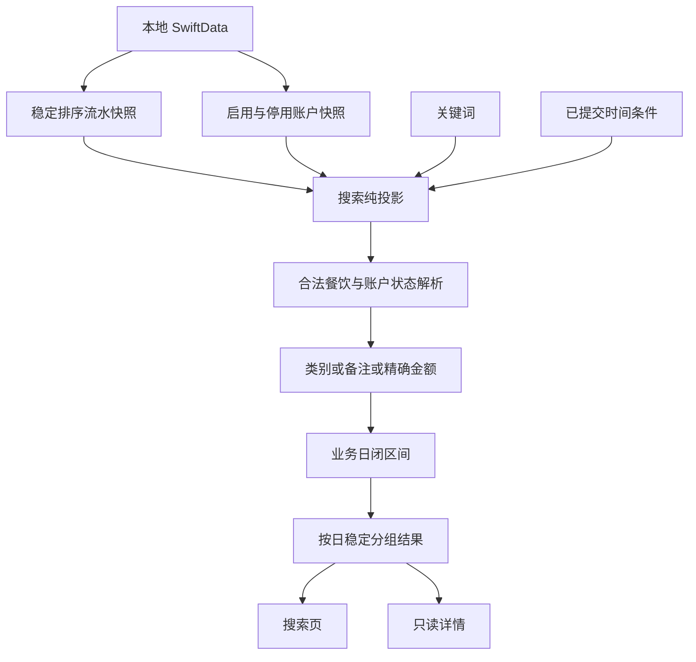
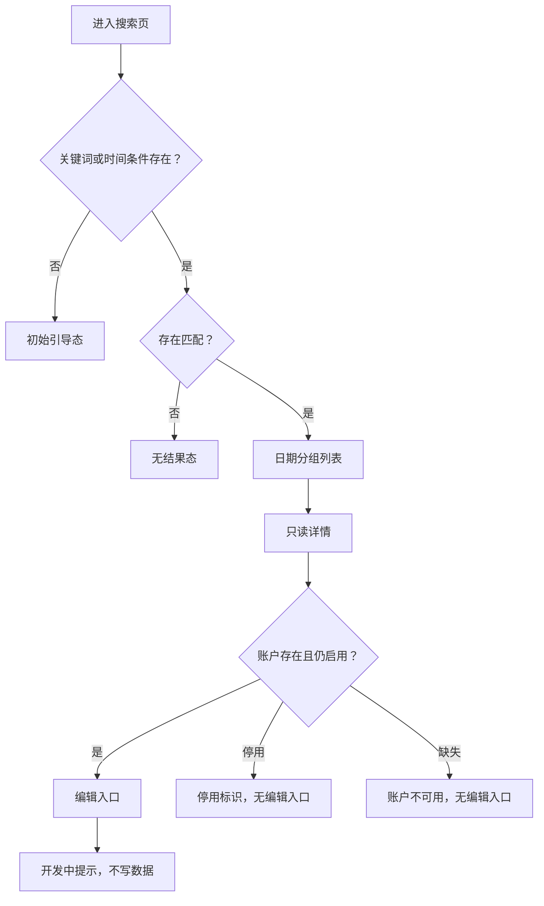

# feat: Add bookkeeping search

## Summary

在现有首页记账投影之上增加只读搜索链路：本地 SwiftData 提供稳定的全量快照，纯 Swift 投影负责类别、精确金额、备注和业务日筛选，SwiftUI 页面负责实时输入、时间条件、结果导航与详情展示。新功能不使用遗留标题字段，不修改持久化 schema，也不接入记账写入流程。

---

## Problem Frame

当前首页只能按月份浏览餐饮支出，账户详情只能按单个账户查看流水。用户记得备注、类别或金额时，缺少跨月份、跨账户定位某笔记账的入口；余额调整又与用户主动记账共用同一流水模型，搜索若重新定义数据范围，容易与首页出现不一致。

---

## Requirements

以下要求承接源文档 `docs/brainstorms/2026-08-26-bookkeeping-search-requirements.md`。

**Entry and search**

- R1. 首页右上角提供可访问的搜索按钮，并在现有导航栈内打开独立搜索页。
- R2. 一个搜索词同时匹配本地化类别、精确金额和备注，字段之间采用 OR 关系。
- R3. 类别与备注支持对清理后关键词的用户友好包含匹配。
- R4. 只有完整关键词可按当前语言环境解析为合法金额时，才增加 `Decimal` 精确相等匹配。
- R5. 搜索词变化后实时重算结果，不要求提交键盘搜索动作。
- R6. 空关键词与不限时间同时存在时展示初始引导态，不查询式展示全部记账。

**Time filter**

- R7. 时间条件提供“不限时间”和自定义起止日期。
- R8. 自定义日期以当前时区的公历业务日形成闭区间，包含起止当天。
- R9. 时间条件确认后立即与当前关键词共同生效。
- R10. 空关键词配合有效时间范围时，展示范围内的全部目标记账。

**Result scope and presentation**

- R11. 搜索与首页使用同一有效记账范围，首版只包含合法餐饮支出。
- R12. 余额调整、未知类型、损坏载荷和无效业务日不进入结果；无法关联账户的合法餐饮流水以“账户不可用”只读降级。
- R13. 启用账户和已停用账户的历史记账均可搜索，不增加账户筛选。
- R14. 结果按业务日倒序分组，同日按保存时间倒序、稳定 UUID 升序排列。
- R15. 结果行展示类别、金额、日期、账户和可选备注；启用账户不重复显示状态，停用或不可用账户额外显示异常状态；不展示遗留标题。
- R16. 初始引导态与搜索后无结果态使用不同的本地化反馈。

**Detail and future edit entry**

- R17. 点击结果通过稳定流水标识进入只读详情。
- R18. 详情展示类别、备注、金额、业务日和所属账户，不展示遗留标题。
- R19. 启用账户的详情右上角显示“编辑”入口，为后续完整编辑预留位置。
- R20. 本期点击“编辑”只显示功能开发中的轻量提示，不修改数据。
- R21. 已停用账户的历史详情显示停用状态，且不展示编辑入口。

---

## Key Technical Decisions

- KTD1. **复用首页的有效记账语义：** 原始查询保持跨账户稳定排序，搜索投影继续以合法 `.diningExpense` 和有效业务日作为唯一纳入条件，避免首页与搜索各自解释流水类型。
- KTD2. **查询与匹配分层：** SwiftData 负责取得流水与全部账户快照，类型校验、金额解析和组合筛选放在纯 Swift 投影中；投影先过滤再格式化匹配行，首版不引入全文索引或新仓储层。
- KTD3. **文本与金额同时参与 OR 匹配：** 类别匹配当前语言下的真实分类名称，备注使用不区分大小写和变音符的包含匹配；完整关键词可解析为金额时，再以 `Decimal ==` 增加金额分支，禁止比较格式化货币字符串或 `Double`。
- KTD4. **时间只比较业务日：** 日期选择转换为 `YYYYMMDD` 后执行闭区间判断，不使用 `savedAt` 或日首、日末时间戳，避免时区和夏令时改变用户选择的自然日。
- KTD5. **账户使用 UUID 快照关联：** 结果与详情通过 `accountID` 关联包含停用账户的账户快照；孤立流水保留首页可见性并显示本地化“账户不可用”，同时保持只读。导航只传稳定流水 UUID，不跨页面持有 SwiftData 模型实例。
- KTD6. **页面状态由条件派生：** 无关键词且不限时间为初始态；存在任一条件但没有匹配为无结果态；有效匹配渲染结果列表，避免用同一个空态掩盖查询是否已经发生。
- KTD7. **筛选先草拟后提交：** 时间筛选 Sheet 每次从已提交条件初始化；首次切换自定义时以当天作为起止日期。取消不改变已提交条件，反向范围禁用确认，切回不限后清空日期约束；搜索页持续显示已应用范围并提供明确清除路径。
- KTD8. **编辑入口不连接旧快速编辑：** 启用账户只显示开发中提示，停用账户完全隐藏入口；本期不复用现有标题/金额快速编辑，不产生跨 context 刷新或账户金额变更风险。
- KTD9. **标题视为遗留实现：** 新搜索、结果与详情不读取或展示 `title`；本期不迁移字段、不清理历史值，也不改变旧首页快速编辑，删除标题留给独立后续改造。
- KTD10. **先测量本地线性投影：** 以 10,000 笔流水和多账户快照建立搜索投影性能基线，目标是一次关键词更新在 100 ms 内完成；只有基线超标时才加入短防抖或把可表达条件下推到 SwiftData，不提前建设索引或分页。

---

## High-Level Technical Design

### Search data flow

### Search and detail states

---

## Implementation Units

### U1. Establish the searchable bookkeeping projection

- **Goal:** 建立与 SwiftUI 解耦的搜索条件、有效流水过滤、账户关联、匹配、日期分组和详情展示投影。
- **Requirements:** R2-R6, R8, R10-R18; F1-F2; AE1-AE4
- **Dependencies:** None
- **Files:**
  - Create `yadoA/Features/Search/BookkeepingSearchPresentation.swift`
  - Create `yadoATests/BookkeepingSearchPresentationTests.swift`
- **Approach:** 让描述符沿用首页的三层稳定排序；投影先校验业务日与 `.diningExpense`，再关联包含停用账户的账户快照。无法关联账户的合法流水保留并生成只读降级账户状态。清理关键词后，用本地化类别和备注做包含匹配；可解析金额同时做精确 `Decimal` 匹配。日期范围作为 AND 条件，过滤完成后才格式化命中行并分组。标题不参与任何输入、输出或匹配。
- **Execution note:** 先以纯投影测试锁定首页范围、OR/AND 语义和边界，再连接 SwiftUI。
- **Patterns to follow:** `HomeOverviewPresentation` 的 descriptor、合法餐饮过滤和排序；`AccountTransactionHistoryPresentation` 的金额/日期本地化；`TransactionDay` 的公历业务日；`AccountAmountParser` 的 locale-aware `Decimal` 解析。
- **Test scenarios:**
  1. Covers AE1. 备注“和朋友吃火锅”在关键词“火锅”下命中。
  2. 中文环境用“餐”命中餐饮类别，英文环境用“Din”命中 `Dining`；只命中遗留标题时不得返回。
  3. Covers AE2. ¥30.00、¥30.50、¥130.00 并存时，`30` 与 `30.00` 只返回 ¥30.00，`30.5` 只返回 ¥30.50。
  4. 逗号小数环境可精确解析 `30,50`；带货币符号、千分位或混合字符时不执行金额字符串包含匹配，但仍检查类别和备注。
  5. 同一流水同时命中类别、备注和金额时只出现一次；首尾空白被清理，纯空白配合不限时间返回初始态。
  6. Covers AE3. 空关键词配合日期范围返回闭区间内全部合法餐饮，包含起止日并排除相邻日。
  7. 关键词与时间同时存在时取交集；跨月、跨年和非 UTC 时区仍按 `transactionDay` 判断。
  8. Covers AE4. 余额调整即使备注或数值命中也排除；未知类型、损坏载荷和无效业务日同样排除。
  9. 启用和停用账户流水均命中并关联正确账户名；孤立流水显示“账户不可用”、保持只读且不崩溃。
  10. 多日结果按业务日倒序，同日按保存时间倒序，相同保存时间按 UUID 稳定排序。
  11. 10,000 笔代表性流水下，一次搜索投影在测试基准环境中稳定低于 100 ms；若不满足，实施时记录并采用最小的防抖或查询下推修正后复测。
- **Verification:** 纯投影测试能证明搜索范围与首页一致，所有匹配、日期、账户状态、排序和首版性能预算均无需 UI 才能验证。

### U2. Build the search page and time filter

- **Goal:** 提供原生实时搜索页、可提交的时间筛选、明确页面状态和首页导航入口。
- **Requirements:** R1, R5-R10, R13-R16; F1-F2; AE1-AE4
- **Dependencies:** U1
- **Files:**
  - Create `yadoA/Features/Search/BookkeepingSearchView.swift`
  - Create `yadoA/Features/Search/BookkeepingSearchTimeFilterView.swift`
  - Modify `yadoA/Features/Home/HomeView.swift`
  - Modify `yadoA/Support/HomeUITestFixture.swift`
  - Modify `yadoA/Localizable.xcstrings`
  - Create `yadoAUITests/BookkeepingSearchFlowUITests.swift`
- **Approach:** 搜索页在现有首页导航栈中打开，并同时观察流水和全部账户。系统搜索栏直接驱动关键词；筛选按钮打开带独立草稿的 Sheet，使用原生日期选择控件、取消和确认操作。已应用范围持续显示可读日期摘要，并可直接清除。列表渲染投影输出的日期组与结果行；结果行在辅助功能字号下改为纵向布局，优先保证类别、金额和账户可读，启用账户不重复显示状态，停用或不可用账户额外显示异常状态，备注允许换行。首页现有装饰性放大镜改为独立、至少 44pt、具备本地化标签和稳定标识的真实入口。
- **Patterns to follow:** `HomeView` 的现有 `NavigationStack`；`HomeMonthPickerView` 的 Sheet 草稿、取消与确认边界；`HomeOverviewList` 的日期分组、语义色和无障碍标识；`HomeUITestFixture` 的隔离内存夹具。
- **Test scenarios:**
  1. 首页搜索按钮具有独立可访问名称和标识，点击后进入搜索页，底部 Tab 数量不变。
  2. 首次进入显示引导态且不显示全部夹具数据；输入关键词后无需提交即可出现结果。
  3. 输入无匹配关键词后显示无结果态；清空关键词且时间不限时恢复引导态。
  4. 首次自定义以当天作为起止日期；重新打开 Sheet 恢复已提交模式与范围；取消不提交，反向范围确认不可用。
  5. 空关键词仅设置时间可返回范围内结果；切回不限时间后恢复引导态或现有关键词的全历史结果。
  6. 已应用范围在搜索页持续可见、可被 VoiceOver 读出，并能通过明确操作清除。
  7. 结果按日期分组，行内可辨认类别、金额、账户和备注；启用账户不重复显示状态，停用账户与孤立流水显示异常状态并继续出现在结果中。
  8. 余额调整与标题-only 命中不出现在 UI 结果中。
  9. 最大辅助功能字号下结果行纵向展开，关键信息不截断且整行仍可点击。
  10. 中英文文案齐全，VoiceOver 不依赖图标或颜色解释入口、筛选状态和空态。
- **Verification:** 单元与 UI 流程共同证明真实首页入口、实时输入、筛选提交、三种页面状态、历史账户结果和本地化交互在 iOS 18 路径成立。

### U3. Add read-only bookkeeping detail and future edit affordance

- **Goal:** 从搜索结果打开稳定、完整且区分账户生命周期的只读详情，并提供不写数据的未来编辑入口。
- **Requirements:** R17-R21; F3; AE5-AE6
- **Dependencies:** U1, U2
- **Files:**
  - Create `yadoA/Features/Search/BookkeepingTransactionDetailView.swift`
  - Create `yadoATests/BookkeepingTransactionDetailPresentationTests.swift`
  - Modify `yadoA/Features/Search/BookkeepingSearchView.swift`
  - Modify `yadoA/Localizable.xcstrings`
  - Modify `yadoAUITests/BookkeepingSearchFlowUITests.swift`
- **Approach:** 结果导航只传流水 UUID，详情以 UUID 定向解析当前流水并关联账户，复用 U1 的合法餐饮和格式化语义。页面展示类别、金额、业务日、账户状态和可选备注，不读取或展示标题。启用账户显示编辑按钮并触发本地化轻量提示；停用或缺失账户显示对应状态且不构造编辑入口。流水在导航期间缺失或失效时安全显示不可用状态，不降级到另一笔流水。
- **Patterns to follow:** `AccountDetailView` 的稳定 UUID 解析与生命周期状态展示；项目现有 `.alert`、本地化和 VoiceOver 反馈；账户详情的语义色与动态字体布局。
- **Test scenarios:**
  1. 点击结果后详情展示正确类别、金额、业务日、账户和备注，遗留标题即使有值也不出现。
  2. Covers AE5. 启用账户显示编辑按钮；点击后出现开发中提示，SwiftData 流水和账户金额均保持不变。
  3. Covers AE6. 停用账户历史显示停用状态，且不存在编辑按钮。
  4. 页面展示期间账户从启用变为停用后，详情收敛为停用状态并移除编辑入口。
  5. 流水在导航后无法解析时显示安全不可用状态；账户缺失时仍展示流水详情与“账户不可用”，两者均不崩溃、不展示其他记录。
  6. 中英文、浅色/深色、最大动态字体和 VoiceOver 下，详情字段、停用状态和开发中提示可理解。
- **Verification:** 详情投影测试与 UI 测试共同证明稳定导航、字段边界、账户生命周期分支和零写入编辑占位行为。

---

## Scope Boundaries

### In Scope

- 类别、精确金额、备注与自定义业务日范围的本地搜索。
- 首页入口、实时结果、日期分组、只读详情和账户生命周期差异。
- 搜索投影、日期筛选、详情分支、SwiftData 快照集成和关键 UI 流程测试。

### Deferred to Follow-Up Work

- 类别、备注、金额和时间的完整编辑流程，以及编辑后的账户金额一致性与搜索刷新。
- 删除 `AccountTransaction.title`、处理已有标题值、移除旧标题编辑并统一首页展示语义。

### Out of Scope

- 标签、收入/支出方向、账户筛选、模糊金额、金额区间和全文检索。
- 余额调整与其他账户维护流水的搜索。
- 独立搜索 Tab、参考产品视觉复刻、新第三方依赖和持久化 schema 变更。

---

## System-Wide Impact

- **Data lifecycle:** 搜索只读现有 `AccountTransaction` 与 `Account`，不新增字段、迁移、写入或后台索引。
- **Historical reporting:** 停用账户流水继续由交易事实决定可见性，不向搜索加入 `isActive` 过滤。
- **Navigation:** 搜索是首页现有导航栈中的二级页面，不改变三个一级 Tab 与默认首页。
- **Localization and accessibility:** 新文案加入 String Catalog 的英文与简体中文；所有图标操作、筛选状态、结果、空态和详情提供文字语义与稳定标识。
- **Compatibility:** 只使用 iOS 18 可用的原生搜索、导航、日期和列表能力；若实施时选择更高版本视觉 API，必须提供 iOS 18 等价分支。

---

## Risks and Dependencies

- **首页与搜索范围漂移：** 两处若分别判断合法餐饮，未来新增类别时可能不一致；投影应复用同一验证语义，并让孤立合法流水在两处都保持可见。
- **本地化匹配漂移：** 类别搜索依赖当前 locale，切换语言会改变可输入的类别词；测试必须显式注入中英文 locale。
- **Decimal 误解析：** 格式化字符串、`Double` 或部分数字包含都会破坏精确金额语义；金额分支只能依赖完整 locale-aware `Decimal` 解析。
- **日期边界错误：** 使用 `Date` 时间戳会在时区或夏令时边界漏数；筛选必须落到业务日整数。
- **历史账户关联：** 账户查询若只取启用账户会丢失历史结果；搜索账户快照必须包含停用账户，并为孤立流水提供只读降级。
- **实时投影成本：** 每次输入都可能扫描全量流水；实施先保持过滤早于格式化，并用 10,000 笔基线验证 100 ms 预算，超标时采用最小修正而不是直接引入索引系统。
- **String Catalog diff 噪声：** 修改本地化资源时保持语义最小差异，避免无关全文件重排。

---

## Acceptance Examples

- AE1. 输入备注中的子串后，目标餐饮记账实时出现。
- AE2. 输入 `30` 时只命中 ¥30.00，不命中 ¥30.50 或 ¥130.00。
- AE3. 空关键词配合自定义日期范围时，只显示包含起止日的范围内记账。
- AE4. 余额调整即使备注或数值命中也不进入搜索结果。
- AE5. 启用账户详情的编辑入口只显示开发中提示，不修改任何数据。
- AE6. 停用账户历史可搜索和查看，但详情没有编辑入口。

---

## Sources and Research

- `docs/brainstorms/2026-08-26-bookkeeping-search-requirements.md` 是产品行为、范围和验收来源。
- `yadoA/Features/Home/HomeOverviewPresentation.swift` 提供跨账户合法餐饮范围、业务日分组和稳定排序模式。
- `yadoA/Features/Home/HomeView.swift` 提供首页导航、现有装饰性搜索图标和列表交互上下文。
- `yadoA/Models/AccountTransaction.swift` 定义类型化流水、精确金额、业务日、备注与遗留标题字段。
- `yadoA/Models/TransactionDay.swift` 提供当前时区下公历业务日的统一编码与解析。
- `yadoA/Models/AccountAmountParser.swift` 提供区域化文本到精确 `Decimal` 的解析边界。
- `yadoA/Features/Accounts/AccountTransactionHistoryPresentation.swift` 提供流水金额、日期和备注的本地化展示模式。
- `yadoATests/HomeOverviewPresentationTests.swift`、`yadoATests/AccountLifecycleHistoricalReportingTests.swift` 与 `yadoATests/DiningExpensePersistenceTests.swift` 提供首页范围、停用历史和精确金额的回归先例。
- 仓库没有 `docs/solutions/`，本计划不依赖外部资料或第三方实现方案。
