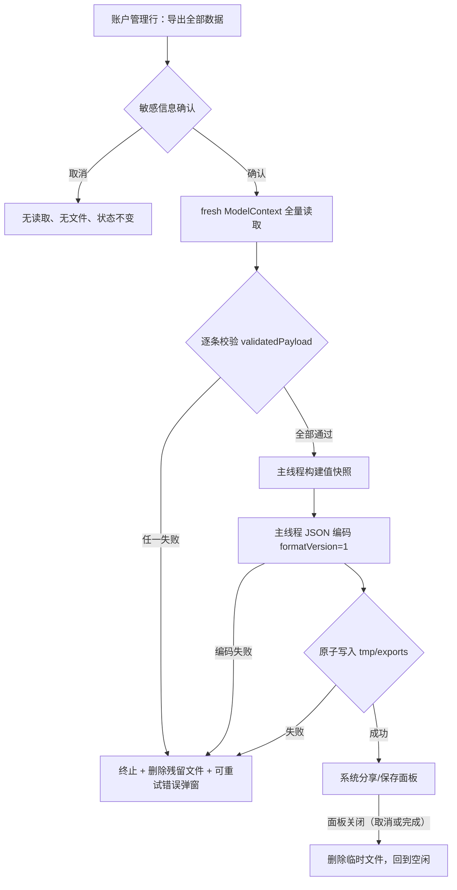

# feat: Export versioned data backup

## Summary

在账户管理中新增「导出全部数据」：读取当前设备上全部本地业务数据（账户、全部流水、默认记账账户偏好），校验完整性后生成一份版本化的 JSON 备份文件（自定义 `.yadoabackup` 类型），通过系统分享面板供用户保存或分享。本期只导出、不导入；任何一条记录不可靠即整体失败，不产出部分备份。

---

## Problem Frame

yadoA 以设备本地数据运行，用户缺少主动留存完整财务数据的方式。未来登录后会有云端统一数据，但当前版本需要一个独立于登录和后端的本地导出能力，且备份格式表达逻辑业务数据（而非 SwiftData 存储文件），为未来导入恢复与多产品联动保留兼容基础（see origin: docs/brainstorms/2026-09-01-data-export-requirements.md）。

---

## Requirements

承接 origin 全部需求（R1-R17），按关注点分组。**R7 澄清：** origin 文本只列「支出与余额调整流水」，但当前 schema 已将收入流水（`AccountTransactionType.income`）作为一等持久化类型；「完整备份」按 R6 的口径必须包含收入，本计划将 R7 解释为覆盖全部三类流水。

Entry and result

- R1. 账户管理页面应提供「导出全部数据」入口。
- R2. 触发导出后，应生成一份可通过系统文件或分享能力保存的 yadoA 备份文件。
- R3. 备份文件名应包含产品名称和导出日期，文件类型应能与普通账单或 CSV 区分。
- R4. 导出完成后，用户应能选择保存位置或分享目标。
- R5. 导出失败时不得生成部分备份，并应展示可重试的本地化错误反馈。

Data scope

- R6. 备份应包含全部启用与已停用账户，保留稳定 UUID、资料、余额、币种及生命周期状态（`deactivatedAt`）。
- R7. 备份应包含全部支出、收入与余额调整流水，保留稳定 UUID 和账户绑定关系（含收入，见上方澄清）。
- R8. 备份应包含默认记账账户偏好，并区分三种状态：无偏好记录、偏好存在但指针为空、指针存在（含失效指针，按原值导出）。
- R9. 备份不得包含图表汇总、搜索结果、缓存、页面选择状态或其他可由业务数据再生成的派生内容。
- R10. 未登录或离线时导出完整可用（纯本地实现，无网络依赖）。

Compatibility and privacy

- R11. 备份应记录格式版本、导出时间和生成它的 App 版本。
- R12. 稳定 UUID 不得因导出而重新生成。
- R13. 金额、日期和枚举等业务值使用跨版本、跨语言可稳定解释的表达，不依赖当前语言或展示文案。
- R14. 备份格式允许未来增加可选字段；旧备份缺少新字段时不得整体失效。
- R15. 未来 yadoI 等产品来源关联作为可选信息扩展，首版记录不受影响（本期不实现，仅保证格式可扩展）。
- R16. 导出前提示备份包含敏感财务信息，提醒用户妥善保存。
- R17. 新增文案本地化（en + zh-Hans），页面适配浅色和深色外观，保持 iOS 18 可用。

---

## Key Technical Decisions

- KTD1. 备份为单文件 JSON，顶层信封含 `formatVersion: 1`、`exportedAt`、`appVersion`/`appBuild` 与三段数据（`accounts`、`transactions` 数组与 `bookkeepingPreference` 单例对象）。向前兼容靠「新版本只增可选字段 + 解码端 `decodeIfPresent` 给默认值」实现；本期编码端不依赖该宽容性。版本递增策略：只增可选字段维持 v1；删除或改变既有字段语义才升 v2；SwiftData schema 版本与备份格式版本各自独立演进。
- KTD2. 金额编码为字符串（`Decimal` 的 description，小数点分隔），解码用 `Decimal(string:)`。iOS 17+ 的 `JSONDecoder` 已修复 Decimal 数值精度问题，但字符串是金额备份的惯用无损表达，且对未来非 Swift 解析器更安全。日期用固定 ISO-8601（含小数秒、UTC）自定义策略，编码解码两端一致——默认 `.iso8601` 策略遇小数秒会抛错。UUID 用默认小写连字符字符串。枚举一律存 rawValue 原文（如 `"diningExpense"`），不做标签重映射。
- KTD3. 导出 DTO 与 SwiftData 存储字段一一镜像（`typeRawValue`/`categoryRawValue`/`templateID` 等），全部为值类型 struct；跨层只传值快照（延续仓库既有 KTD 约束）。DTO 形状天然排除派生数据（R9）。
- KTD4. 导出服务沿用 `Local*Repository` 模式：`@MainActor final class`，注入 `ModelContainer`，每次用新建 `ModelContext`（`autosaveEnabled = false`）读取，保证单上下文时间点一致的快照；不读视图的 `@Query` 结果。完整性校验 = 每条流水过 `validatedPayload()` + 账户字段编码，任一失败抛错终止（R5）。全程同步执行（快照、编码、原子写入都在主线程）：个人记账数据量级下编码为毫秒级，与仓库全同步模式一致，也规避 `SWIFT_APPROACHABLE_CONCURRENCY` 下后台化的 Sendable/钩子隔离摩擦；后台编码是备选，仅当真实数据量证明主线程卡顿时再引入（需显式 `Task.detached`）。提供 `beforeWrite` 故障注入钩子（只读导出不会触发既有 `beforeSave`，故自建对称钩子）。
- KTD5. 注册自定义文件类型：UTTypeIdentifier `com.yado.yadoA.backup`，conforms to `public.json`，扩展名 `yadoabackup`。通过「部分 Info.plist + `INFOPLIST_FILE`」声明，与 `GENERATE_INFOPLIST_FILE = YES` 合并（Apple 支持的做法；无对应 `INFOPLIST_KEY_*` 设置）。声明放在 `UTExportedTypeDeclarations`（导出足够，`CFBundleDocumentTypes` 留给未来导入）。部分 plist 必须放在 `yadoA/` 同步目录之外，避免被文件系统同步组加为 target 成员/资源。
- KTD6. 文件名 `yadoA-backup-<yyyy-MM-dd-HHmm>.yadoabackup`：产品名常量 + 日期精确到分钟，规避同日重复导出重名；固定格式不随语言变化（R13）。时间可注入以便测试。
- KTD7. 临时文件生命周期：`Data` 完整生成后以 `.atomic` 写入 `tmp/exports/`；失败即删；分享面板关闭（无论用户取消还是完成）后删除；下次导出开始时清扫残留（覆盖进程被杀场景）。系统读取临时文件的时机无 Apple 文档保证，一律等分享面板 dismiss 后再删。清理动作由 DataExportFlow 统一拥有（删除 + 复位），视图的 `onDismiss` 只调用它。App 启动时（如 DataExportFlow 初始化或容器启动路径）也清扫一次残留，避免分享期间进程被杀后明文无限期滞留。
- KTD8. UI 走确认门：入口行 → 敏感信息确认弹窗（R16，取消则不读数据、不写文件、状态不变）→ 生成 → 以 `UIViewControllerRepresentable` 包 `UIActivityViewController` 经 `.sheet(item:)` 呈现系统分享/保存面板（`ShareLink` 无编程式 `isPresented` 初始化器；`.sheet(item:)` 同时提供确定的 `onDismiss` 清理点）。失败用既有 `.alert` 模式展示可重试错误（复用 `common.retry`）；重试从全新读取重新走全流程。用 `isExporting` 状态同步置位防双击/重复导出。
- KTD9. 偏好只导出 canonical 单例行（`id == BookkeepingPreference.singletonID`），忽略杂散行；`defaultAccountID` 按原值导出，失效指针不修复、不失败——与读取侧「不静默修复」的既有规则一致。
- KTD10. 文案全部经 `AccountLocalization.string` + `Localizable.xcstrings`（en + zh-Hans）；颜色只用系统语义色；分享包装为 UIKit 既有 API，无需 iOS 26 门控（Liquid Glass 外观自动获得）。

---

## High-Level Technical Design

导出管线与失败分支（组件链路：AccountManagementView → DataExportFlow（状态机）→ BackupExportService → AccountDataContainer / DTO → 临时文件 → 系统分享面板（UIActivityViewController 包装）；跨层只传值快照）：



DataExportFlow 状态：`idle → preparing → sharing(URL) → failed(BackupExportError)`，`failed` 可重试回 `preparing`；`preparing` 期间入口行禁用（防重入）。

备份信封形状（方向性示意，非实现规格）：

```text
BackupFile {
  formatVersion: 1
  exportedAt: ISO-8601(UTC, 含小数秒)
  appVersion / appBuild: CFBundleShortVersionString / CFBundleVersion
  accounts: [ { id, type, templateID?, name, note?, lastFourDigits?,
                balance(字符串金额), currencyCode, createdAt, updatedAt, deactivatedAt? } ]
  transactions: [ { id, accountID, type, category?, amount?, title?,
                    balanceBefore?, balanceAfter?, balanceDelta?, currencyCode,
                    transactionDay, note?, savedAt } ]
  bookkeepingPreference: 缺省 | { defaultAccountID: null | <UUID 原值> }
}
```

---

## Implementation Units

### U1. 备份格式层：DTO、版本化信封与编解码

- **Goal:** 定义长期可解释、向前兼容的备份文件格式（Codable 值类型镜像全部存储字段）与稳定的编解码策略。
- **Requirements:** R9, R11, R12, R13, R14（格式契约层）。
- **Dependencies:** 无。
- **Files:** `yadoA/Features/Export/BackupFile.swift`（信封 + `BackupAccount`/`BackupTransaction`/`BackupBookkeepingPreference` DTO + `formatVersion = 1` 常量）、`yadoA/Features/Export/BackupFileEncoding.swift`（编码器/解码器配置）、`yadoATests/BackupFileRoundTripTests.swift`。
- **Approach:** 字段名与 KTD2/KTD3 对齐；偏好信封用「键缺省 / `defaultAccountID: null` / 有值」表达 R8 三态。解码：身份与绑定字段（`id`、`accountID`）严格解码，内容字段经 keyed container `decodeIfPresent` 给默认值，为 R14 留出扩展位（本期编码端始终写全字段）。信封版本维度记录 `appVersion`（营销版本）与 `appBuild`（构建号）：营销版本静态时构建号是 R11 的主要诊断值。每种类型与关键约束补中文 `///` 文档注释，说明格式契约。
- **Patterns to follow:** `AccountDisposalPlan` 等既有值类型快照模式；`validatedPayload()` 的严格字段矩阵思想（DTO 文档中注明与 `AccountTransaction.swift` 字段矩阵的对应关系）。
- **Test scenarios:**
  - 三类流水 DTO（expense/income/balanceAdjustment）JSON 往返后与原值完全相等（含 rawValue 原文、UUID、`transactionDay`）。
  - 金额边界值（0.01、负余额、多位整数）字符串编码往返无损；日期含小数秒往返无损且为 UTC。
  - 偏好三态：键缺省解码为「无记录」、`null` 解码为「指针为空」、有值解码为原 UUID——三者可区分。
  - 模拟未来版本：信封含 v1 未知的额外可选字段时，v1 解码不失败且忽略未知键（R14）。
  - 身份字段缺失（如无 `id`）时解码抛错（结构性损坏不得静默）。
- **Verification:** 往返测试全绿；编码产物是稳定可读 JSON（固定键序不要求，但金额/日期表达符合 R13）。

### U2. 导出服务：快照、完整性校验与临时文件生成

- **Goal:** 从本地容器全量读取、逐条校验、生成完整备份数据并原子写入临时文件；任何失败不产出文件。
- **Requirements:** R2, R3, R5, R6, R7（含收入）, R8, R9, R10, R12。
- **Dependencies:** U1。
- **Files:** `yadoA/Features/Export/BackupExportService.swift`、`yadoATests/BackupExportServiceTests.swift`。
- **Approach:** 按 KTD4/KTD7/KTD9 实现。首次写入前确保 `tmp/exports/` 目录存在（`.atomic` 写入不创建中间目录）。错误类型 `BackupExportError`（Equatable：记录不可读、编码失败、写入失败）；错误反馈保持通用文案，不向弹窗泄露失败记录细节（仓库既有风格）。文件名时间源与清扫入口可注入。账户无「不可读」校验入口（无流水那样的字段矩阵），校验落在编码阶段——`Decimal`/`Date` 编码失败即整体失败，同样满足 R5。
- **Patterns to follow:** `LocalAccountRepository` 等的新建上下文 + 值快照模式；`FetchDescriptor` 全量拉取（schema 扁平、无 SwiftData relationship，全量拉取即可）。
- **Test scenarios:**
  - Covers F1 / AE1, AE10. 构造启用账户 + 已停用账户（`deactivatedAt` 有值）+ 支出/收入/调整流水 + 默认偏好，导出后解析文件：UUID、账户绑定、余额、币种、生命周期字段全部保留，收入流水在列。
  - Covers F2 / AE3. 插入合法流水后改动持久化模型的 `typeRawValue` 为未知值（指定初始化器私有，插入后变更是唯一注入路径），导出抛 `recordUnreadable`，且 `tmp/exports/` 无任何文件。
  - 预置 `tmp/exports/` 残留文件 → 新导出开始时被清扫删除（进程被杀场景的防线）。
  - 启动清扫：预置残留文件后执行启动期清扫初始化 → 残留被删除（分享期间进程被杀场景的兜底）。
  - Covers AE7. 空库（零账户、零流水、无偏好记录）导出成功：文件可解析、数组为空、偏好为「缺省」态。
  - Covers AE8. 偏好 `defaultAccountID` 指向不存在的账户：按原值导出，导出成功。
  - 存在非 canonical 偏好行（id ≠ singletonID）：忽略不失败。
  - 固定时间源 → 精确文件名；同日两次导出（时间源差 5 分钟）→ 文件名不同。
  - `beforeWrite` 钩子抛错 → 导出失败、无文件残留。
  - Covers AE4. 断言快照/DTO 结构不含任何派生字段（结构级检查，快照类型仅有存储字段）。
- **Verification:** 服务测试全绿（in-memory 容器 + 故障注入）；失败路径下文件系统无残留。

### U3. 注册 `.yadoabackup` 文件类型（工程配置）

- **Goal:** 给备份文件系统级类型身份，Files 中可识别为 yadoA 备份，为未来导入预留接收能力。
- **Requirements:** R3（文件类型可区分）。
- **Dependencies:** 无硬依赖（配置本身独立）；排期置于 U2 之后，U4 的手动验证链需要其成品。
- **Files:** `yadoA-Info.plist`（新建，项目根、`.xcodeproj` 旁）、`yadoA.xcodeproj/project.pbxproj`（app target 增设 `INFOPLIST_FILE`）、`yadoA/Features/Export/BackupFileType.swift`（`UTType` 常量封装）。
- **Approach:** 按 KTD5。plist 仅含 `UTExportedTypeDeclarations`（`UTTypeIdentifier: com.yado.yadoA.backup`、`UTTypeDescription: yadoA Backup`、`UTTypeConformsTo: [public.json]`、`UTTypeTagSpecification` 扩展名 `[yadoabackup]`）；保持 `GENERATE_INFOPLIST_FILE = YES`，二者由 Xcode 合并。plist 不得加入 `yadoA/` 同步目录，也不得成为 target 成员。
- **Patterns to follow:** 工程现有生成式 Info.plist 配置（无物理 plist）。
- **Test scenarios:** Test expectation: none -- 工程级配置，无独立运行时行为；由构建产物与本单元 Verification 覆盖。
- **Verification:** 构建成功；检查构建产物 app bundle 的 Info.plist 含该声明。

### U4. 账户管理入口：确认门、状态机与分享呈现

- **Goal:** 打通完整用户路径：入口行 → 敏感信息确认 → 生成 → 系统分享/保存面板；失败可重试，取消干净收场。
- **Requirements:** R1, R2, R4, R5, R16, R17。
- **Dependencies:** U1, U2；类型呈现质量依赖 U3。
- **Files:** `yadoA/Features/Export/DataExportFlow.swift`（`@MainActor` ObservableObject 状态机）、`yadoA/Features/Accounts/AccountManagementView.swift`（入口行 + 确认弹窗 + 分享面板呈现 + 关闭清理 + 错误弹窗）、`yadoA/Localizable.xcstrings`（新键 en + zh-Hans）、`yadoATests/DataExportFlowTests.swift`。
- **Approach:** 入口行加入既有 `List` 分区（放置位置跟随现有分区语义，用 `Label` + SF Symbol，如 `square.and.arrow.up`）。确认弹窗按既有 `.alert` 模式（标题 + 敏感提醒文案 + 「导出」/「取消」，取消按钮 role: .cancel）。分享呈现用 `UIViewControllerRepresentable` 包 `UIActivityViewController`，经 `.sheet(item:)` 呈现（`ShareLink` 无编程式呈现初始化器；`.sheet(item:)` 提供确定的 `onDismiss` 清理点）。临时文件删除与状态复位由 flow 统一拥有（如 `finishSharing()`），视图 `onDismiss` 只调用它；`preparing` 期间行禁用。流程状态机测试以真实 `BackupExportService` + in-memory 容器运行，覆盖视图→状态机→服务→文件的集成缝。无障碍：`account-management-export-data`（行）、`account-management-export-confirm` / `account-management-export-cancel`（弹窗按钮，标题与标识符同时设置）。新增键：`account.management.export.title`、`account.management.export.warning.title`、`account.management.export.warning.message`、`account.management.export.error`；复用 `common.cancel` / `common.retry` / `common.close`。
- **Patterns to follow:** `AccountManagementView` 现有行/弹窗结构；`AccountLifecycleFlow` 的 ObservableObject 状态机模式；`DefaultAccountSelectionView` 的错误弹窗模板。
- **Test scenarios:**
  - 空闲状态确认导出 → 状态依次到达 `preparing` → `sharing(URL)`，URL 指向存在的临时文件。
  - 确认弹窗取消 → 状态始终 `idle`，服务未被调用，`tmp/exports/` 无文件。
  - 服务抛错 → 状态 `failed`，临时文件不存在；重试触发从全新读取开始的第二次完整流程（第二次可成功）。
  - `sharing` 状态触发面板关闭清理 → 临时文件被删除、状态复位 `idle`。
  - `preparing` 期间再次触发确认 → 忽略（防重入），不产生第二个文件/面板。
- **Verification:** 流程状态机测试全绿；真机手动走通「确认 → 保存到文件」与「失败 → 重试」两条路径；分享面板中备份文件带类型标识而非通用未知文件；深浅色与中英文检查通过。

### U5. UI 冒烟测试与数据夹具

- **Goal:** 用既有 UI 测试基建覆盖入口可见性与确认门取消路径；系统分享面板本身不在 UI 测试范围。
- **Requirements:** R1, R16（可见性层面验证）。
- **Dependencies:** U4。
- **Files:** `yadoA/Support/HomeUITestFixture.swift`（扩展 export 夹具种子）、`yadoA/yadoAApp.swift`（新增 `--ui-testing-export-fixture` 启动参数分支）、`yadoAUITests/AccountManagementExportUITests.swift`（新建）。
- **Approach:** 夹具播种一个启用账户、一个已停用账户与少量流水（复用 in-memory 启动参数模式）。测试路径：账户列表工具栏 → 管理页 → 入口行存在且文案本地化 → 点击行 → 确认弹窗出现 → 点取消 → 弹窗消失、无分享面板元素、页面状态不变，结束。可选冒烟：确认后断言分享面板元素出现即止。
- **Patterns to follow:** `AccountListFlowUITests.swift` 的可达性标识符驱动方式；`HomeUITestFixture.seed` 夹具模式。
- **Test scenarios:**
  - 夹具启动后入口行可见、文案与语言设置一致。
  - Covers AE5.（计划新增）取消路径：确认弹窗取消后无分享面板、无错误弹窗。
- **Verification:** UI 测试通过；不触碰系统分享面板内部（避免系统 UI 脆弱断言）。

---

## Acceptance Examples

AE1-AE4 承接 origin（docs/brainstorms/2026-09-01-data-export-requirements.md），AE5 起为本计划按流程分析补充，编号延续 origin：

- AE1. 完整导出账户历史（启用/停用账户、三类流水、偏好，UUID 与关联保留）— Covers R6-R8, R12
- AE2. 离线导出可用 — Covers R10
- AE3. 拒绝部分备份（任一记录不可靠即整体失败、无文件）— Covers R5
- AE4. 排除派生数据 — Covers R9
- AE5. 确认门取消：不读数据、不写文件、无分享面板、状态不变
- AE6. 分享面板关闭（取消或完成）：不报错、临时文件清理、回到空闲
- AE7. 空库导出：合法空备份成功，偏好记为「缺省」
- AE8. 失效默认账户指针：按原值导出、导出成功
- AE9. 同日重复导出：文件名确定且可区分
- AE10. 收入流水包含在备份中（R7 澄清的验收面）
- AE11. 失败后重试：从全新读取重新执行完整管线并可成功

---

## Scope Boundaries

本期不做（承接 origin）：导入、恢复、合并或覆盖现有数据；CSV、账单报表或按时间/账户的范围导出；登录、后端上传、云端备份或多设备同步；读取或打包 yadoI 数据及新增 yadoI 联动字段；密码加密备份；备份历史列表与自动定时导出。

### Deferred to Follow-Up Work

- `CFBundleDocumentTypes` 接收声明、本地化的类型描述（InfoPlist.strings）与 QuickLook 预览——随未来导入功能一并落地。`UTTypeDescription` 是 Files/分享面板中的用户可见文案，本期以英文占位，作为 R17 的显式例外在此记录。
- SwiftData `Schema` 版本不动（维持 V5）；导出不引入任何 schema 变更或数据迁移。

---

## Risks and Dependencies

- **部分 Info.plist 与文件系统同步组的相互作用：** plist 若进入 `yadoA/` 同步目录会被自动加为 target 成员/资源，违反 Apple「不要加入 target」的要求。缓解：置于项目根且仅经 `INFOPLIST_FILE` 引用；以「构建产物 Info.plist 含声明」作为验证门槛。
- **分享面板读取临时文件的时机无 Apple 文档保证：** 过早删除可能导致「保存到文件」读到空。缓解：只在面板 dismiss 后删除，且每次导出开始时清扫残留（KTD7）。
- **完整性校验当前是防御性的：** 现有写入路径已在入库前跑同一字段矩阵，正常数据不会触发失败；真实触发场景是未来版本 skew 或库损坏。导出是唯一必须「抛错而非跳过」的消费方（展示层静默跳过坏行是既有行为），这一不对称是有意的（R5「完整优先」）。
- **备份为未加密的完整财务明文：** 用户保存到哪，明文就在哪。按 origin 决策本期不加密，唯一缓解是 R16 确认门（敏感提醒 + 明确取消路径）；加密随未来 `formatVersion` 演进引入，不后补进 v1 语义。
- **依赖面：** 不新增 SPM 依赖；分享面板包装为 UIKit 既有 API，iOS 18 最低版本约束不受影响；`IPHONEOS_DEPLOYMENT_TARGET` 保持 18.0。

---

## System-Wide Impact

- 工程配置：app target 首次出现 `INFOPLIST_FILE`，影响后续所有构建；其余 target 不动。
- 文件系统：新增 `tmp/exports/` 临时目录约定（系统可随时清理，App 不依赖其持久性）。
- 本地化目录：`Localizable.xcstrings` 新增约 4 个键（en + zh-Hans）。
- SwiftData schema 与既有仓库层零改动；展示层仅在既有 `AccountManagementView` 新增导出入口、确认弹窗与错误弹窗（不改既有行为）。

---

## Sources and Research

- Origin: docs/brainstorms/2026-09-01-data-export-requirements.md（R1-R17、F1-F2、AE1-AE4、边界与假设）。
- 代码锚点：`yadoA/Persistence/AccountDataContainer.swift`（schema V5、容器构造）、`yadoA/Models/Account.swift`、`yadoA/Models/AccountTransaction.swift`（`validatedPayload()` 字段矩阵、私有指定初始化器）、`yadoA/Models/BookkeepingPreference.swift`（singletonID、resolution 语义）、`yadoA/Persistence/LocalAccountRepository.swift`（fresh-context 仓库模式）、`yadoA/Features/Accounts/AccountManagementView.swift`（入口落点）、`yadoA/Models/AccountType.swift`（`AccountLocalization`）、`yadoA/Localizable.xcstrings`。
- 外部研究（对本计划 KTD1/KTD2/KTD5/KTD7 起决定作用）：Apple《Managing your app's information property list values》确认部分 plist 与 `GENERATE_INFOPLIST_FILE` 合并；`UTExportedTypeDeclarations` / 《Defining file and data types for your app》确认导出型声明与 `public.json` conformance；Swift 社区确认 JSONDecoder Decimal 精度问题已在 iOS 17+ 修复（SR-7054）、`.iso8601` 默认策略不支持小数秒；分享面板读取临时文件时机为社区共识（dismiss 后删）而非 Apple 文档保证——已计入风险；Apple ShareLink API 面确认无编程式 `isPresented` 初始化器，程序化呈现走 `UIActivityViewController` 包装（KTD8 依据）。
